# Prompting Templates Repository

<cite>
**Referenced Files in This Document**   
- [prompting_templates_repository.go](file://internal/database/repositories/prompting_templates_repository.go)
- [profile_prompt.go](file://internal/database/prompts/profile_prompt.go)
- [summarization_prompt.go](file://internal/database/prompts/summarization_prompt.go)
- [content_prompt.go](file://internal/database/prompts/content_prompt.go)
- [intro_prompt.go](file://internal/database/prompts/intro_prompt.go)
- [tool_prompt.go](file://internal/database/prompts/tool_prompt.go)
- [summarization_service.go](file://internal/services/summarization_service.go)
</cite>

## Table of Contents
1. [Introduction](#introduction)
2. [Core Components](#core-components)
3. [Architecture Overview](#architecture-overview)
4. [Detailed Component Analysis](#detailed-component-analysis)
5. [Usage Patterns](#usage-patterns)
6. [Domain Model](#domain-model)
7. [Public Interfaces](#public-interfaces)
8. [Common Issues and Best Practices](#common-issues-and-best-practices)
9. [Conclusion](#conclusion)

## Introduction
The Prompting Templates Repository is a critical component of the evocoders-bot-go application, responsible for managing AI prompt templates used across various features such as profile search, content search, and daily summarization. This repository provides a centralized mechanism for storing, retrieving, and managing prompt templates that guide the behavior of AI responses generated through OpenAI integration. The system supports dynamic parameter injection and template versioning, enabling flexible and context-aware AI interactions while maintaining consistency in tone and formatting across different use cases.

## Core Components

The Prompting Templates Repository consists of a database-backed storage system for prompt templates, with predefined templates for different functional domains within the application. The repository enables runtime retrieval of templates, allowing services to dynamically construct AI prompts based on current requirements and context variables.

**Section sources**
- [prompting_templates_repository.go](file://internal/database/repositories/prompting_templates_repository.go#L9-L42)
- [profile_prompt.go](file://internal/database/prompts/profile_prompt.go#L3-L37)
- [summarization_prompt.go](file://internal/database/prompts/summarization_prompt.go#L3-L41)

## Architecture Overview

The Prompting Templates Repository follows a simple repository pattern implementation, providing an abstraction layer between the application services and the underlying database storage. Services request templates by key, and the repository either returns the stored template or falls back to default values.


**Diagram sources **
- [prompting_templates_repository.go](file://internal/database/repositories/prompting_templates_repository.go#L9-L42)
- [summarization_service.go](file://internal/services/summarization_service.go#L28-L40)

## Detailed Component Analysis

### Prompting Template Repository Analysis
The PromptingTemplateRepository provides a simple interface for retrieving prompt templates by key from the database. It follows the repository pattern, abstracting database operations and providing a clean API for template retrieval.


**Diagram sources **
- [prompting_templates_repository.go](file://internal/database/repositories/prompting_templates_repository.go#L9-L42)

### Template Types Analysis
The system implements several specialized prompt templates for different use cases, each with specific formatting requirements and response guidelines.

#### Profile Search Template
Handles queries for finding club members based on their profiles, with specific formatting requirements for displaying results.


**Diagram sources **
- [profile_prompt.go](file://internal/database/prompts/profile_prompt.go#L3-L37)

#### Daily Summarization Template
Processes chat messages to generate daily summaries with specific formatting requirements including HTML links to original messages.

```mermaid
flowchart TD
Start([Summarization Request]) --> Retrieve["Retrieve summarization_prompt template"]
Retrieve --> Group["Group messages by conversation threads"]
Group --> Identify["Identify main discussion topics"]
Identify --> Format["Format as bulleted list with 🔸 symbol"]
Format --> Link["Add HTML links to first message of each thread"]
Link --> Restrict["Restrict HTML tags to <b>, <i>, <a> only"]
Restrict --> Output["Return formatted summary"]
```



**Diagram sources **
- [summarization_prompt.go](file://internal/database/prompts/summarization_prompt.go#L3-L41)

#### Content Search Template
Handles queries for finding specific content within the club, with formatting that includes publication dates and content links.


**Diagram sources **
- [content_prompt.go](file://internal/database/prompts/content_prompt.go#L3-L37)

## Usage Patterns

The Prompting Templates Repository is used throughout the application to ensure consistent AI responses across different features. Services retrieve templates before making OpenAI API calls, injecting relevant context data into the template placeholders.


**Diagram sources **
- [summarization_service.go](file://internal/services/summarization_service.go#L43-L71)
- [prompting_templates_repository.go](file://internal/database/repositories/prompting_templates_repository.go#L25-L42)

## Domain Model

The domain model for the Prompting Templates Repository consists of template types, versioning considerations, and dynamic parameter injection mechanisms.

### Template Types
The system supports multiple template types for different use cases:

| Template Type | Key Constant | Purpose | Context Parameters |
|---------------|-------------|---------|-------------------|
| Profile Search | GetProfilePromptTemplateDbKey | Search member profiles | database content, user request |
| Daily Summarization | DailySummarizationPromptTemplateDbKey | Generate daily chat summaries | date, chat ID, message context |
| Content Search | GetContentPromptTemplateDbKey | Search club content | database content, user request |
| Member Introduction | GetIntroPromptTemplateDbKey | Find member introductions | database content, user request |
| Tool Information | GetToolPromptTemplateDbKey | Search AI development tools | database content, user request |

**Section sources**
- [profile_prompt.go](file://internal/database/prompts/profile_prompt.go#L1-L37)
- [summarization_prompt.go](file://internal/database/prompts/summarization_prompt.go#L1-L41)
- [content_prompt.go](file://internal/database/prompts/content_prompt.go#L1-L37)
- [intro_prompt.go](file://internal/database/prompts/intro_prompt.go#L1-L22)
- [tool_prompt.go](file://internal/database/prompts/tool_prompt.go#L1-L41)

### Versioning and Dynamic Injection
The repository supports template versioning through database storage, allowing updates without code changes. Templates use printf-style formatting for dynamic parameter injection, enabling runtime customization of prompts with contextual data.

## Public Interfaces

The Prompting Templates Repository exposes a simple interface for template retrieval:

```go
// Get retrieves a prompt template by its key
func (r *PromptingTemplateRepository) Get(templateKey string) (string, error)
```

Parameters:
- `templateKey` (string): The identifier for the requested template (e.g., "get_profile_prompt")

Return values:
- `templateText` (string): The template text, or empty string if not found
- `error`: Error object if database operation fails

The interface follows a fail-soft approach, returning an empty string when templates are not found in the database, allowing the system to potentially fall back to default templates defined in code.

**Section sources**
- [prompting_templates_repository.go](file://internal/database/repositories/prompting_templates_repository.go#L25-L42)

## Common Issues and Best Practices

### Common Issues

#### Prompt Injection Risks
Since user input is injected into templates, there's a risk of prompt injection attacks where users might attempt to manipulate the AI's behavior by including instructions in their queries. The current implementation mitigates this by using structured templates with clear separation between user request and system instructions.

#### Outdated Templates Affecting AI Quality
Templates stored in the database can become outdated, leading to suboptimal AI responses. Without a versioning system or audit trail, it's difficult to track changes or roll back to previous versions if new templates produce worse results.

#### Caching Strategies
The current implementation doesn't include caching, which could lead to repeated database queries for frequently used templates. This could impact performance, especially during high-traffic periods when multiple services simultaneously request the same templates.

### Best Practices for Template Management and Security

1. **Input Sanitization**: Always validate and sanitize user inputs before injecting them into templates to prevent prompt injection attacks.

2. **Template Review Process**: Implement a review process for template changes, especially for production environments, to ensure quality and consistency.

3. **Version Control**: Maintain version history of templates to enable rollback capabilities and track the impact of template changes on AI response quality.

4. **Testing Framework**: Develop a testing framework for templates that evaluates their effectiveness with sample inputs before deployment.

5. **Monitoring and Analytics**: Implement monitoring to track template usage and AI response quality, identifying templates that consistently produce poor results.

6. **Access Control**: Restrict database access to template tables to authorized personnel only, preventing unauthorized modifications.

7. **Default Fallbacks**: Always maintain default templates in code as a fallback when database templates are unavailable or corrupted.

8. **Regular Audits**: Conduct regular audits of template content to ensure they align with current community guidelines and response standards.

## Conclusion
The Prompting Templates Repository plays a crucial role in maintaining consistent and high-quality AI interactions within the evocoders-bot-go application. By centralizing prompt management, the system enables flexible AI behavior across multiple features while maintaining control over response formatting and content. The repository pattern implementation provides a clean abstraction for template retrieval, allowing services to focus on their core functionality while ensuring consistent AI interactions. Future improvements could include template caching for performance optimization, enhanced versioning capabilities, and more sophisticated input validation to further improve security and reliability.