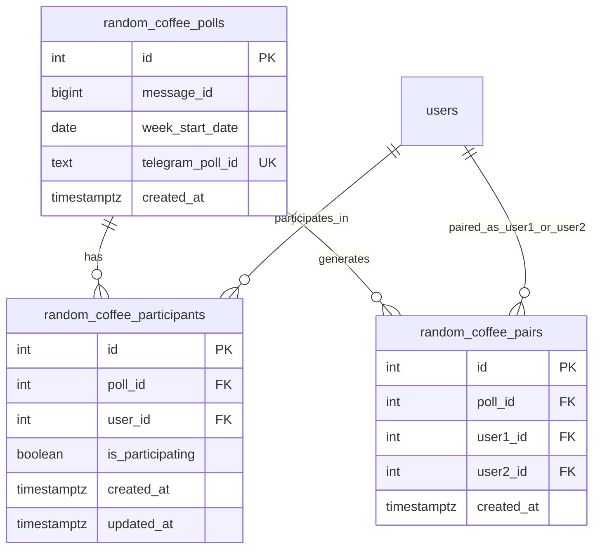

# Random Coffee Repositories

<cite>
**Referenced Files in This Document**   
- [random_coffee_poll_repository.go](file://internal/database/repositories/random_coffee_poll_repository.go)
- [random_coffee_participant_repository.go](file://internal/database/repositories/random_coffee_participant_repository.go)
- [random_coffee_pair_repository.go](file://internal/database/repositories/random_coffee_pair_repository.go)
- [20250602_add_random_coffee_poll_tables.go](file://internal/database/migrations/implementations/20250602_add_random_coffee_poll_tables.go)
- [20250609_add_random_coffee_pairs_table.go](file://internal/database/migrations/implementations/20250609_add_random_coffee_pairs_table.go)
</cite>

## Table of Contents
1. [Introduction](#introduction)
2. [Domain Model Overview](#domain-model-overview)
3. [Poll Repository](#poll-repository)
4. [Participant Repository](#participant-repository)
5. [Pair Repository](#pair-repository)
6. [Data Relationships and Integrity](#data-relationships-and-integrity)
7. [Usage Patterns and Examples](#usage-patterns-and-examples)
8. [Common Issues and Mitigation Strategies](#common-issues-and-mitigation-strategies)
9. [Conclusion](#conclusion)

## Introduction
The Random Coffee feature in the evocoders-bot-go application enables weekly pairing of community members for informal virtual coffee meetings. This document details the implementation of the three core repositories—Poll, Participant, and Pair—that manage the lifecycle of these events. The system is designed to store poll metadata, track user participation, and persist generated pairs while ensuring data integrity and efficient querying. These repositories are backed by PostgreSQL tables with appropriate constraints and relationships.

## Domain Model Overview
The Random Coffee domain consists of three primary entities:
- **Poll**: Represents a weekly poll instance used to gather participation intent.
- **Participant**: Tracks individual user responses within a specific poll.
- **Pair**: Stores the resulting user pairings generated from a poll.

These entities are linked hierarchically: a Poll has many Participants and many Pairs. The data model ensures referential integrity through foreign key constraints and enforces business rules such as unique participation per user per poll and unique pairings within a poll.

**Diagram sources**
- [20250602_add_random_coffee_poll_tables.go](file://internal/database/migrations/implementations/20250602_add_random_coffee_poll_tables.go)
- [20250609_add_random_coffee_pairs_table.go](file://internal/database/migrations/implementations/20250609_add_random_coffee_pairs_table.go)

## Poll Repository
The `RandomCoffeePollRepository` manages the lifecycle of weekly polls. Each poll is uniquely identified by its `telegram_poll_id`, which corresponds to the Telegram platform's poll identifier. Polls are stored with metadata including the associated message ID, the start date of the week, and creation timestamp.

Key operations include:
- **CreatePoll**: Inserts a new poll record. If `CreatedAt` is not provided, it defaults to the current time.
- **GetPollByTelegramPollID**: Retrieves a poll using its unique Telegram poll ID, enabling fast lookup during user interaction.
- **GetLatestPoll**: Fetches the most recent poll based on `week_start_date`, used to identify the current active poll.

This repository serves as the anchor for all related data, ensuring that participants and pairs are correctly scoped to a specific poll cycle.

**Section sources**
- [random_coffee_poll_repository.go](file://internal/database/repositories/random_coffee_poll_repository.go#L1-L96)

## Participant Repository
The `RandomCoffeeParticipantRepository` handles user participation status for a given poll. It supports idempotent updates via PostgreSQL's `ON CONFLICT` clause, allowing safe upserts when users change their participation status.

Key operations include:
- **UpsertParticipant**: Inserts a new participant or updates the `is_participating` flag and `updated_at` timestamp if the record already exists. This prevents duplicate entries and ensures data consistency.
- **RemoveParticipant**: Deletes a participant record, typically used when a user explicitly opts out.
- **GetParticipant**: Retrieves a specific user's participation status for a poll.
- **GetParticipatingUsers**: Returns a list of all users actively participating in a poll by joining with the `users` table, used during pair generation.

The repository enforces a unique constraint on `(poll_id, user_id)` and automatically updates timestamps via a database trigger, ensuring auditability and preventing stale data.

**Section sources**
- [random_coffee_participant_repository.go](file://internal/database/repositories/random_coffee_participant_repository.go#L1-L86)

## Pair Repository
The `RandomCoffeePairRepository` persists the generated user pairings for a poll. It ensures that each pair within a poll is unique and prevents duplicate pairings.

Key operations include:
- **CreatePair**: Inserts a new pair record linking two users within a poll context.
- **GetPairsHistoryForUsers**: Retrieves historical pairing data for a set of users across the most recent N polls. This function is critical for avoiding repeat pairings and uses dynamic SQL to handle variable user lists.
- **GetMostRecentPairPoll**: Determines the most recent poll in which two users were paired, returning 0 if they have never been paired. This supports smart pairing logic by identifying long-separated users.

The repository uses a composite unique constraint on `(poll_id, user1_id, user2_id)` to prevent duplicate entries and maintains a `created_at` timestamp for audit purposes.

**Section sources**
- [random_coffee_pair_repository.go](file://internal/database/repositories/random_coffee_pair_repository.go#L1-L125)

## Data Relationships and Integrity
The data model enforces referential integrity through foreign key constraints:
- `random_coffee_participants.poll_id` references `random_coffee_polls.id` with `ON DELETE CASCADE`, ensuring participants are removed if their poll is deleted.
- `random_coffee_pairs.poll_id` similarly references `random_coffee_polls.id`.
- Both participant and pair user IDs reference the `users.id` table.

Additional constraints include:
- Unique `telegram_poll_id` in `random_coffee_polls` to prevent duplicate polls.
- Unique `(poll_id, user_id)` in `random_coffee_participants` to prevent duplicate registration.
- Unique `(poll_id, user1_id, user2_id)` in `random_coffee_pairs` to prevent duplicate pairings.

A database trigger automatically updates the `updated_at` field in `random_coffee_participants` on every modification, ensuring accurate tracking of participation changes.

**Section sources**
- [20250602_add_random_coffee_poll_tables.go](file://internal/database/migrations/implementations/20250602_add_random_coffee_poll_tables.go#L1-L110)
- [20250609_add_random_coffee_pairs_table.go](file://internal/database/migrations/implementations/20250609_add_random_coffee_pairs_table.go#L1-L40)

## Usage Patterns and Examples
### Fetching Active Poll Participants
To generate pairs, the system first retrieves all participating users from the latest poll:
1. Call `GetLatestPoll()` to identify the current poll.
2. Use the poll ID with `GetParticipatingUsers(pollID)` to obtain the list of active participants.

### Recording Poll Results
When a user responds to a poll:
1. The handler retrieves the poll via `GetPollByTelegramPollID()`.
2. It upserts the participant status using `UpsertParticipant()` with the `is_participating` flag set based on the response.

### Persisting Generated Pairs
After generating pairs:
1. For each pair, call `CreatePair(pollID, user1ID, user2ID)`.
2. The operation is typically performed in a loop or batch within a transaction to ensure atomicity.

### Avoiding Repeat Pairings
Before finalizing new pairs:
1. Use `GetPairsHistoryForUsers(userIDs, lastNPolls)` to check recent pairings.
2. Apply business logic to minimize repeats, potentially using `GetMostRecentPairPoll(user1ID, user2ID, N)` for specific checks.

**Section sources**
- [random_coffee_poll_repository.go](file://internal/database/repositories/random_coffee_poll_repository.go#L50-L96)
- [random_coffee_participant_repository.go](file://internal/database/repositories/random_coffee_participant_repository.go#L50-L86)
- [random_coffee_pair_repository.go](file://internal/database/repositories/random_coffee_pair_repository.go#L30-L125)

## Common Issues and Mitigation Strategies
### Duplicate Participation
**Issue**: Users might submit multiple responses due to network retries or UI glitches.  
**Mitigation**: The `ON CONFLICT` clause in `UpsertParticipant` ensures only one record exists per user per poll, updating the status idempotently.

### Orphaned Records
**Issue**: Manual database operations or failed transactions could leave participants or pairs without a corresponding poll.  
**Mitigation**: Foreign key constraints with `ON DELETE CASCADE` automatically clean up dependent records when a poll is removed.

### Race Conditions During Pair Generation
**Issue**: Concurrent pair generation attempts could result in inconsistent or duplicated pairs.  
**Mitigation**: Pair generation should be wrapped in a database transaction with appropriate isolation level (e.g., `SERIALIZABLE`). The unique constraint on `random_coffee_pairs` provides a final safeguard against duplicates.

### Performance of Historical Queries
**Issue**: `GetPairsHistoryForUsers` can become slow with large user bases or deep history.  
**Mitigation**: Ensure indexes exist on relevant columns (`poll_id`, `user1_id`, `user2_id`) and consider limiting `lastNPolls` in practice. The query structure already optimizes by limiting results to the most recent polls.

**Section sources**
- [random_coffee_participant_repository.go](file://internal/database/repositories/random_coffee_participant_repository.go#L20-L30)
- [random_coffee_pair_repository.go](file://internal/database/repositories/random_coffee_pair_repository.go#L30-L70)
- [20250602_add_random_coffee_poll_tables.go](file://internal/database/migrations/implementations/20250602_add_random_coffee_poll_tables.go#L50-L60)

## Conclusion
The Random Coffee repositories provide a robust foundation for managing weekly user pairings. By leveraging PostgreSQL's constraint system and transactional integrity, the implementation ensures data consistency while supporting efficient querying for both real-time operations and historical analysis. The clear separation of concerns between Poll, Participant, and Pair repositories enables maintainable and scalable code, with well-defined interfaces for core operations. Future enhancements could include more sophisticated pairing algorithms and improved query performance through indexing strategies.