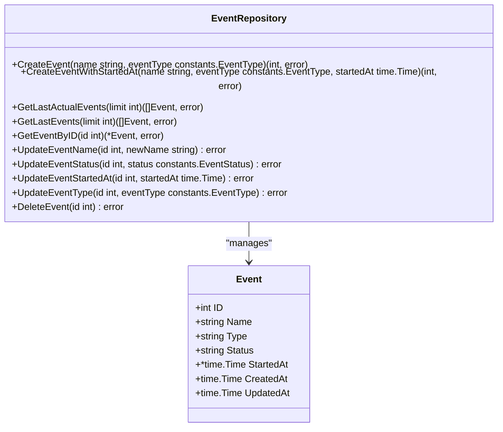
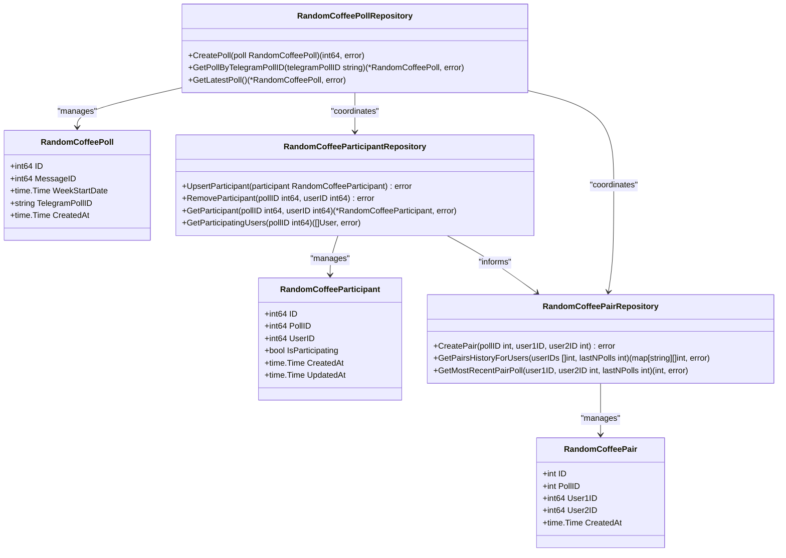
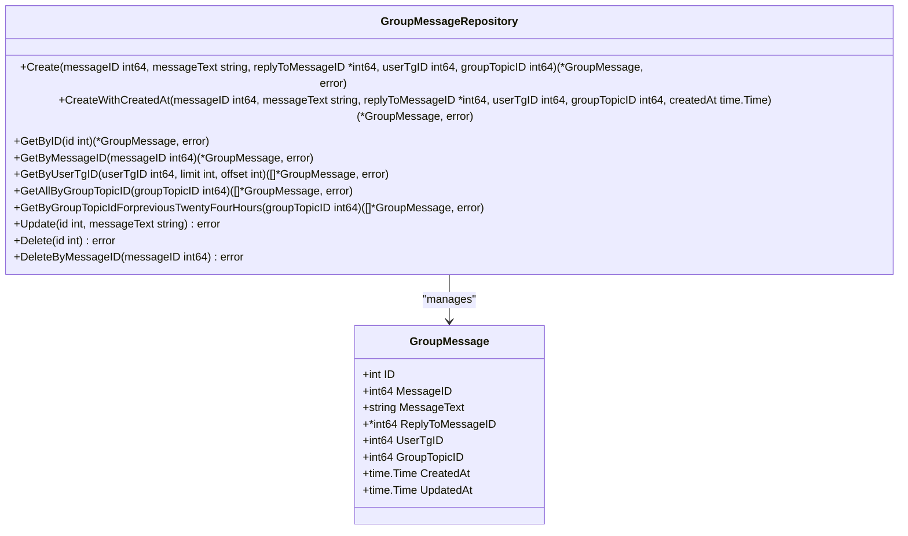
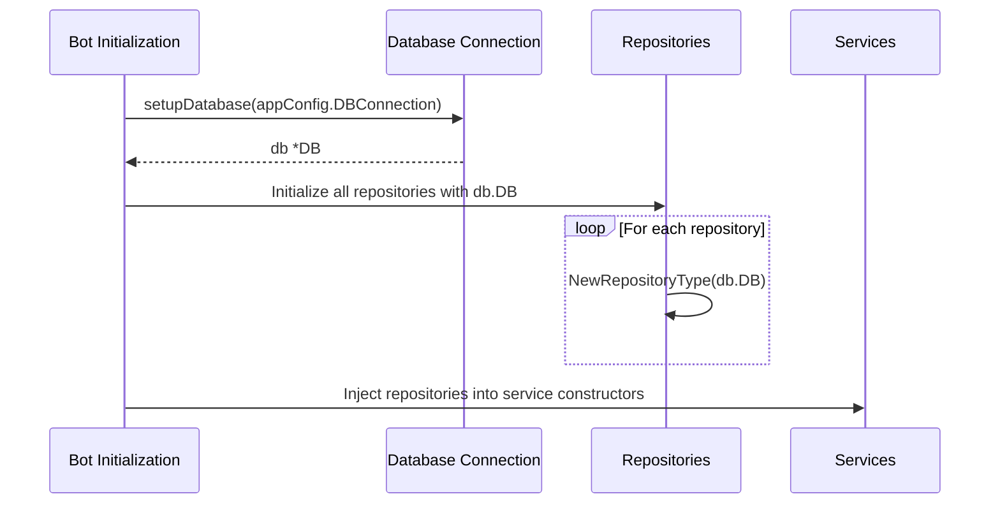
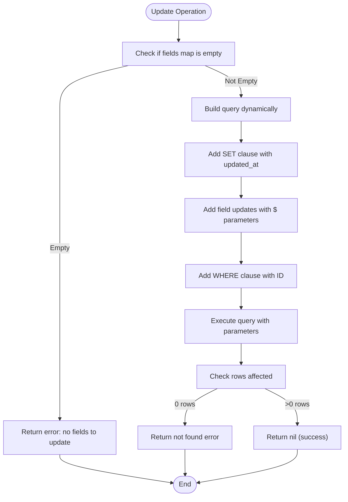

# Repository Layer

<cite>
**Referenced Files in This Document**   
- [user_repository.go](file://internal/database/repositories/user_repository.go)
- [profile_repository.go](file://internal/database/repositories/profile_repository.go)
- [event_repository.go](file://internal/database/repositories/event_repository.go)
- [random_coffee_poll_repository.go](file://internal/database/repositories/random_coffee_poll_repository.go)
- [random_coffee_participant_repository.go](file://internal/database/repositories/random_coffee_participant_repository.go)
- [random_coffee_pair_repository.go](file://internal/database/repositories/random_coffee_pair_repository.go)
- [group_message_repository.go](file://internal/database/repositories/group_message_repository.go)
- [db.go](file://internal/database/db.go)
- [bot.go](file://internal/bot/bot.go)
</cite>

## Update Summary
**Changes Made**   
- Added documentation for new `CreateWithCreatedAt` method in GroupMessageRepository that preserves original Telegram message timestamps
- Updated Common Use Cases section with new example for retrieving all messages without limits
- Enhanced Query Optimization section with details about unlimited message retrieval for search completeness
- Updated diagram sources to reflect new method implementations
- Added new section sources for summarization_service.go and tools_handler.go where new repository methods are utilized

## Table of Contents
1. [Introduction](#introduction)
2. [Architecture Overview](#architecture-overview)
3. [Core Entities and Repository Patterns](#core-entities-and-repository-patterns)
4. [Data Access Implementation Details](#data-access-implementation-details)
5. [Query Construction and Optimization](#query-construction-and-optimization)
6. [Common Use Cases and Examples](#common-use-cases-and-examples)
7. [Error Handling and Common Issues](#error-handling-and-common-issues)
8. [Conclusion](#conclusion)

## Introduction

The Repository Layer in evocoders-bot-go implements a clean separation between the application's business logic and data persistence mechanisms. This layer provides an abstraction over database operations for key entities including User, Profile, Event, RandomCoffeePoll, RandomCoffeeParticipant, RandomCoffeePair, and GroupMessage. By encapsulating data access patterns within dedicated repository classes, the system achieves improved testability, maintainability, and separation of concerns. The repositories follow the Go standard library's database/sql patterns while providing higher-level interfaces tailored to the application's specific needs.

## Architecture Overview

The repository layer follows a structured architecture where each entity has its corresponding repository implementation. All repositories share a common dependency on the database connection and follow consistent patterns for CRUD operations, error handling, and transaction management.

```mermaid
graph TD
DB[(Database)]
subgraph Repositories
UserRepo[UserRepository]
ProfileRepo[ProfileRepository]
EventRepo[EventRepository]
PollRepo[RandomCoffeePollRepository]
ParticipantRepo[RandomCoffeeParticipantRepository]
PairRepo[RandomCoffeePairRepository]
MessageRepo[GroupMessageRepository]
end
DB --> UserRepo
DB --> ProfileRepo
DB --> EventRepo
DB --> PollRepo
DB --> ParticipantRepo
DB --> PairRepo
DB --> MessageRepo
UserRepo < --> ProfileRepo
EventRepo < --> TopicRepo[TopicRepository]
PollRepo < --> ParticipantRepo
PollRepo < --> PairRepo
ParticipantRepo < --> UserRepo
PairRepo < --> UserRepo
MessageRepo < --> UserRepo
MessageRepo < --> TopicRepo
style UserRepo fill:#f9f,stroke:#333
style ProfileRepo fill:#f9f,stroke:#333
style EventRepo fill:#f9f,stroke:#333
style PollRepo fill:#f9f,stroke:#333
style ParticipantRepo fill:#f9f,stroke:#333
style PairRepo fill:#f9f,stroke:#333
style MessageRepo fill:#f9f,stroke:#333
```

**Diagram sources**
- [user_repository.go](file://internal/database/repositories/user_repository.go)
- [profile_repository.go](file://internal/database/repositories/profile_repository.go)
- [event_repository.go](file://internal/database/repositories/event_repository.go)
- [random_coffee_poll_repository.go](file://internal/database/repositories/random_coffee_poll_repository.go)
- [random_coffee_participant_repository.go](file://internal/database/repositories/random_coffee_participant_repository.go)
- [random_coffee_pair_repository.go](file://internal/database/repositories/random_coffee_pair_repository.go)
- [group_message_repository.go](file://internal/database/repositories/group_message_repository.go)

**Section sources**
- [db.go](file://internal/database/db.go)
- [bot.go](file://internal/bot/bot.go)

## Core Entities and Repository Patterns

### User and Profile Entities

The User and Profile entities represent the core identity system within the application. The UserRepository manages user records with comprehensive methods for creation, retrieval, and updates.

```mermaid
classDiagram
class User {
+int ID
+int64 TgID
+string Firstname
+string Lastname
+string TgUsername
+int Score
+bool HasCoffeeBan
+bool IsClubMember
+time.Time CreatedAt
+time.Time UpdatedAt
}
class Profile {
+int ID
+int UserID
+string Bio
+sql.NullInt64 PublishedMessageID
+time.Time CreatedAt
+time.Time UpdatedAt
}
class UserRepository {
+GetByID(id int) (*User, error)
+GetByTelegramID(tgID int64) (*User, error)
+GetByTelegramUsername(tgUsername string) (*User, error)
+Create(tgID int64, firstname, lastname, username string) (int, error)
+Update(id int, fields map[string]interface{}) error
+GetOrCreate(tgUser *gotgbot.User) (*User, error)
+GetOrFullCreate(user *gotgbot.User) (*User, *Profile, error)
}
class ProfileRepository {
+GetByID(id int) (*Profile, error)
+GetByUserID(userID int) (*Profile, error)
+Create(userID int, bio string) (int, error)
+Update(id int, fields map[string]interface{}) error
+GetOrCreate(userID int) (*Profile, error)
+GetOrCreateWithBio(userID int, bio string) (*Profile, error)
+GetAllWithUsers() ([]ProfileWithUser, error)
}
UserRepository --> User : "manages"
ProfileRepository --> Profile : "manages"
UserRepository --> ProfileRepository : "collaborates"
ProfileRepository --> UserRepository : "depends on"
```

**Diagram sources**
- [user_repository.go](file://internal/database/repositories/user_repository.go#L20-L423)
- [profile_repository.go](file://internal/database/repositories/profile_repository.go#L20-L285)

**Section sources**
- [user_repository.go](file://internal/database/repositories/user_repository.go)
- [profile_repository.go](file://internal/database/repositories/profile_repository.go)

### Event Entity

The Event entity represents scheduled activities within the system, with the EventRepository providing methods to manage event lifecycle and status.



**Diagram sources**
- [event_repository.go](file://internal/database/repositories/event_repository.go#L20-L252)

**Section sources**
- [event_repository.go](file://internal/database/repositories/event_repository.go)

### Random Coffee Entities

The Random Coffee feature is implemented through three interconnected entities: Poll, Participant, and Pair. These repositories work together to manage the coffee pairing process.



**Diagram sources**
- [random_coffee_poll_repository.go](file://internal/database/repositories/random_coffee_poll_repository.go#L20-L96)
- [random_coffee_participant_repository.go](file://internal/database/repositories/random_coffee_participant_repository.go#L20-L86)
- [random_coffee_pair_repository.go](file://internal/database/repositories/random_coffee_pair_repository.go#L20-L125)

**Section sources**
- [random_coffee_poll_repository.go](file://internal/database/repositories/random_coffee_poll_repository.go)
- [random_coffee_participant_repository.go](file://internal/database/repositories/random_coffee_participant_repository.go)
- [random_coffee_pair_repository.go](file://internal/database/repositories/random_coffee_pair_repository.go)

### Group Message Entity

The GroupMessage entity captures messages from the group chat, enabling features like content summarization and message history.



**Diagram sources**
- [group_message_repository.go](file://internal/database/repositories/group_message_repository.go#L20-L263)
- [group_message_repository.go](file://internal/database/repositories/group_message_repository.go#L63-L86) - *Added CreateWithCreatedAt method*
- [group_message_repository.go](file://internal/database/repositories/group_message_repository.go#L190-L227) - *Added GetAllByGroupTopicID method*
- [group_message_repository.go](file://internal/database/repositories/group_message_repository.go#L230-L267) - *Added GetByGroupTopicIdForpreviousTwentyFourHours method*

**Section sources**
- [group_message_repository.go](file://internal/database/repositories/group_message_repository.go)

## Data Access Implementation Details

### Repository Initialization and Dependency Injection

Repositories are initialized with a database connection and injected into services through dependency injection. The bot initialization process sets up all repositories with the shared database connection.



**Diagram sources**
- [bot.go](file://internal/bot/bot.go#L75-L91)
- [bot.go](file://internal/bot/bot.go#L20-L43)

**Section sources**
- [bot.go](file://internal/bot/bot.go)

### Common Repository Patterns

All repositories follow consistent implementation patterns:

1. **Constructor Pattern**: Each repository has a `NewRepositoryName(db *sql.DB)` constructor
2. **Error Handling**: Comprehensive error wrapping using fmt.Errorf with context
3. **SQL Query Patterns**: Use of parameterized queries to prevent SQL injection
4. **Transaction Safety**: Individual operations are atomic; complex transactions handled at service layer
5. **Null Value Handling**: Proper handling of nullable database fields using sql.Null* types

The repositories leverage Go's database/sql package features including:
- Prepared statements through parameterized queries
- Proper scanning of result sets
- Error handling for sql.ErrNoRows
- Connection pooling managed by the underlying driver

## Query Construction and Optimization

### Dynamic Query Building

The repository layer employs dynamic query construction for update operations, allowing flexible field updates without exposing raw SQL to callers.



**Diagram sources**
- [user_repository.go](file://internal/database/repositories/user_repository.go#L100-L130)
- [profile_repository.go](file://internal/database/repositories/profile_repository.go#L100-L130)

### Query Optimization Techniques

The repository layer implements several optimization techniques:

1. **Index Utilization**: Queries are designed to leverage database indexes on primary and foreign keys
2. **Batch Operations**: Where applicable, operations retrieve multiple records in a single query
3. **Selective Field Retrieval**: Queries only select fields that are needed
4. **Proper Ordering**: Use of ORDER BY with appropriate indexes for pagination
5. **Unlimited Retrieval**: For search completeness, certain operations retrieve all messages without limits

For example, the `GetAllByGroupTopicID` method in GroupMessageRepository retrieves all messages from a topic without pagination limits, ensuring complete data retrieval for search operations. This approach prioritizes data completeness over memory efficiency for specific use cases like content search and tool discovery.

## Common Use Cases and Examples

### Finding All Active Participants

To retrieve all users participating in a random coffee poll, the system uses the `GetParticipatingUsers` method:

```go
[SPEC SYMBOL](file://internal/database/repositories/random_coffee_participant_repository.go#L70-L85)
```

This method performs a JOIN between the users and random_coffee_participants tables, filtering for active participants in the specified poll.

### Retrieving Messages for Summarization

To retrieve group messages for summarization, the system uses the `GetByGroupTopicIdForpreviousTwentyFourHours` method with a 24-hour time filter:

```go
[SPEC SYMBOL](file://internal/database/repositories/group_message_repository.go#L230-L267)
```

This allows the summarization service to process messages from the last 24 hours, focusing on recent activity.

### Creating or Updating User Profiles

The `GetOrCreate` pattern is used throughout the system to handle user and profile creation:

```go
[SPEC SYMBOL](file://internal/database/repositories/user_repository.go#L300-L380)
```

This method first attempts to retrieve an existing user by Telegram ID, and if not found, creates a new user record.

### Preserving Original Message Timestamps

When creating group messages, the system can now preserve the original Telegram message timestamps using the `CreateWithCreatedAt` method:

```go
[SPEC SYMBOL](file://internal/database/repositories/group_message_repository.go#L63-L86)
```

This enhancement ensures that message chronology is maintained accurately in the database, reflecting the actual time messages were sent in Telegram.

### Retrieving All Messages for Search Completeness

For comprehensive search operations, the system uses `GetAllByGroupTopicID` to retrieve all messages without pagination limits:

```go
[SPEC SYMBOL](file://internal/database/repositories/group_message_repository.go#L190-L227)
```

This method is critical for search functionality, ensuring that no relevant messages are missed during content discovery operations.

## Error Handling and Common Issues

### Error Handling Strategies

The repository layer implements comprehensive error handling:

1. **Error Wrapping**: All errors are wrapped with context using fmt.Errorf
2. **Specific Error Types**: sql.ErrNoRows is handled as a business logic condition
3. **Logging**: Critical errors are logged using the standard log package
4. **Graceful Degradation**: Methods return appropriate values for not-found conditions

Common error patterns include:
- Returning `nil, sql.ErrNoRows` when a record is not found
- Wrapping database errors with contextual information
- Logging non-critical errors without failing the operation

### Common Issues and Solutions

**Issue 1: Race Conditions in Participant Updates**
When multiple users respond to a poll simultaneously, race conditions could occur. The solution uses PostgreSQL's UPSERT (INSERT ... ON CONFLICT) pattern:

```sql
[SPEC SYMBOL](file://internal/database/repositories/random_coffee_participant_repository.go#L50-L60)
```

**Issue 2: Large Result Sets**
For operations that could return large result sets (e.g., all messages), the repository implements pagination:

```go
[SPEC SYMBOL](file://internal/database/repositories/group_message_repository.go#L180-L200)
```

**Issue 3: Foreign Key Constraints**
The repository layer respects database foreign key constraints, with parent entities being created before dependent entities. For example, a User must exist before a Profile can be created.

## Conclusion

The Repository Layer in evocoders-bot-go provides a robust, maintainable abstraction over the database layer. By following consistent patterns across all entities, the system achieves code reuse, improved testability, and clear separation of concerns. The repositories effectively encapsulate data access logic while providing a clean interface to the service layer. Key strengths include comprehensive error handling, efficient query construction, and proper handling of relationships between entities. This architecture supports the application's core features including user management, event scheduling, random coffee pairings, and group message processing. Recent enhancements to the GroupMessageRepository, including timestamp preservation and unlimited message retrieval, further strengthen the system's capabilities for content search and summarization use cases.