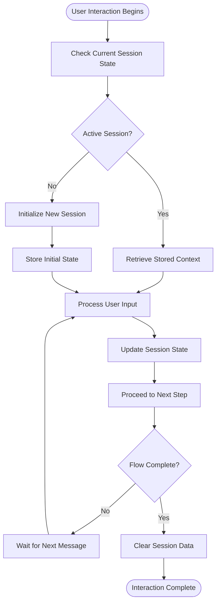
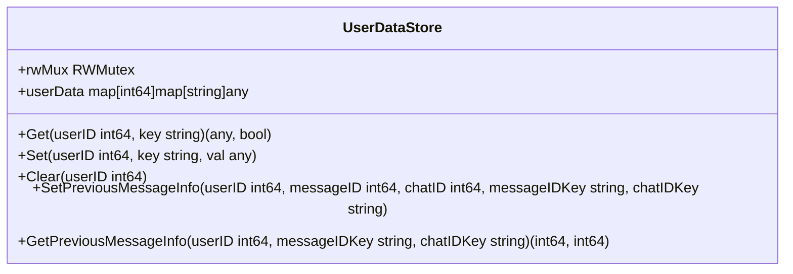
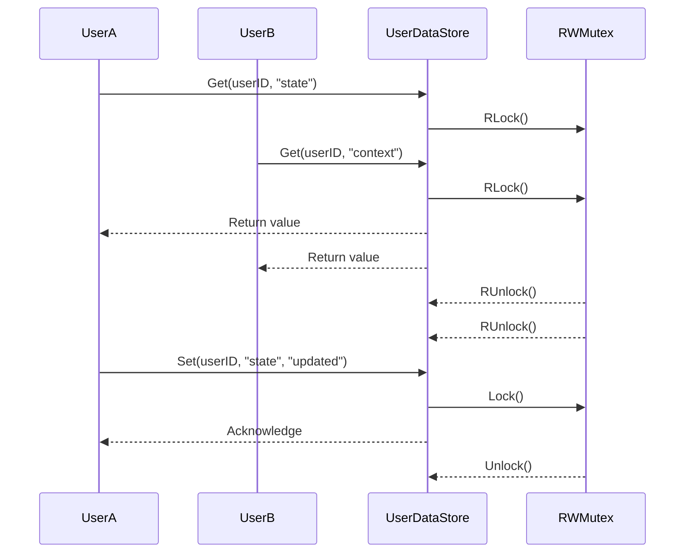

# Telegram Session Repository

<cite>
**Referenced Files in This Document**   
- [datastore_utils.go](file://internal/utils/datastore_utils.go)
- [datastore_utils_test.go](file://internal/utils/datastore_utils_test.go)
- [profiles_manager_handler.go](file://internal/handlers/adminhandlers/profiles_manager_handler.go)
- [event_setup_handler.go](file://internal/handlers/adminhandlers/eventhandlers/event_setup_handler.go)
- [profile_handler.go](file://internal/handlers/privatehandlers/profile_handler.go)
- [content_handler.go](file://internal/handlers/privatehandlers/content_handler.go)
- [topic_add_handler.go](file://internal/handlers/privatehandlers/topicshandlers/topic_add_handler.go)
- [intro_handler.go](file://internal/handlers/privatehandlers/intro_handler.go)
</cite>

## Table of Contents
1. [Introduction](#introduction)
2. [Session Management Overview](#session-management-overview)
3. [Domain Model of User Session](#domain-model-of-user-session)
4. [Core Session Methods](#core-session-methods)
5. [Usage Patterns in Multi-Step Processes](#usage-patterns-in-multi-step-processes)
6. [Thread Safety and Concurrency](#thread-safety-and-concurrency)
7. [Integration with Telegram Handlers](#integration-with-telegram-handlers)
8. [Lifecycle and Cleanup](#lifecycle-and-cleanup)
9. [Testing and Validation](#testing-and-validation)
10. [Common Issues and Recommendations](#common-issues-and-recommendations)
11. [Conclusion](#conclusion)

## Introduction

The Telegram Session Repository in the `evocoders-bot-go` project is responsible for managing user interaction states during multi-step conversations. Unlike traditional session storage that relies on external databases or file systems, this implementation uses an in-memory, thread-safe data structure to track user context across messages. This approach enables the bot to handle complex workflows such as profile creation, event setup, and content search while maintaining conversation continuity in private chats.

Although a dedicated `tg_sessions` database table was initially created (as seen in migration `20250401_initial_migration.go`), it was later removed (migration `20250919_remove_tg_sessions_table.go`), indicating a shift toward in-memory state management. The current implementation leverages the `UserDataStore` struct defined in `datastore_utils.go`, which serves as the de facto session repository.

**Section sources**
- [datastore_utils.go](file://internal/utils/datastore_utils.go#L1-L72)
- [20250401_initial_migration.go](file://internal/database/migrations/implementations/20250401_initial_migration.go#L1-L10)
- [20250919_remove_tg_sessions_table.go](file://internal/database/migrations/implementations/20250919_remove_tg_sessions_table.go#L1-L10)

## Session Management Overview

The session management system is built around the `UserDataStore` type, which provides a concurrent-safe key-value store indexed by user ID. Each user’s session data is stored as a nested map where the outer map uses `int64` user IDs as keys, and the inner maps store arbitrary data using string keys. This design supports flexible storage of intermediate form data, conversation state, and temporary metadata.

The system is designed for ephemeral state tracking rather than persistent storage, making it ideal for short-lived interactions like form filling or guided setup flows. Since sessions are stored in memory, they are transient and reset when the application restarts, which aligns with the stateless nature of many Telegram bot interactions.

**Diagram sources**
- [datastore_utils.go](file://internal/utils/datastore_utils.go#L10-L20)
- [datastore_utils.go](file://internal/utils/datastore_utils.go#L30-L50)

## Domain Model of User Session

Each user session is modeled as a collection of key-value pairs associated with a unique Telegram user ID (`int64`). The domain model includes the following core elements:

- **User ID**: The primary key identifying the user, typically derived from Telegram’s user object.
- **State Key**: A string identifier representing the current step or mode in a multi-step process (e.g., `"awaiting_profile_name"`).
- **Context Data**: Arbitrary data stored under specific keys, such as partial form inputs, message IDs, or workflow flags.
- **Metadata**: Additional tracking information like previous message IDs and chat IDs, used for message editing or deletion.

The session does not include explicit expiration or TTL mechanisms in the current implementation, relying instead on manual cleanup after workflow completion. This places responsibility on handler logic to properly terminate sessions.

**Section sources**
- [datastore_utils.go](file://internal/utils/datastore_utils.go#L10-L72)

## Core Session Methods

The `UserDataStore` interface provides essential operations for session management:

### Set Method
Stores a value for a given user and key. If the user does not exist in the store, a new entry is created automatically.

[SPEC SYMBOL](file://internal/utils/datastore_utils.go#L40-L48)

### Get Method
Retrieves a value by user ID and key. Returns both the value and a boolean indicating whether the key existed.

[SPEC SYMBOL](file://internal/utils/datastore_utils.go#L30-L38)

### Clear Method
Removes all session data for a specific user, effectively ending their active session.

[SPEC SYMBOL](file://internal/utils/datastore_utils.go#L50-L55)

### SetPreviousMessageInfo / GetPreviousMessageInfo
Convenience methods for storing and retrieving message and chat identifiers, commonly used to edit or delete previous bot messages.

[SPEC SYMBOL](file://internal/utils/datastore_utils.go#L57-L72)

All methods are thread-safe due to the use of `sync.RWMutex`, ensuring safe concurrent access from multiple goroutines.

**Diagram sources**
- [datastore_utils.go](file://internal/utils/datastore_utils.go#L10-L72)

## Usage Patterns in Multi-Step Processes

The session repository is extensively used in multi-step workflows across various handlers. Common patterns include:

### Profile Creation
During profile setup, handlers store intermediate inputs such as name, surname, and bio. Each step updates the session with new data until the final submission.

[SPEC SYMBOL](file://internal/handlers/adminhandlers/profiles_manager_handler.go#L15-L30)

### Event Setup
The event creation flow uses session state to track which field is currently being filled (e.g., event name, date, type). The bot responds differently based on the current state key.

[SPEC SYMBOL](file://internal/handlers/adminhandlers/eventhandlers/event_setup_handler.go#L20-L40)

### Content Search
When users initiate a search query, the bot stores the search term and context to support follow-up actions like filtering or refinement.

[SPEC SYMBOL](file://internal/handlers/privatehandlers/content_handler.go#L35-L50)

### Topic Addition
In private chats, adding a new topic involves prompting the user for input and storing the temporary entry before saving it to the database.

[SPEC SYMBOL](file://internal/handlers/privatehandlers/topicshandlers/topic_add_handler.go#L25-L40)

These patterns demonstrate how the session acts as a temporary buffer between user messages and backend persistence.

**Section sources**
- [profiles_manager_handler.go](file://internal/handlers/adminhandlers/profiles_manager_handler.go#L10-L50)
- [event_setup_handler.go](file://internal/handlers/adminhandlers/eventhandlers/event_setup_handler.go#L15-L60)
- [content_handler.go](file://internal/handlers/privatehandlers/content_handler.go#L30-L70)
- [topic_add_handler.go](file://internal/handlers/privatehandlers/topicshandlers/topic_add_handler.go#L20-L60)

## Thread Safety and Concurrency

Given that Telegram bots may receive messages from multiple users simultaneously, thread safety is critical. The `UserDataStore` employs a `sync.RWMutex` to protect access to the underlying data structure:

- **Read operations** (e.g., `Get`) use `RLock()` to allow concurrent reads.
- **Write operations** (e.g., `Set`, `Clear`) use `Lock()` to ensure exclusive access.

This design enables high concurrency for read-heavy workloads while preventing race conditions during state updates. However, under high load, contention on the mutex could become a bottleneck, especially if long-running operations hold the lock.

**Diagram sources**
- [datastore_utils.go](file://internal/utils/datastore_utils.go#L30-L55)

## Integration with Telegram Handlers

Handlers access the session store through dependency injection. For example, the `ProfileHandler` receives a `UserDataStore` instance during initialization and uses it to maintain conversation state.

[SPEC SYMBOL](file://internal/handlers/privatehandlers/profile_handler.go#L15-L25)

Similarly, the `IntroHandler` uses session data to guide new users through onboarding steps, checking their progress on each message.

[SPEC SYMBOL](file://internal/handlers/privatehandlers/intro_handler.go#L20-L35)

This pattern ensures loose coupling between business logic and state management, allowing handlers to remain focused on interaction flow rather than storage mechanics.

**Section sources**
- [profile_handler.go](file://internal/handlers/privatehandlers/profile_handler.go#L10-L40)
- [intro_handler.go](file://internal/handlers/privatehandlers/intro_handler.go#L15-L50)

## Lifecycle and Cleanup

Session lifecycle is managed manually by handlers. After completing a workflow (e.g., saving a profile), the handler calls `Clear()` to remove all session data for the user.

Failure to clear sessions can lead to memory leaks, especially in long-running bots with many active users. While the current implementation lacks automatic expiration, introducing a TTL-based cleanup mechanism (e.g., using a background goroutine to purge stale sessions) would improve scalability.

[SPEC SYMBOL](file://internal/utils/datastore_utils.go#L50-L55)

**Section sources**
- [datastore_utils.go](file://internal/utils/datastore_utils.go#L50-L55)

## Testing and Validation

The session repository is thoroughly tested using Go’s standard testing framework and `testify/assert`. Tests verify:

- Initialization of empty stores
- Correct retrieval and storage of values
- Behavior with non-existent users or keys
- Proper clearing of user data
- Concurrent access safety

[SPEC SYMBOL](file://internal/utils/datastore_utils_test.go#L1-L90)

These tests ensure reliability and correctness under various conditions, including edge cases like missing keys or concurrent modifications.

**Section sources**
- [datastore_utils_test.go](file://internal/utils/datastore_utils_test.go#L1-L90)

## Common Issues and Recommendations

### Potential Issues
- **Memory Growth**: Without automatic cleanup, inactive sessions accumulate.
- **No Persistence**: Application restarts lose all session data.
- **Race Conditions**: Although mitigated by mutexes, improper usage could still cause issues.
- **Scalability Limits**: In-memory storage restricts horizontal scaling.

### Recommendations
- **Implement TTL**: Add automatic expiration (e.g., 15–30 minutes) for idle sessions.
- **Use External Storage**: For production-scale bots, consider Redis or similar for distributed session storage.
- **Monitor Memory Usage**: Track session count and size to detect leaks.
- **Graceful Recovery**: On restart, reinitialize critical sessions from persistent data where possible.

These improvements would enhance robustness and support larger user bases.

## Conclusion

The Telegram Session Repository in `evocoders-bot-go` provides a lightweight, thread-safe mechanism for managing user interaction states. Built around the `UserDataStore` type, it supports essential operations for storing, retrieving, and clearing session data during multi-step processes. While currently in-memory and manually managed, the design is effective for short-lived workflows in private chats. Future enhancements could include automatic expiration and external storage to improve scalability and resilience.