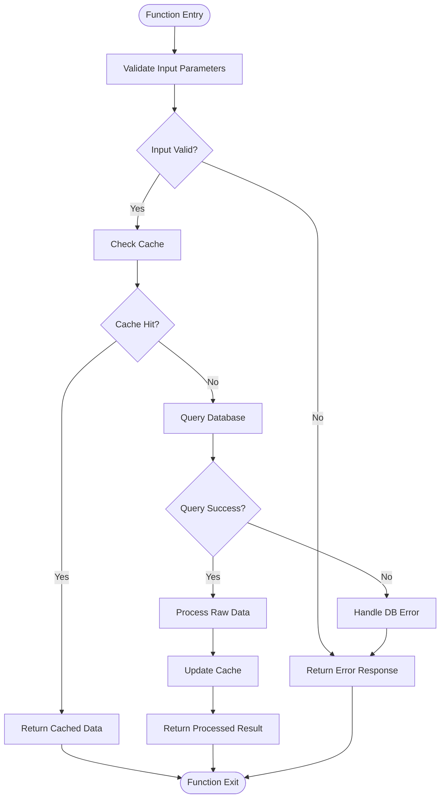
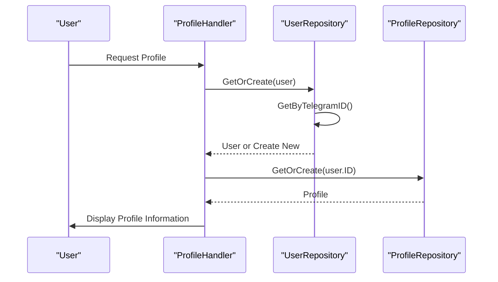
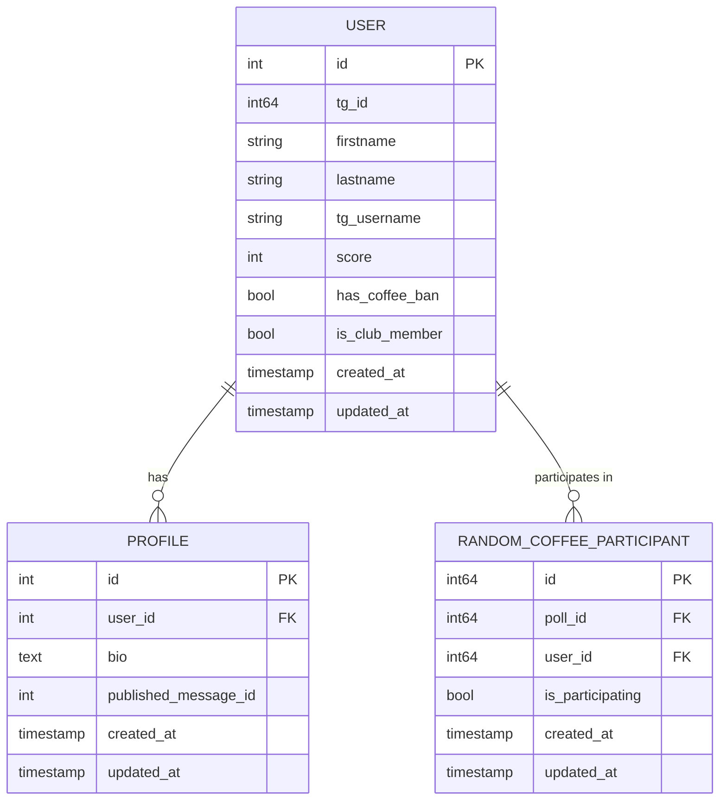

# User Repository

<cite>
**Referenced Files in This Document**   
- [user_repository.go](file://internal/database/repositories/user_repository.go)
- [profile_repository.go](file://internal/database/repositories/profile_repository.go)
- [random_coffee_participant_repository.go](file://internal/database/repositories/random_coffee_participant_repository.go)
- [profile_handler.go](file://internal/handlers/privatehandlers/profile_handler.go)
- [profiles_manager_handler.go](file://internal/handlers/adminhandlers/profiles_manager_handler.go)
- [random_coffee_service.go](file://internal/services/random_coffee_service.go)
</cite>

## Table of Contents
1. [Introduction](#introduction)
2. [Domain Model](#domain-model)
3. [Core Functions](#core-functions)
4. [Usage Patterns](#usage-patterns)
5. [Relationships with Other Components](#relationships-with-other-components)
6. [Error Handling and Edge Cases](#error-handling-and-edge-cases)
7. [Performance and Transaction Safety](#performance-and-transaction-safety)
8. [Conclusion](#conclusion)

## Introduction
The User Repository component in evocoders-bot-go is responsible for managing user records within the application's database. It provides a comprehensive interface for creating, retrieving, updating, and deleting user data, while also supporting specialized operations such as checking club membership status and managing user scores. This repository serves as a critical data access layer between the application logic and the underlying PostgreSQL database, ensuring consistent and reliable user data management across various features including profile management, random coffee pairings, and permission checks.

**Section sources**
- [user_repository.go](file://internal/database/repositories/user_repository.go#L1-L50)

## Domain Model
The User entity represents a row in the users table and contains essential information about each user in the system. The model includes both identification data and behavioral attributes that support various application features.

```mermaid
classDiagram
class User {
+int ID
+int64 TgID
+string Firstname
+string Lastname
+string TgUsername
+int Score
+bool HasCoffeeBan
+bool IsClubMember
+time.Time CreatedAt
+time.Time UpdatedAt
}
class UserRepository {
+*sql.DB db
+GetByID(id int) (*User, error)
+GetByTelegramID(tgID int64) (*User, error)
+GetByTelegramUsername(tgUsername string) (*User, error)
+Create(tgID int64, firstname string, lastname string, username string) (int, error)
+Update(id int, fields map[string]interface{}) error
+Delete(id int) error
+UpdateScore(id int, score int) error
+SetCoffeeBan(id int, banned bool) error
+SetClubMemberStatus(id int, isMember bool) error
+UpdateTelegramUsername(id int, username string) error
+UpdateFirstname(id int, firstname string) error
+UpdateLastname(id int, lastname string) error
+GetOrCreate(tgUser *gotgbot.User) (*User, error)
+GetOrFullCreate(user *gotgbot.User) (*User, *Profile, error)
+SearchByName(firstname, lastname string) (*User, error)
}
User "1" -- "1" UserRepository : "managed by"
```

**Diagram sources**
- [user_repository.go](file://internal/database/repositories/user_repository.go#L13-L24)

**Section sources**
- [user_repository.go](file://internal/database/repositories/user_repository.go#L13-L24)

## Core Functions
The User Repository provides a comprehensive set of functions for user data management. These functions are designed to handle both simple CRUD operations and more complex business logic requirements.

### Creation and Retrieval
The repository offers multiple methods for retrieving user records based on different identifiers. The `GetByID` method retrieves a user by their internal database ID, while `GetByTelegramID` and `GetByTelegramUsername` allow lookup by Telegram-specific identifiers. Each retrieval method returns a pointer to a User struct and an error, with `sql.ErrNoRows` indicating that no user was found.

For user creation, the `Create` method inserts a new user record with default values for certain fields. When a new user is created, they are automatically assigned a score of 0, no coffee ban status, and club membership is set to true by default. The method returns the newly created user's ID and any error encountered during insertion.



**Diagram sources**
- [user_repository.go](file://internal/database/repositories/user_repository.go#L75-L105)

**Section sources**
- [user_repository.go](file://internal/database/repositories/user_repository.go#L50-L150)

### Update Operations
The User Repository provides both general and specialized update methods. The `Update` method allows modification of multiple user fields through a map of field names to values, building dynamic SQL queries based on the provided fields. This method includes validation to ensure at least one field is being updated and checks the number of affected rows to confirm the update was successful.

Specialized update methods include `UpdateScore`, `SetCoffeeBan`, `SetClubMemberStatus`, and individual field updates for firstname, lastname, and Telegram username. Each of these methods performs targeted updates to specific user attributes, with appropriate error handling and row affected validation.

### Existence Verification and Search
The `GetOrCreate` method implements a common pattern for ensuring a user exists in the database. It first attempts to retrieve an existing user by Telegram ID. If the user exists, it checks whether any profile information (firstname, lastname, username) has changed and updates the record accordingly. If the user doesn't exist, it creates a new record with the provided information.

The `SearchByName` method enables searching for users by their first and last name combination, performing case-insensitive matching using PostgreSQL's LOWER function. This method is particularly useful for profile search functionality where users may be identified by their real names rather than Telegram identifiers.

**Section sources**
- [user_repository.go](file://internal/database/repositories/user_repository.go#L150-L423)

## Usage Patterns
The User Repository is integrated throughout the application to support various user-facing features and administrative functions.

### Profile Management
In the profile management workflow, the User Repository is used extensively to verify user existence, retrieve user information, and update user details. When a user accesses their profile, the system uses `GetOrCreate` to ensure the user record exists and is up-to-date with the latest information from Telegram.



**Diagram sources**
- [profile_handler.go](file://internal/handlers/privatehandlers/profile_handler.go#L200-L300)
- [user_repository.go](file://internal/database/repositories/user_repository.go#L350-L390)

### Permission and Club Membership Checks
The repository supports permission checks by providing access to the `IsClubMember` field, which determines whether a user has access to certain features. Administrative handlers use methods like `GetByTelegramUsername` and `SearchByName` to locate users for management purposes, enabling administrators to search for users by various identifiers.

### Random Coffee Functionality
The User Repository plays a crucial role in the random coffee pairing system. The `GetParticipatingUsers` method in the RandomCoffeeParticipantRepository joins user data with participation records to identify users who have opted into the current coffee poll. This integration allows the system to generate pairs while maintaining user information consistency across the application.

**Section sources**
- [profile_handler.go](file://internal/handlers/privatehandlers/profile_handler.go#L200-L400)
- [profiles_manager_handler.go](file://internal/handlers/adminhandlers/profiles_manager_handler.go#L300-L500)
- [random_coffee_service.go](file://internal/services/random_coffee_service.go#L200-L300)

## Relationships with Other Components
The User Repository maintains critical relationships with several other components in the system architecture.

### Profile Integration
The User and Profile entities have a one-to-one relationship, with each user having exactly one profile. This relationship is enforced through foreign key constraints in the database schema. The `GetOrFullCreate` method demonstrates this integration by retrieving or creating both a user and their associated profile in a single operation.

### Random Coffee Participant Relationship
Users can participate in random coffee events, with their participation status tracked in the random_coffee_participants table. The User Repository provides the foundational user data that is joined with participation records to determine who is eligible for pairing. This relationship enables the system to maintain historical pairing data while ensuring user information remains consistent.



**Diagram sources**
- [user_repository.go](file://internal/database/repositories/user_repository.go#L13-L24)
- [profile_repository.go](file://internal/database/repositories/profile_repository.go#L15-L25)
- [random_coffee_participant_repository.go](file://internal/database/repositories/random_coffee_participant_repository.go#L5-L15)

**Section sources**
- [user_repository.go](file://internal/database/repositories/user_repository.go#L13-L24)
- [profile_repository.go](file://internal/database/repositories/profile_repository.go#L15-L25)
- [random_coffee_participant_repository.go](file://internal/database/repositories/random_coffee_participant_repository.go#L5-L15)

## Error Handling and Edge Cases
The User Repository implements comprehensive error handling to address various edge cases and potential failure scenarios.

### Race Conditions During User Creation
The `GetOrCreate` method addresses potential race conditions that could occur when multiple requests attempt to create the same user simultaneously. By first attempting to retrieve the user and only creating a new record if none exists, the method ensures data consistency. The underlying database constraints prevent duplicate user records based on Telegram ID.

### Nullable Field Handling
The repository handles nullable fields appropriately, particularly in related components. For example, the Profile entity includes a `PublishedMessageID` field of type `sql.NullInt64`, which can represent both valid message IDs and null values when a profile has not been published. This pattern allows the system to distinguish between unset values and default values.

### Input Validation and Sanitization
While the repository itself focuses on data access rather than validation, it works in conjunction with higher-level components to ensure data integrity. For instance, the profile handler validates input length before calling repository update methods, preventing database errors due to field size constraints.

**Section sources**
- [user_repository.go](file://internal/database/repositories/user_repository.go#L350-L390)
- [profile_repository.go](file://internal/database/repositories/profile_repository.go#L15-L25)

## Performance and Transaction Safety
The User Repository is designed with performance and data integrity in mind, implementing several optimization strategies and safety measures.

### Query Optimization
The repository uses parameterized queries to prevent SQL injection attacks and improve query plan caching. Indexes on key fields such as `tg_id` and `tg_username` ensure fast lookups, while the use of `QueryRow` for single-row results minimizes data transfer overhead.

### Transaction Safety
While individual repository methods typically operate within implicit transactions, the design allows for integration with explicit transaction management when needed. The row affected checks after update and delete operations provide assurance that the intended records were modified, helping to prevent silent failures.

### Connection Management
The repository relies on the underlying database connection pool managed by the sql.DB instance, ensuring efficient connection reuse and proper resource management. This approach prevents connection leaks and optimizes database resource utilization across concurrent requests.

**Section sources**
- [user_repository.go](file://internal/database/repositories/user_repository.go#L50-L423)

## Conclusion
The User Repository component provides a robust and comprehensive interface for managing user data in the evocoders-bot-go application. By offering a wide range of retrieval, creation, and update methods, it supports diverse use cases from profile management to event participation. The repository's integration with related components like Profile and RandomCoffeeParticipant enables rich functionality while maintaining data consistency. Its thoughtful error handling and performance optimizations ensure reliable operation even under concurrent access patterns. For developers, the repository offers a clear and consistent API that abstracts database complexity while providing the flexibility needed for various application features.