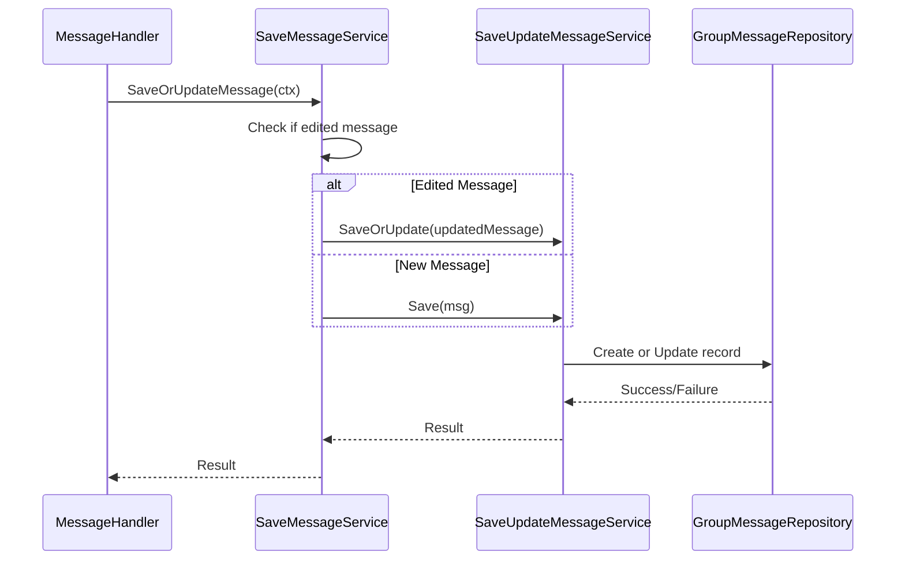
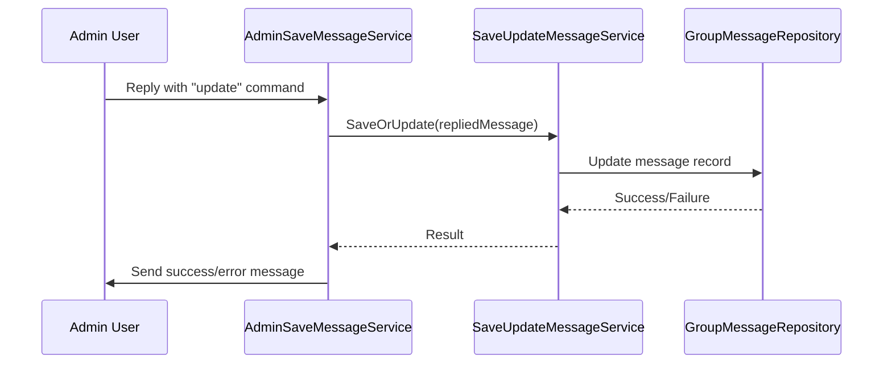
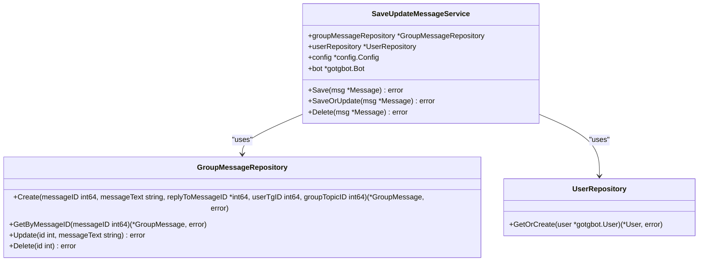
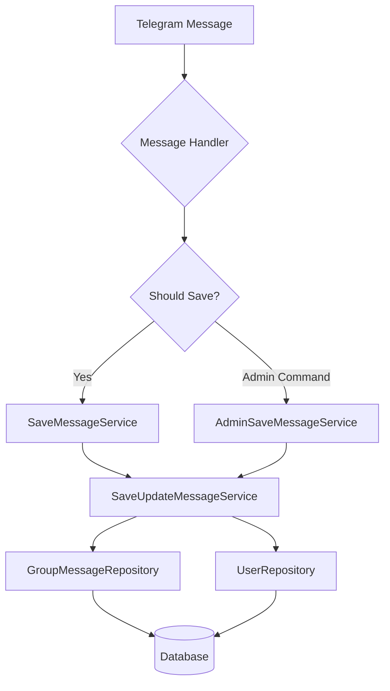

# Save Update Message Service

<cite>
**Referenced Files in This Document**   
- [save_update_message_service.go](file://internal/services/grouphandlersservices/save_update_message_service.go)
- [save_message_service.go](file://internal/services/grouphandlersservices/save_message_service.go)
- [admin_save_message_service.go](file://internal/services/grouphandlersservices/admin_save_message_service.go)
- [message_handler.go](file://internal/handlers/grouphandlers/message_handler.go)
- [group_message_repository.go](file://internal/database/repositories/group_message_repository.go)
</cite>

## Table of Contents
1. [Introduction](#introduction)
2. [Core Methods](#core-methods)
3. [Integration with Group Handlers](#integration-with-group-handlers)
4. [Message Handling Patterns](#message-handling-patterns)
5. [Service Architecture](#service-architecture)
6. [Separation of Concerns](#separation-of-concerns)
7. [Error Handling and Logging](#error-handling-and-logging)

## Introduction
The SaveUpdateMessageService is a core component responsible for managing message persistence in the database. It handles three primary operations: saving new messages, updating edited messages, and deleting messages from both Telegram and the database. The service acts as a bridge between Telegram message events and the underlying database storage, ensuring that all relevant messages are properly stored and synchronized.

The service plays a critical role in maintaining message history and enabling features that depend on message data, such as summarization, content analysis, and user activity tracking. It works in conjunction with various handlers to process messages based on their context and content.

**Section sources**
- [save_update_message_service.go](file://internal/services/grouphandlersservices/save_update_message_service.go#L1-L220)

## Core Methods
The SaveUpdateMessageService provides three main methods for message management: Save, SaveOrUpdate, and Delete.

### Save Method
The Save method stores a new message in the database. It extracts message content, converts it to HTML format, and creates a new record in the group_messages table. The method also handles user information by ensuring the sender exists in the database.

[SPEC SYMBOL](file://internal/services/grouphandlersservices/save_update_message_service.go#L42-L44)

### SaveOrUpdate Method
The SaveOrUpdate method handles both new messages and edited messages. When a message edit is detected, it first checks if the message exists in the database. If found, it compares the new content with the existing content and updates only if changes are detected. This prevents unnecessary database writes when no actual content changes occur.

[SPEC SYMBOL](file://internal/services/grouphandlersservices/save_update_message_service.go#L46-L74)

### Delete Method
The Delete method removes a message from both Telegram and the database. It first attempts to retrieve the message from the database to get its internal ID, then deletes it from Telegram, and finally removes it from the database. The method is designed to continue processing even if some steps fail, ensuring maximum cleanup.

[SPEC SYMBOL](file://internal/services/grouphandlersservices/save_update_message_service.go#L114-L149)

**Section sources**
- [save_update_message_service.go](file://internal/services/grouphandlersservices/save_update_message_service.go#L42-L149)

## Integration with Group Handlers
The SaveUpdateMessageService is integrated into the message processing pipeline through multiple handler services that determine when and how messages should be saved or updated.

### SaveMessageService Integration
The SaveMessageService acts as an intermediary between the message handler and the SaveUpdateMessageService. It processes incoming message updates and delegates to the appropriate SaveUpdateMessageService method based on whether the message is new or edited.

**Diagram sources**
- [save_message_service.go](file://internal/services/grouphandlersservices/save_message_service.go#L39-L52)
- [save_update_message_service.go](file://internal/services/grouphandlersservices/save_update_message_service.go#L42-L74)

### AdminSaveMessageService Integration
The AdminSaveMessageService provides administrative control over message persistence. Administrators can use specific commands to explicitly save, update, or delete messages by replying to them with "update" or "delete" commands.

**Diagram sources**
- [admin_save_message_service.go](file://internal/services/grouphandlersservices/admin_save_message_service.go#L50-L113)

**Section sources**
- [save_message_service.go](file://internal/services/grouphandlersservices/save_message_service.go#L39-L52)
- [admin_save_message_service.go](file://internal/services/grouphandlersservices/admin_save_message_service.go#L50-L113)

## Message Handling Patterns
The system implements distinct patterns for handling different types of message events, ensuring appropriate processing based on message context.

### New Message Processing
When a new message arrives, the system follows this flow:
1. MessageHandler receives the message
2. SaveMessageService determines if the message should be saved
3. SaveUpdateMessageService.Save() is called
4. Message is stored in the database with all relevant metadata

[SPEC SYMBOL](file://internal/services/grouphandlersservices/save_message_service.go#L50-L52)

### Edited Message Processing
When a message is edited, the system follows this flow:
1. MessageHandler receives the edited message update
2. SaveMessageService detects the edit
3. SaveUpdateMessageService.SaveOrUpdate() is called
4. Service checks if message exists in database
5. If exists and content changed, update the record
6. If doesn't exist, save as new message

[SPEC SYMBOL](file://internal/services/grouphandlersservices/save_message_service.go#L40-L48)

### Message Deletion Processing
Messages can be deleted through two pathways:
- Automatic deletion when a user sends a "delete" command
- Administrative deletion when an admin replies with "delete"

Both pathways ultimately call SaveUpdateMessageService.Delete(), which removes the message from both Telegram and the database.

[SPEC SYMBOL](file://internal/services/grouphandlersservices/save_message_service.go#L44-L46)
[SPEC SYMBOL](file://internal/services/grouphandlersservices/admin_save_message_service.go#L100-L113)

**Section sources**
- [save_message_service.go](file://internal/services/grouphandlersservices/save_message_service.go#L39-L52)
- [admin_save_message_service.go](file://internal/services/grouphandlersservices/admin_save_message_service.go#L100-L113)

## Service Architecture
The SaveUpdateMessageService is designed with clear dependencies and responsibilities, following the dependency injection pattern.

**Diagram sources**
- [save_update_message_service.go](file://internal/services/grouphandlersservices/save_update_message_service.go#L14-L19)
- [group_message_repository.go](file://internal/database/repositories/group_message_repository.go#L25-L304)
- [user_repository.go](file://internal/database/repositories/user_repository.go#L1-L200)

**Section sources**
- [save_update_message_service.go](file://internal/services/grouphandlersservices/save_update_message_service.go#L14-L19)

## Separation of Concerns
The system demonstrates clear separation of concerns between handlers and services, with each component having well-defined responsibilities.

### Handler Responsibilities
Handlers are responsible for:
- Determining when message persistence operations should occur
- Interpreting user commands and intents
- Extracting relevant message data from context
- Delegating persistence operations to services

### Service Responsibilities
Services are responsible for:
- Implementing business logic for message persistence
- Interacting with the database through repositories
- Handling errors and providing feedback
- Maintaining data consistency across systems

This separation allows handlers to focus on message routing and command interpretation, while services handle the complexities of data storage and retrieval.

**Diagram sources**
- [message_handler.go](file://internal/handlers/grouphandlers/message_handler.go#L23-L85)
- [save_message_service.go](file://internal/services/grouphandlersservices/save_message_service.go#L39-L52)
- [admin_save_message_service.go](file://internal/services/grouphandlersservices/admin_save_message_service.go#L50-L113)
- [save_update_message_service.go](file://internal/services/grouphandlersservices/save_update_message_service.go#L42-L149)

**Section sources**
- [message_handler.go](file://internal/handlers/grouphandlers/message_handler.go#L23-L85)

## Error Handling and Logging
The SaveUpdateMessageService implements comprehensive error handling and logging to ensure reliability and provide visibility into message processing operations.

### Error Handling Strategy
The service follows a resilient error handling approach:
- Database lookup failures are handled gracefully when deleting messages
- Telegram deletion failures do not prevent database cleanup
- Content extraction errors are minimized through defensive programming
- User operations are non-blocking to prevent message processing failures

### Logging Practices
The service uses structured logging to track message operations:
- Successful saves and updates are logged with message and user IDs
- Database operations are logged with internal and external message IDs
- Errors are logged with context and error chains
- Deletion operations are logged at multiple stages

[SPEC SYMBOL](file://internal/services/grouphandlersservices/save_update_message_service.go#L116-L147)

**Section sources**
- [save_update_message_service.go](file://internal/services/grouphandlersservices/save_update_message_service.go#L114-L149)