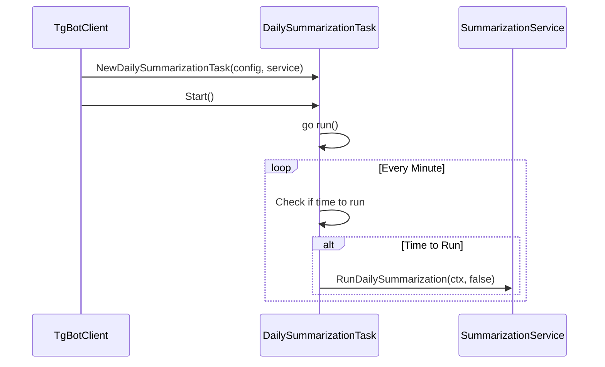
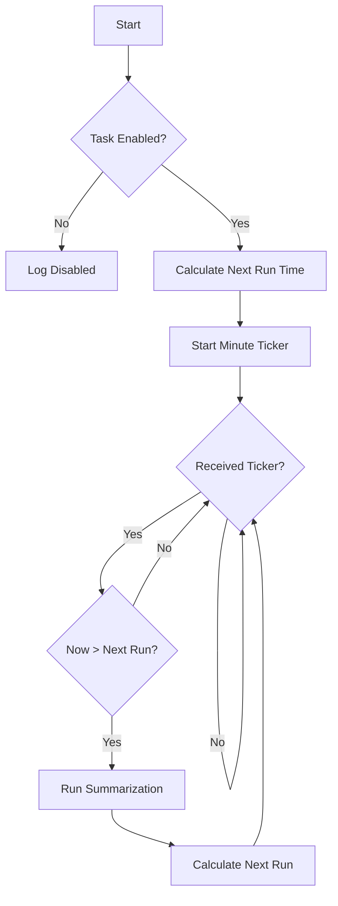
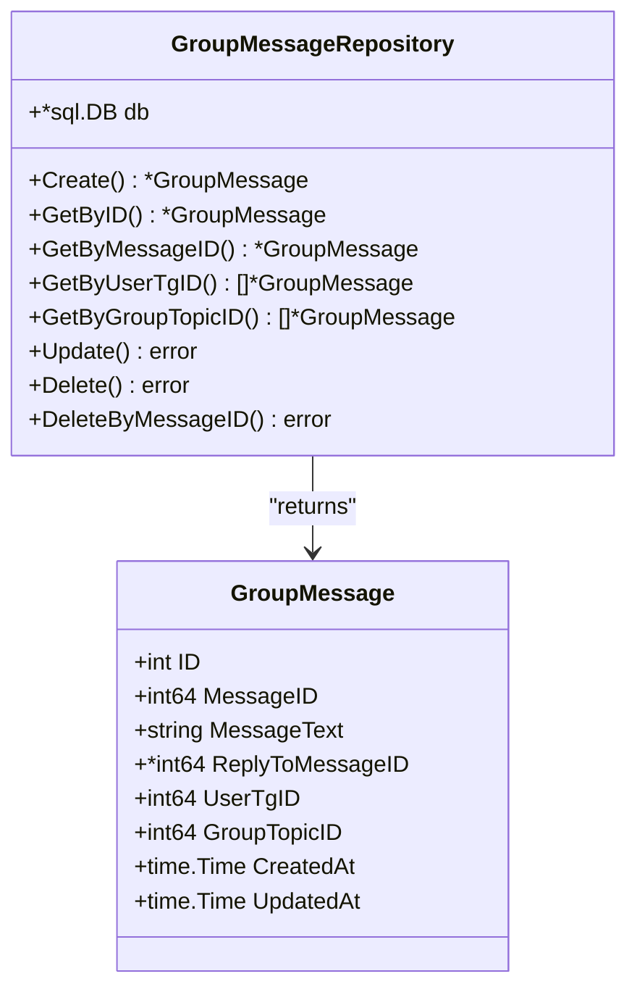
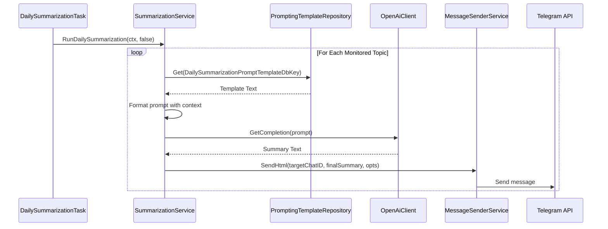
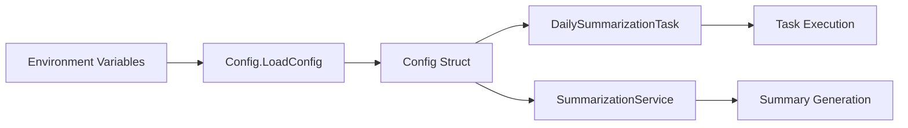
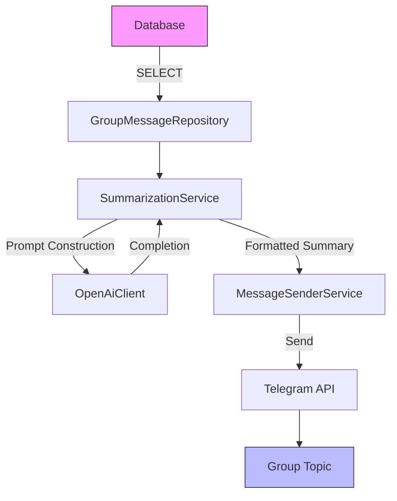
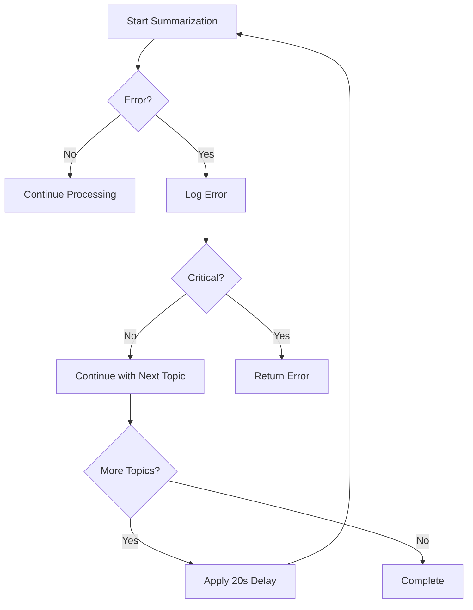

# Daily Summarization Task

<cite>
**Referenced Files in This Document**   
- [daily_summarization_task.go](file://internal/tasks/daily_summarization_task.go)
- [summarization_service.go](file://internal/services/summarization_service.go)
- [group_message_repository.go](file://internal/database/repositories/group_message_repository.go)
- [bot.go](file://internal/bot/bot.go)
- [config.go](file://internal/config/config.go)
</cite>

## Table of Contents
1. [Introduction](#introduction)
2. [Task Initialization and Lifecycle](#task-initialization-and-lifecycle)
3. [Scheduling Mechanism](#scheduling-mechanism)
4. [Message Collection Process](#message-collection-process)
5. [Summarization Service Workflow](#summarization-service-workflow)
6. [Configuration and Environment Variables](#configuration-and-environment-variables)
7. [Domain Model and Data Flow](#domain-model-and-data-flow)
8. [Error Handling and Resilience](#error-handling-and-resilience)
9. [Integration with Telegram Bot Lifecycle](#integration-with-telegram-bot-lifecycle)
10. [Troubleshooting Common Issues](#troubleshooting-common-issues)

## Introduction
The daily_summarization_task component in evocoders-bot-go is responsible for automatically generating AI-powered summaries of recent group messages at a scheduled time. This task operates as part of the bot's background job system, collecting message data from monitored topics, processing it through an OpenAI-powered summarization service, and posting the resulting summary back to a designated Telegram group topic. The implementation follows a clean separation of concerns between task scheduling, data retrieval, AI processing, and message delivery layers.

**Section sources**
- [daily_summarization_task.go](file://internal/tasks/daily_summarization_task.go#L1-L100)

## Task Initialization and Lifecycle
The DailySummarizationTask is initialized with configuration parameters and a reference to the SummarizationService. It follows a standard lifecycle pattern with Start and Stop methods that integrate with the bot's overall lifecycle management. The task is created during bot initialization in bot.go and added to the list of scheduled tasks that are started when the bot begins polling for updates.



**Diagram sources**
- [daily_summarization_task.go](file://internal/tasks/daily_summarization_task.go#L15-L99)
- [bot.go](file://internal/bot/bot.go#L150-L160)

**Section sources**
- [daily_summarization_task.go](file://internal/tasks/daily_summarization_task.go#L15-L45)
- [bot.go](file://internal/bot/bot.go#L150-L160)

## Scheduling Mechanism
The task uses Go's time.Ticker to check every minute whether it's time to execute the summarization process. The scheduling logic calculates the next run time based on the configured SummaryTime in UTC, using a ticker pattern that balances precision with resource efficiency. When the current time exceeds the next scheduled run time, the task triggers the summarization process and then calculates the next day's execution time.



**Diagram sources**
- [daily_summarization_task.go](file://internal/tasks/daily_summarization_task.go#L50-L99)

**Section sources**
- [daily_summarization_task.go](file://internal/tasks/daily_summarization_task.go#L50-L99)

## Message Collection Process
The message collection process is handled by the GroupMessageRepository, which retrieves recent messages from the database for each monitored topic. The summarization service queries messages from the past 24 hours, using the GetByGroupTopicID method to fetch message records. Each message includes metadata such as sender ID, timestamp, and message content, which are formatted into context for the AI model.



**Diagram sources**
- [group_message_repository.go](file://internal/database/repositories/group_message_repository.go#L10-L264)

**Section sources**
- [group_message_repository.go](file://internal/database/repositories/group_message_repository.go#L10-L264)
- [summarization_service.go](file://internal/services/summarization_service.go#L60-L80)

## Summarization Service Workflow
The SummarizationService orchestrates the end-to-end summarization process, coordinating between the OpenAI client, message repository, and message sender. It processes each monitored topic sequentially with a 20-second delay between topics to avoid rate limiting. The service retrieves a prompt template from the database, formats it with message context and metadata, and sends it to the OpenAI API for completion. The resulting summary is then posted to the designated Telegram topic.



**Diagram sources**
- [summarization_service.go](file://internal/services/summarization_service.go#L30-L177)

**Section sources**
- [summarization_service.go](file://internal/services/summarization_service.go#L30-L177)

## Configuration and Environment Variables
The daily summarization task is controlled by several environment variables that determine its behavior and schedule. These configurations are loaded into the Config struct during application startup and include timing parameters, topic IDs, and feature toggles. The configuration system provides default values for optional settings while requiring essential parameters to be explicitly set.

**Configuration Options**
- **TG_EVO_BOT_SUMMARY_TIME**: Time of day to run summarization (default: "03:00")
- **TG_EVO_BOT_MONITORED_TOPICS_IDS**: Comma-separated list of topic IDs to monitor
- **TG_EVO_BOT_SUMMARY_TOPIC_ID**: Topic ID where summaries are posted
- **TG_EVO_BOT_SUMMARIZATION_TASK_ENABLED**: Feature toggle (default: true)
- **TG_EVO_BOT_SUPERGROUP_CHAT_ID**: Main group chat identifier



**Section sources**
- [config.go](file://internal/config/config.go#L50-L150)
- [daily_summarization_task.go](file://internal/tasks/daily_summarization_task.go#L15-L25)
- [summarization_service.go](file://internal/services/summarization_service.go#L15-L25)

## Domain Model and Data Flow
The daily summarization process follows a clear domain model with well-defined data flow between components. Messages are collected from the database, formatted into AI context, processed by the OpenAI service, and delivered back to Telegram. The data flow maintains separation between domain entities, service logic, and external integrations.



**Diagram sources**
- [summarization_service.go](file://internal/services/summarization_service.go#L30-L177)
- [group_message_repository.go](file://internal/database/repositories/group_message_repository.go#L10-L50)

**Section sources**
- [summarization_service.go](file://internal/services/summarization_service.go#L30-L177)
- [group_message_repository.go](file://internal/database/repositories/group_message_repository.go#L10-L50)

## Error Handling and Resilience
The summarization system implements robust error handling to maintain reliability in the face of various failure modes. Errors in processing one topic do not prevent processing of subsequent topics, and the system uses context timeouts to prevent indefinite blocking. The task gracefully handles shutdown signals and implements retry delays to avoid overwhelming external services.

**Error Handling Strategies**
- **Context Timeout**: 30-minute timeout for summarization operations
- **Graceful Degradation**: Continue processing other topics if one fails
- **Rate Limiting Prevention**: 20-second delay between topic processing
- **Shutdown Handling**: Proper cleanup via stop channel
- **Error Logging**: Comprehensive logging of errors at each stage



**Section sources**
- [summarization_service.go](file://internal/services/summarization_service.go#L60-L100)
- [daily_summarization_task.go](file://internal/tasks/daily_summarization_task.go#L70-L80)

## Integration with Telegram Bot Lifecycle
The daily summarization task integrates seamlessly with the Telegram bot's lifecycle through the TgBotClient structure. During bot initialization, the task is created with necessary dependencies and added to the tasks list. When the bot starts, all scheduled tasks are started concurrently, and during shutdown, they are properly stopped to ensure graceful termination.

```mermaid
sequenceDiagram
participant Main as main.go
participant Bot as TgBotClient
participant Task as DailySummarizationTask
Main->>Bot : NewTgBotClient()
Bot->>Task : NewDailySummarizationTask()
Bot->>Bot : Add to tasks list
Bot->>Bot : Start()
Bot->>Task : task.Start()
Task->>Task : Begin ticker loop
Bot->>Bot : StartPolling()
Bot->>Bot : Idle()
deactivate Bot
deactivate Main
```

**Diagram sources**
- [bot.go](file://internal/bot/bot.go#L100-L200)

**Section sources**
- [bot.go](file://internal/bot/bot.go#L100-L200)

## Troubleshooting Common Issues
Several common issues may arise when operating the daily summarization task, each with specific solutions and mitigation strategies.

**Rate Limiting from OpenAI**
- **Symptoms**: 429 errors, timeouts, incomplete summaries
- **Solutions**: 
  - Implement 20-second delays between topic processing
  - Monitor API usage and adjust frequency
  - Consider caching or batching requests

**Message Fetching Failures**
- **Symptoms**: Empty message lists, database query errors
- **Solutions**:
  - Verify database connectivity
  - Check that messages are being saved to group_messages table
  - Validate topic IDs in configuration

**Network Timeouts**
- **Symptoms**: Context deadline exceeded errors
- **Solutions**:
  - Adjust context timeout duration
  - Implement retry logic with exponential backoff
  - Monitor network connectivity

**Configuration Errors**
- **Symptoms**: Task not running, wrong timing, incorrect topics
- **Solutions**:
  - Verify environment variables are set correctly
  - Check time zone handling (UTC)
  - Validate topic ID mappings

**Section sources**
- [daily_summarization_task.go](file://internal/tasks/daily_summarization_task.go#L70-L90)
- [summarization_service.go](file://internal/services/summarization_service.go#L90-L120)
- [config.go](file://internal/config/config.go#L100-L150)