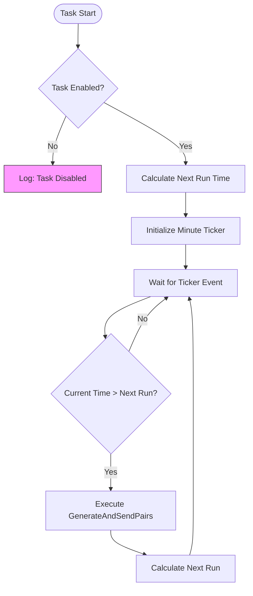
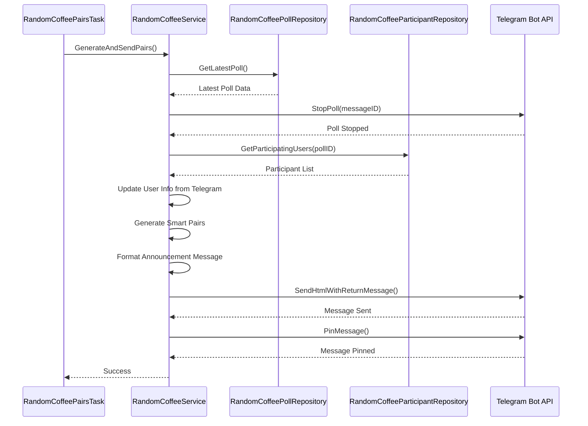
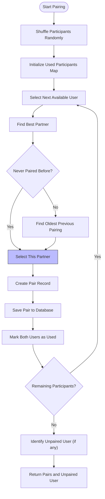
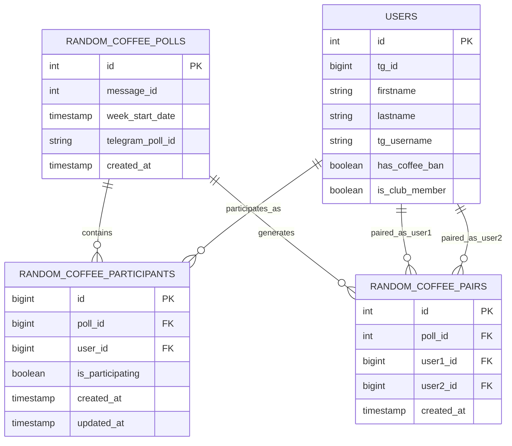
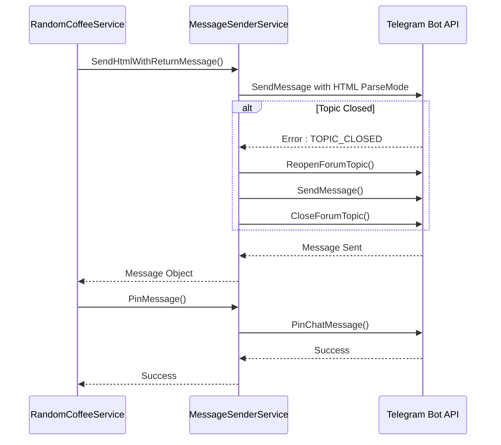
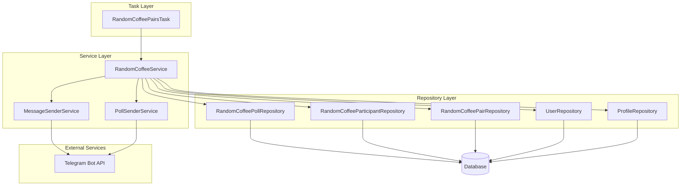

# Random Coffee Pairs Task

<cite>
**Referenced Files in This Document**   
- [random_coffee_pairs_task.go](file://internal/tasks/random_coffee_pairs_task.go)
- [random_coffee_service.go](file://internal/services/random_coffee_service.go)
- [random_coffee_participant_repository.go](file://internal/database/repositories/random_coffee_participant_repository.go)
- [random_coffee_pair_repository.go](file://internal/database/repositories/random_coffee_pair_repository.go)
- [message_sender_service.go](file://internal/services/message_sender_service.go)
- [config.go](file://internal/config/config.go)
- [user_repository.go](file://internal/database/repositories/user_repository.go)
- [profile_repository.go](file://internal/database/repositories/profile_repository.go)
- [random_coffee_poll_repository.go](file://internal/database/repositories/random_coffee_poll_repository.go)
- [poll_sender_service.go](file://internal/services/poll_sender_service.go)
</cite>

## Table of Contents
1. [Introduction](#introduction)
2. [Task Scheduling and Execution](#task-scheduling-and-execution)
3. [Pair Generation Workflow](#pair-generation-workflow)
4. [Smart Pairing Algorithm](#smart-pairing-algorithm)
5. [Data Persistence and Repositories](#data-persistence-and-repositories)
6. [User Notification System](#user-notification-system)
7. [Configuration Parameters](#configuration-parameters)
8. [Error Handling and Edge Cases](#error-handling-and-edge-cases)
9. [Architecture Overview](#architecture-overview)
10. [Conclusion](#conclusion)

## Introduction
The Random Coffee Pairs Task is a scheduled component of the evocoders-bot-go application that automatically generates participant pairs for weekly random coffee meetings after the participation poll closes. This system orchestrates the pairing process by retrieving poll results, applying intelligent pairing logic to avoid recent repeats, persisting pairings to the database, and notifying participants via direct messages. The task runs on a configurable schedule, ensuring timely pair generation while maintaining fairness and engagement across the community.

**Section sources**
- [random_coffee_pairs_task.go](file://internal/tasks/random_coffee_pairs_task.go#L1-L101)

## Task Scheduling and Execution
The Random Coffee Pairs Task operates as a scheduled background process that triggers the pairing workflow at a predefined time and day. The task initialization occurs through the `NewRandomCoffeePairsTask` constructor, which injects configuration parameters and the `RandomCoffeeService` dependency responsible for the core pairing logic. The task's execution is governed by configuration settings that determine its enabled state, execution time, and recurrence day.

The scheduling mechanism uses a ticker-based approach with minute-level precision to check when the next execution should occur. The `calculateNextRun` method computes the upcoming execution time based on the configured day of the week and time of day, ensuring the task runs exactly once per cycle. When the execution time arrives, the task invokes the `GenerateAndSendPairs` method on the `RandomCoffeeService`, executing this operation in a separate goroutine to prevent blocking the main scheduling loop.

**Diagram sources**
- [random_coffee_pairs_task.go](file://internal/tasks/random_coffee_pairs_task.go#L50-L101)

**Section sources**
- [random_coffee_pairs_task.go](file://internal/tasks/random_coffee_pairs_task.go#L1-L101)
- [config.go](file://internal/config/config.go#L150-L200)

## Pair Generation Workflow
The pair generation workflow begins with retrieving the latest random coffee poll from the database through the `RandomCoffeePollRepository`. The system first attempts to stop the active poll using the Telegram Bot API to prevent late participants from joining after the pairing process has commenced. This operation includes error handling to continue the workflow even if poll stopping fails, ensuring resilience against temporary API issues.

After retrieving poll results, the system fetches all participating users from the `RandomCoffeeParticipantRepository`, filtering for those who indicated participation. The workflow validates that sufficient participants exist (minimum of two) before proceeding with pairing. For each participant, the system synchronizes user information with the Telegram API to ensure profile data reflects current usernames, first names, and last names, updating the database when discrepancies are found.

The pairing process then applies the smart pairing algorithm to create optimal pairs while considering historical pairings. After generating pairs, the system formats a comprehensive announcement message that lists all pairs and identifies any unpaired participant. This message is sent to the designated random coffee topic in the Telegram group and pinned for visibility.

**Diagram sources**
- [random_coffee_service.go](file://internal/services/random_coffee_service.go#L150-L300)

**Section sources**
- [random_coffee_service.go](file://internal/services/random_coffee_service.go#L150-L480)
- [random_coffee_poll_repository.go](file://internal/database/repositories/random_coffee_poll_repository.go#L50-L96)
- [random_coffee_participant_repository.go](file://internal/database/repositories/random_coffee_participant_repository.go#L70-L86)

## Smart Pairing Algorithm
The smart pairing algorithm implements a fairness-oriented approach that minimizes repeat pairings by considering historical data from the previous four coffee events. The algorithm begins by retrieving all historical pairs involving the current participants from the `RandomCoffeePairRepository`, creating a comprehensive history map that tracks which users were paired together in past events.

The pairing process starts with a random shuffle of participants to ensure fairness in selection order. For each available participant, the algorithm searches for the optimal pairing partner by evaluating two criteria: whether the users have never been paired before, or if they have been paired, how long ago their last pairing occurred. The algorithm prioritizes never-paired combinations, and when repeats are unavoidable, it selects the pairing with the oldest previous occurrence.

During the pairing process, the system maintains a map of used participants to prevent double assignment. When a suitable partner is found, the pair is recorded in the database through the `RandomCoffeePairRepository`, with user IDs stored in ascending order to maintain consistency. If the number of participants is odd, one user will remain unpaired and is identified in the announcement message to encourage self-organization.

**Diagram sources**
- [random_coffee_service.go](file://internal/services/random_coffee_service.go#L300-L450)

**Section sources**
- [random_coffee_service.go](file://internal/services/random_coffee_service.go#L300-L450)
- [random_coffee_pair_repository.go](file://internal/database/repositories/random_coffee_pair_repository.go#L50-L125)

## Data Persistence and Repositories
The system employs a repository pattern to manage data persistence across multiple entities involved in the random coffee workflow. The `RandomCoffeePollRepository` handles CRUD operations for poll records, storing metadata such as message IDs, week start dates, and Telegram poll identifiers. This repository enables retrieval of the latest poll to determine which participation event to process.

The `RandomCoffeeParticipantRepository` manages participant records, tracking which users have opted into each coffee event. This repository provides the `GetParticipatingUsers` method that joins user data with participation records to return complete user profiles of those who voted to participate. The repository uses upsert operations to handle both insertions and updates, ensuring participant status can be modified if users change their votes.

The `RandomCoffeePairRepository` persists the generated pairs, creating records that link two users within the context of a specific poll. This repository supports historical queries through the `GetPairsHistoryForUsers` method, which retrieves past pairings for a set of users across the most recent N polls. This historical data is essential for the smart pairing algorithm to avoid recent repeats and ensure diverse interactions across the community.

**Diagram sources**
- [random_coffee_poll_repository.go](file://internal/database/repositories/random_coffee_poll_repository.go#L1-L96)
- [random_coffee_participant_repository.go](file://internal/database/repositories/random_coffee_participant_repository.go#L1-L86)
- [random_coffee_pair_repository.go](file://internal/database/repositories/random_coffee_pair_repository.go#L1-L125)
- [user_repository.go](file://internal/database/repositories/user_repository.go#L1-L423)

**Section sources**
- [random_coffee_poll_repository.go](file://internal/database/repositories/random_coffee_poll_repository.go#L1-L96)
- [random_coffee_participant_repository.go](file://internal/database/repositories/random_coffee_participant_repository.go#L1-L86)
- [random_coffee_pair_repository.go](file://internal/database/repositories/random_coffee_pair_repository.go#L1-L125)

## User Notification System
The user notification system leverages the `MessageSenderService` to deliver formatted announcements to the Telegram group and personalized messages to individual participants. After generating pairs, the system constructs an HTML-formatted message that lists all pairs with clickable profile links for each participant. The formatting process uses the `formatUserDisplay` method to create user representations that include Telegram usernames and links to their published profiles when available.

The announcement message is sent to the designated random coffee topic using the `SendHtmlWithReturnMessage` method, which specifies the message thread ID to ensure proper placement within the Telegram forum. Following successful message delivery, the system pins the announcement to maintain visibility throughout the week. The pinning operation is performed without notification to avoid spamming group members.

For individual notifications, while not explicitly shown in the current implementation, the architecture supports direct messaging through the same `MessageSenderService`. The service provides methods for sending various message types (text, markdown, HTML) with configurable options for link previews, parse modes, and message threading. The service also includes error handling for common issues like closed topics, automatically attempting to reopen topics when necessary before sending messages.

**Diagram sources**
- [random_coffee_service.go](file://internal/services/random_coffee_service.go#L250-L300)
- [message_sender_service.go](file://internal/services/message_sender_service.go#L150-L300)

**Section sources**
- [random_coffee_service.go](file://internal/services/random_coffee_service.go#L250-L300)
- [message_sender_service.go](file://internal/services/message_sender_service.go#L1-L480)
- [profile_repository.go](file://internal/database/repositories/profile_repository.go#L1-L285)

## Configuration Parameters
The Random Coffee Pairs Task is controlled by several configuration parameters that determine its behavior and scheduling. These parameters are loaded from environment variables through the `LoadConfig` function in the `config.go` file. The primary configuration options include `RandomCoffeePairsTaskEnabled`, which acts as a master switch to enable or disable the task, and `RandomCoffeePairsTime`, which specifies the exact time of day when the pairing should occur.

The `RandomCoffeePairsDay` parameter determines the day of the week for pair generation, allowing administrators to schedule the task for Monday, Tuesday, or any other day based on community preferences. Additional configuration includes `RandomCoffeeTopicID`, which identifies the specific topic in the Telegram group where announcements should be posted, and `SuperGroupChatID`, which specifies the main group chat identifier.

The system also inherits configuration from related components, such as the minimum participant threshold (implicitly enforced at 2 participants) and the number of historical polls considered for avoiding repeat pairings (hardcoded at 4). These configuration values provide flexibility in deployment while maintaining essential constraints for proper functionality.

**Section sources**
- [config.go](file://internal/config/config.go#L150-L200)
- [random_coffee_service.go](file://internal/services/random_coffee_service.go#L300-L450)

## Error Handling and Edge Cases
The system implements comprehensive error handling to address various edge cases and potential failure points in the pairing workflow. When insufficient participants register for a coffee event (fewer than two), the system returns a descriptive error that prevents pair generation while maintaining the scheduling cycle. Database operations include proper error propagation, with repository methods returning wrapped errors that include context about the failing operation.

The pairing algorithm includes a fallback mechanism that activates if the smart pairing logic fails. In such cases, the system resorts to a simple random shuffle approach to ensure pairs are still generated, maintaining the core functionality even when optimal pairing cannot be achieved. This fallback ensures service continuity while logging the failure for diagnostic purposes.

Race conditions during pair generation are mitigated through the application-level coordination of the process, with a single task instance responsible for each pairing cycle. The system handles notification failures gracefully, logging errors without interrupting the overall workflow. When updating user information from the Telegram API, the system processes each field independently, allowing partial updates to succeed even if some fields fail to update.

**Section sources**
- [random_coffee_service.go](file://internal/services/random_coffee_service.go#L150-L480)
- [random_coffee_pairs_task.go](file://internal/tasks/random_coffee_pairs_task.go#L70-L90)

## Architecture Overview
The Random Coffee Pairs Task operates within a modular architecture that separates concerns across configuration, scheduling, business logic, data access, and external service integration. The task component handles scheduling and execution timing, while delegating the core pairing logic to the `RandomCoffeeService`. This service orchestrates the workflow by coordinating with repository components for data persistence and service components for external API interactions.

The architecture follows dependency injection principles, with the `RandomCoffeePairsTask` receiving its dependencies (configuration and service) through its constructor. This design enables testability and flexibility in configuration. The repository pattern provides a clean abstraction over database operations, allowing the business logic to remain independent of the underlying data storage implementation.

External integrations with the Telegram Bot API are encapsulated within dedicated service classes (`PollSenderService` and `MessageSenderService`), which handle API-specific concerns like error recovery, message formatting, and rate limiting considerations. This separation ensures that the core pairing logic remains focused on business rules rather than API integration details.

**Diagram sources**
- [random_coffee_pairs_task.go](file://internal/tasks/random_coffee_pairs_task.go#L1-L101)
- [random_coffee_service.go](file://internal/services/random_coffee_service.go#L1-L480)
- [repositories](file://internal/database/repositories/)

**Section sources**
- [random_coffee_pairs_task.go](file://internal/tasks/random_coffee_pairs_task.go#L1-L101)
- [random_coffee_service.go](file://internal/services/random_coffee_service.go#L1-L480)

## Conclusion
The Random Coffee Pairs Task represents a sophisticated automation system that enhances community engagement through scheduled, intelligent pairing of participants. By combining configurable scheduling, historical awareness, and robust error handling, the system ensures reliable operation while maximizing meaningful interactions across the community. The modular architecture separates concerns effectively, allowing for independent evolution of scheduling, pairing logic, and notification components.

The implementation demonstrates several best practices in Go application development, including proper error handling with context, dependency injection for testability, and separation of concerns through the repository pattern. The fallback mechanism for pairing ensures service continuity even when optimal conditions cannot be met, while the comprehensive logging provides visibility into system operations for monitoring and debugging.

Future enhancements could include more sophisticated pairing algorithms that consider user preferences or availability, enhanced notification systems with calendar integration, or analytics reporting on pairing patterns over time. However, the current implementation provides a solid foundation that effectively meets the core requirements of automated, fair, and reliable participant pairing for community coffee events.