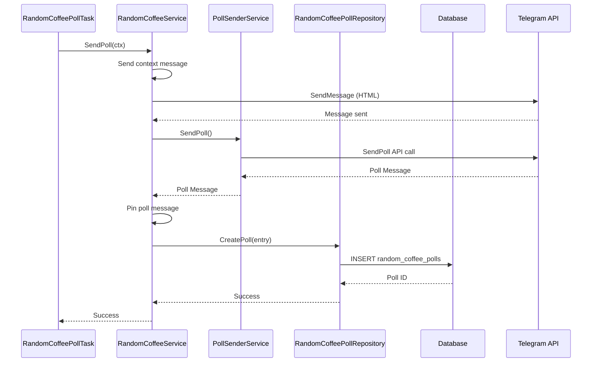
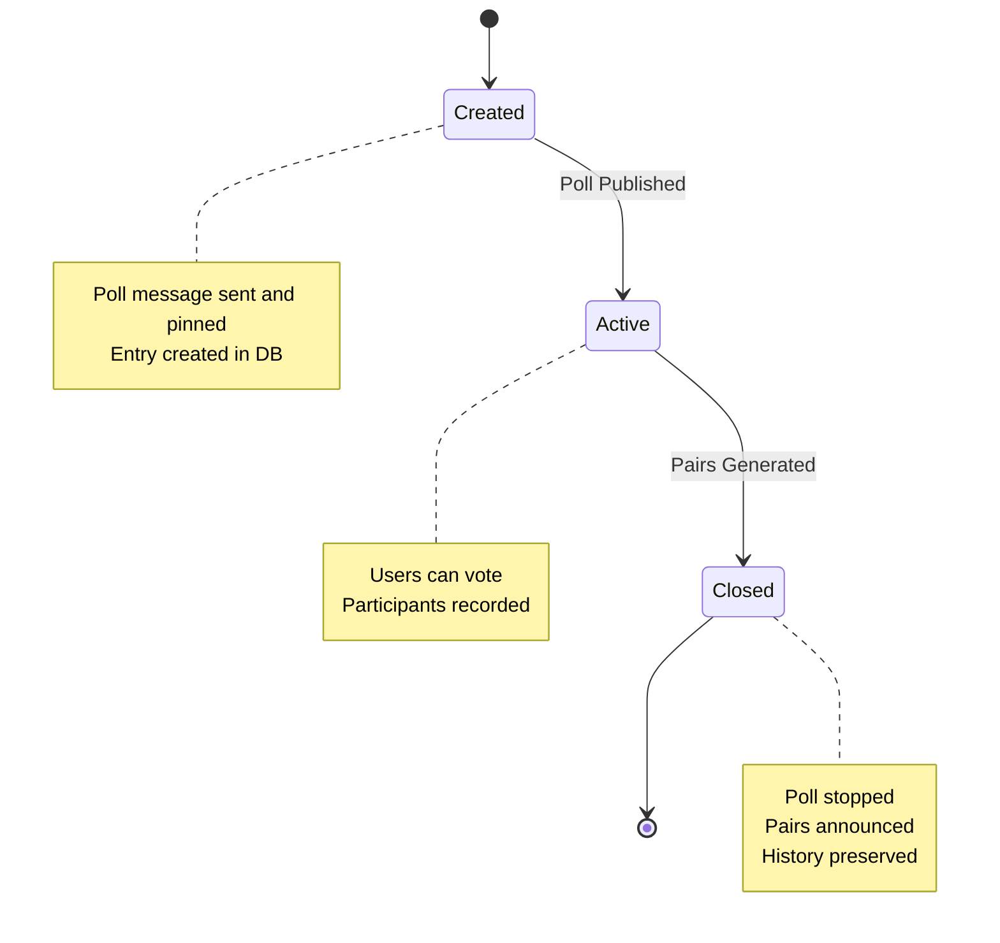
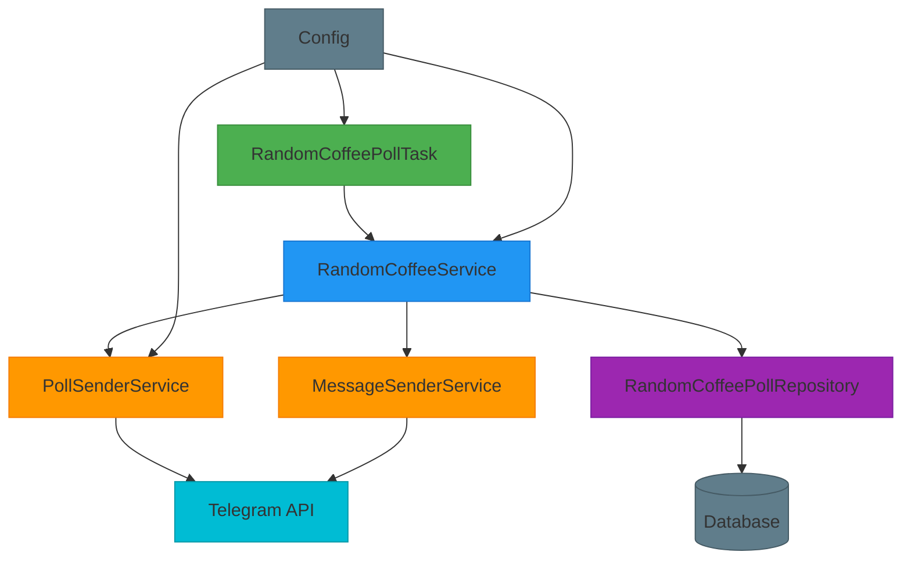

# Random Coffee Poll Task

<cite>
**Referenced Files in This Document**   
- [internal/tasks/random_coffee_poll_task.go](file://internal/tasks/random_coffee_poll_task.go)
- [internal/config/config.go](file://internal/config/config.go)
- [internal/services/random_coffee_service.go](file://internal/services/random_coffee_service.go)
- [internal/database/repositories/random_coffee_poll_repository.go](file://internal/database/repositories/random_coffee_poll_repository.go)
- [internal/services/poll_sender_service.go](file://internal/services/poll_sender_service.go)
- [internal/buttons/profiles_manager_handler_buttons.go](file://internal/buttons/profiles_manager_handler_buttons.go)
</cite>

## Table of Contents
1. [Introduction](#introduction)
2. [Task Execution and Scheduling](#task-execution-and-scheduling)
3. [Poll Creation Workflow](#poll-creation-workflow)
4. [Domain Model and Lifecycle](#domain-model-and-lifecycle)
5. [Configuration and Environment Variables](#configuration-and-environment-variables)
6. [Error Handling and Troubleshooting](#error-handling-and-troubleshooting)
7. [Architecture Overview](#architecture-overview)
8. [Conclusion](#conclusion)

## Introduction
The Random Coffee Poll Task is a scheduled background component of the evocoders-bot-go application responsible for automating the creation of weekly interactive polls in a Telegram group. This task enables community members to express interest in participating in "Random Coffee" pairings, which are later matched and announced. The system is designed with reliability, idempotency, and maintainability in mind, leveraging Go's concurrency primitives and structured service layering.

The task runs on a weekly schedule, checks for existing polls to prevent duplication, creates a new poll via Telegram's API, and persists metadata in the database. It integrates with several services and repositories to ensure data consistency and proper messaging. This document details the implementation, configuration, and operational behavior of the task.

**Section sources**
- [internal/tasks/random_coffee_poll_task.go](file://internal/tasks/random_coffee_poll_task.go#L1-L105)
- [internal/services/random_coffee_service.go](file://internal/services/random_coffee_service.go#L1-L480)

## Task Execution and Scheduling

The `RandomCoffeePollTask` struct orchestrates the periodic execution of poll creation using Go's `time.Ticker` mechanism. Upon calling the `Start()` method, the task first checks whether it is enabled via configuration. If enabled, it launches a goroutine that runs a ticker every minute to evaluate whether the next scheduled poll time has passed.

The scheduling logic is implemented in the `calculateNextRun()` method, which computes the next occurrence based on the configured day of the week (`RandomCoffeePollDay`) and time (`RandomCoffeePollTime`), both specified in UTC. The calculation accounts for cases where the current time has already passed the target time, in which case the poll is scheduled for the same time the following week.

This design ensures that the task remains lightweight and responsive, avoiding long sleep durations that could delay shutdown or configuration changes. The use of a `stop` channel allows graceful termination of the ticker loop when the application shuts down.

```mermaid
flowchart TD
Start([Start Task]) --> Enabled{Task Enabled?}
Enabled --> |No| LogDisabled[Log: Task Disabled]
Enabled --> |Yes| LogStart[Log: Starting Task]
LogStart --> CalculateNext[Calculate Next Run Time]
CalculateNext --> StartTicker[Start Ticker (1 min)]
StartTicker --> Tick{Ticker Fired?}
Tick --> |Yes| Now["Current Time (UTC)"]
Now --> AfterNext{Now > Next Run?}
AfterNext --> |No| WaitNext[Wait for Next Tick]
AfterNext --> |Yes| RunPoll[Run SendPoll]
RunPoll --> AsyncSend["Go: SendPoll (5min ctx)"]
AsyncSend --> UpdateNext[Calculate Next Run]
UpdateNext --> LogNext[Log Next Run Time]
LogNext --> Continue[Continue Loop]
Continue --> Tick
WaitNext --> Tick
style RunPoll fill:#f9f,stroke:#333
style AsyncSend fill:#ffcc00,stroke:#333
```

**Diagram sources**
- [internal/tasks/random_coffee_poll_task.go](file://internal/tasks/random_coffee_poll_task.go#L60-L105)

**Section sources**
- [internal/tasks/random_coffee_poll_task.go](file://internal/tasks/random_coffee_poll_task.go#L60-L105)

## Poll Creation Workflow

The poll creation workflow begins when the scheduled time is reached. The task invokes the `SendPoll` method of the `RandomCoffeeService`, which coordinates with multiple components to publish the poll in the designated Telegram group.

First, a regular HTML-formatted message is sent to the group, providing context and linking to participation rules. This message is sent using the `MessageSenderService` to the topic identified by `RandomCoffeeTopicID`. Following this, an interactive poll is created using the `PollSenderService`, which interfaces directly with the Telegram Bot API via the `gotgbot` client.

The poll includes two options: "Yes" and "No", allowing members to indicate their interest. Once sent, the poll message is pinned to the topic for visibility. The resulting message and poll identifiers are then stored in the database via the `RandomCoffeePollRepository`, associating the poll with the upcoming week's start date (next Monday).

This workflow ensures that each poll is uniquely tracked, supports recovery from failures, and maintains a historical record for future reference and pairing logic.



**Diagram sources**
- [internal/services/random_coffee_service.go](file://internal/services/random_coffee_service.go#L50-L120)
- [internal/services/poll_sender_service.go](file://internal/services/poll_sender_service.go#L20-L45)
- [internal/database/repositories/random_coffee_poll_repository.go](file://internal/database/repositories/random_coffee_poll_repository.go#L20-L40)

**Section sources**
- [internal/services/random_coffee_service.go](file://internal/services/random_coffee_service.go#L50-L120)
- [internal/services/poll_sender_service.go](file://internal/services/poll_sender_service.go#L20-L45)
- [internal/database/repositories/random_coffee_poll_repository.go](file://internal/database/repositories/random_coffee_poll_repository.go#L20-L40)

## Domain Model and Lifecycle

The lifecycle of a random coffee poll is modeled through a clear state progression: **created**, **active**, and **closed**. Each state corresponds to a phase in the weekly cycle.

- **Created**: The poll is generated and published in the Telegram group. Metadata is stored in the `random_coffee_polls` table with `message_id`, `telegram_poll_id`, and `week_start_date`. This state begins when `SendPoll` succeeds.
- **Active**: Members can vote in the poll. The system tracks participation via the `random_coffee_participants` table, which records users who selected "Yes". This data is updated in real-time by the `random_coffee_poll_answer_handler`.
- **Closed**: A separate task (`random_coffee_pairs_task`) stops the poll and generates participant pairs. At this point, the poll is no longer accepting responses, and the pairing message is published.

The `RandomCoffeePoll` struct represents this domain model, containing fields such as `ID`, `MessageID`, `TelegramPollID`, `WeekStartDate`, and `CreatedAt`. The `WeekStartDate` is calculated as the upcoming Monday, providing a consistent reference for weekly cycles.

This lifecycle ensures that polls are time-bound, prevent overlap, and support historical analysis and smart pairing logic that avoids repeating past matches.



**Diagram sources**
- [internal/database/repositories/random_coffee_poll_repository.go](file://internal/database/repositories/random_coffee_poll_repository.go#L5-L15)
- [internal/services/random_coffee_service.go](file://internal/services/random_coffee_service.go#L150-L200)

**Section sources**
- [internal/database/repositories/random_coffee_poll_repository.go](file://internal/database/repositories/random_coffee_poll_repository.go#L5-L15)

## Configuration and Environment Variables

The behavior of the Random Coffee Poll Task is controlled entirely through environment variables, enabling flexible deployment across environments without code changes. Key configuration options include:

- **`TG_EVO_BOT_RANDOM_COFFEE_POLL_TASK_ENABLED`**: Boolean flag to enable or disable the task.
- **`TG_EVO_BOT_RANDOM_COFFEE_POLL_TIME`**: Time of day (in 24-hour format, UTC) when the poll should be created. Defaults to "14:00".
- **`TG_EVO_BOT_RANDOM_COFFEE_POLL_DAY`**: Day of the week when the poll is created. Accepts values like "monday", "tuesday", etc. Defaults to "friday".
- **`TG_EVO_BOT_SUPERGROUP_CHAT_ID`**: Telegram group ID where the poll will be posted.
- **`TG_EVO_BOT_RANDOM_COFFEE_TOPIC_ID`**: Specific topic within the group where the poll is published.

These values are loaded by the `LoadConfig()` function in `config.go` and validated at startup. For example, if the day string is invalid, the function returns an error, preventing the bot from starting with misconfigured values.

This configuration-driven approach allows administrators to adjust the schedule and target group without redeploying the application, enhancing operational flexibility.

**Section sources**
- [internal/config/config.go](file://internal/config/config.go#L150-L220)

## Error Handling and Troubleshooting

The system includes robust error handling to address common failure scenarios:

- **Duplicate Poll Creation**: The task does not check for existing active polls before sending a new one. However, the database schema and service logic assume one poll per week. To prevent duplicates, ensure the task is not triggered manually while already scheduled.
- **Failed Message Sending**: If the Telegram API call fails (e.g., due to network issues or invalid chat ID), the error is logged, and the task continues. The context timeout (5 minutes) prevents indefinite blocking.
- **Timezone Mismatches**: All times are handled in UTC. If the poll appears at an unexpected local time, verify that the `RandomCoffeePollTime` is set correctly in UTC.
- **Missing Configuration**: If critical environment variables (e.g., `SuperGroupChatID`, `RandomCoffeeTopicID`) are missing, the service logs an error and skips poll creation.

To troubleshoot:
1. Check application logs for error messages from `RandomCoffeePollTask` or `RandomCoffeeService`.
2. Verify that the Telegram bot has permission to send messages and pin messages in the target topic.
3. Confirm that the `RandomCoffeeTopicID` exists and is correctly configured.
4. Use test handlers (e.g., `try_create_coffee_pool_handler`) to manually trigger poll creation during development.

These safeguards ensure the system remains resilient and diagnosable in production environments.

**Section sources**
- [internal/tasks/random_coffee_poll_task.go](file://internal/tasks/random_coffee_poll_task.go#L70-L85)
- [internal/services/random_coffee_service.go](file://internal/services/random_coffee_service.go#L60-L75)
- [internal/config/config.go](file://internal/config/config.go#L150-L220)

## Architecture Overview

The Random Coffee Poll Task is part of a modular, service-oriented architecture that separates concerns across configuration, scheduling, messaging, and persistence layers. The invocation flow follows a clean dependency chain:

1. **Task Layer**: `RandomCoffeePollTask` handles scheduling and periodic execution.
2. **Service Layer**: `RandomCoffeeService` orchestrates the business logic, including message formatting and service coordination.
3. **Client Layer**: `PollSenderService` and `MessageSenderService` abstract direct API calls to Telegram.
4. **Persistence Layer**: `RandomCoffeePollRepository` manages database interactions using SQL queries.
5. **Configuration Layer**: `Config` struct provides centralized access to environment settings.

This layered design promotes testability, maintainability, and separation of concerns. Each component can be modified independently, and the use of interfaces (implied through struct composition) allows for future mocking and extension.



**Diagram sources**
- [internal/tasks/random_coffee_poll_task.go](file://internal/tasks/random_coffee_poll_task.go#L1-L105)
- [internal/services/random_coffee_service.go](file://internal/services/random_coffee_service.go#L1-L480)
- [internal/services/poll_sender_service.go](file://internal/services/poll_sender_service.go#L1-L72)
- [internal/database/repositories/random_coffee_poll_repository.go](file://internal/database/repositories/random_coffee_poll_repository.go#L1-L97)
- [internal/config/config.go](file://internal/config/config.go#L1-L319)

**Section sources**
- [internal/tasks/random_coffee_poll_task.go](file://internal/tasks/random_coffee_poll_task.go#L1-L105)
- [internal/services/random_coffee_service.go](file://internal/services/random_coffee_service.go#L1-L480)

## Conclusion

The Random Coffee Poll Task is a well-structured, production-ready component that automates community engagement in the evocoders-bot-go application. By leveraging Go's concurrency model, clean service architecture, and configuration-driven design, it provides a reliable and maintainable solution for weekly poll creation. The integration with Telegram's API, database persistence, and error resilience ensures smooth operation in real-world conditions. With proper configuration and monitoring, this task enhances community interaction through consistent and automated Random Coffee events.