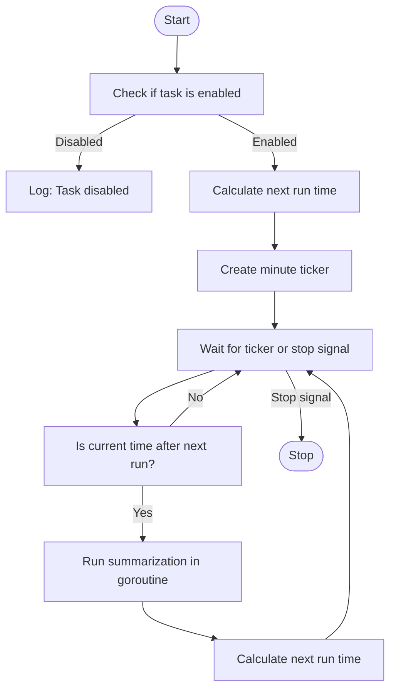
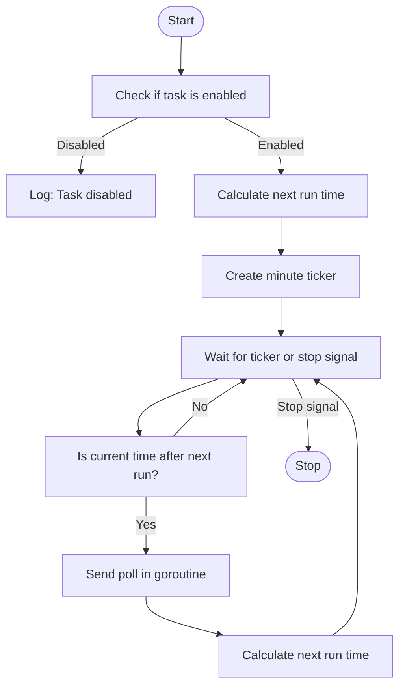
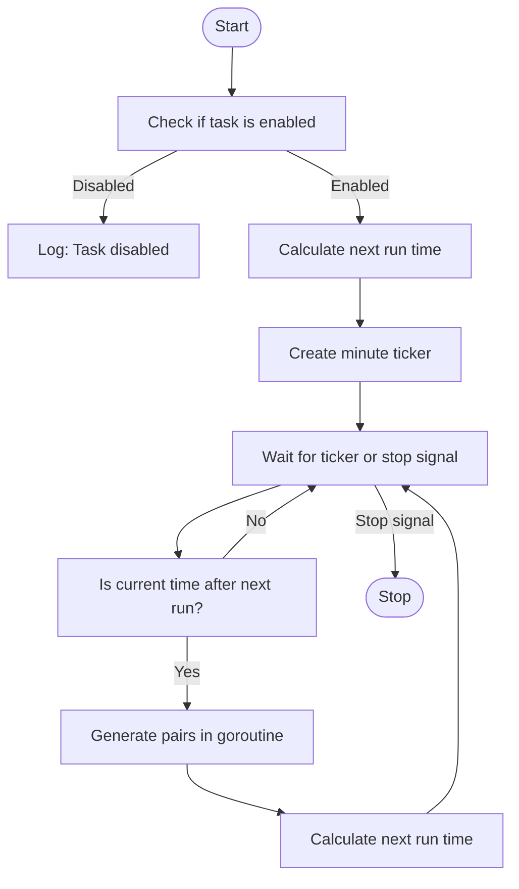
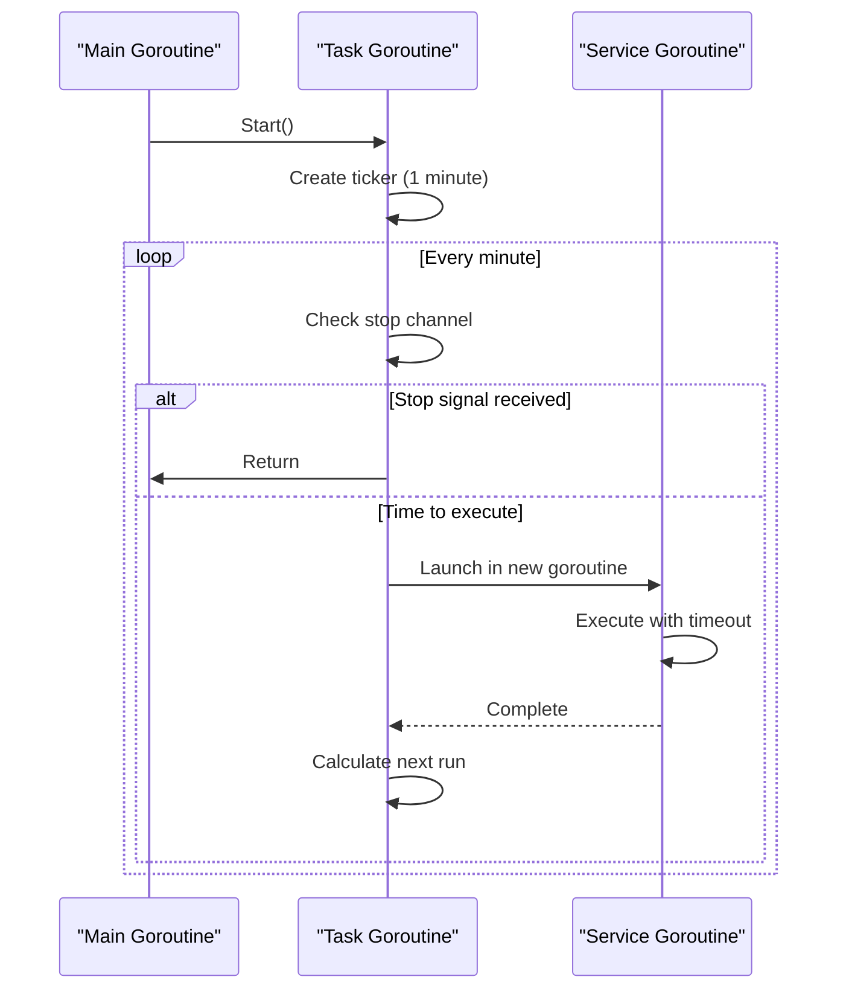
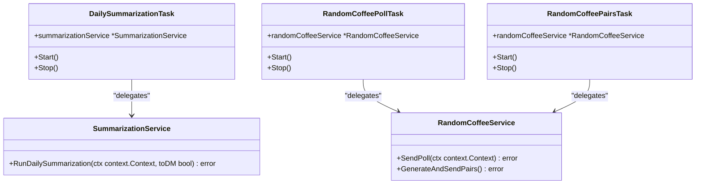

# Scheduled Tasks

<cite>
**Referenced Files in This Document**   
- [task.go](file://internal/tasks/task.go)
- [daily_summarization_task.go](file://internal/tasks/daily_summarization_task.go)
- [random_coffee_poll_task.go](file://internal/tasks/random_coffee_poll_task.go)
- [random_coffee_pairs_task.go](file://internal/tasks/random_coffee_pairs_task.go)
- [bot.go](file://internal/bot/bot.go)
- [config.go](file://internal/config/config.go)
</cite>

## Table of Contents
1. [Introduction](#introduction)
2. [Architecture Overview](#architecture-overview)
3. [Core Components](#core-components)
4. [Task Implementation Details](#task-implementation-details)
5. [Task Registration and Lifecycle Management](#task-registration-and-lifecycle-management)
6. [Configuration and Scheduling](#configuration-and-scheduling)
7. [Concurrency and Error Handling](#concurrency-and-error-handling)
8. [Integration with Services](#integration-with-services)
9. [Common Issues and Solutions](#common-issues-and-solutions)
10. [Conclusion](#conclusion)

## Introduction

The Scheduled Tasks system in evocoders-bot-go provides a robust mechanism for background job automation through goroutines and ticker patterns. This system enables the bot to perform time-based operations without user interaction, including daily summarization of group discussions and organizing random coffee meetings among community members. The architecture is designed for reliability, configurability, and graceful shutdown, ensuring that scheduled operations execute precisely when needed while maintaining system stability.

The system follows a clean interface-driven design with three primary scheduled tasks: daily summarization, random coffee poll creation, and random coffee pair generation. Each task operates independently with its own scheduling logic, yet shares a common interface and lifecycle management pattern. Configuration is driven entirely by environment variables, allowing deployment-specific settings without code changes.

**Section sources**
- [task.go](file://internal/tasks/task.go#L1-L5)
- [config.go](file://internal/config/config.go#L1-L340)

## Architecture Overview

The scheduled task architecture follows a modular design pattern where tasks are defined as independent components that implement a common interface. The system leverages Go's concurrency model through goroutines and channels to manage background execution, with precise timing control provided by the time.Ticker mechanism.

```mermaid
graph TB
subgraph "Bot Core"
TgBotClient[TgBotClient]
end
subgraph "Scheduled Tasks"
DailySummarization[DailySummarizationTask]
RandomCoffeePoll[RandomCoffeePollTask]
RandomCoffeePairs[RandomCoffeePairsTask]
end
subgraph "Service Layer"
SummarizationService[SummarizationService]
RandomCoffeeService[RandomCoffeeService]
end
subgraph "Configuration"
Config[Config]
end
TgBotClient --> DailySummarization : "creates and manages"
TgBotClient --> RandomCoffeePoll : "creates and manages"
TgBotClient --> RandomCoffeePairs : "creates and manages"
DailySummarization --> SummarizationService : "delegates work"
RandomCoffeePoll --> RandomCoffeeService : "delegates work"
RandomCoffeePairs --> RandomCoffeeService : "delegates work"
DailySummarization --> Config : "reads schedule"
RandomCoffeePoll --> Config : "reads schedule"
RandomCoffeePairs --> Config : "reads schedule"
```

**Diagram sources**
- [bot.go](file://internal/bot/bot.go#L46-L52)
- [task.go](file://internal/tasks/task.go#L1-L5)

## Core Components

The scheduled tasks system consists of several core components that work together to provide reliable background job execution. At the foundation is the Task interface, which defines a consistent lifecycle for all scheduled operations. Each concrete task implementation follows the same pattern: initialization with dependencies, start/stop control, and a run loop that checks timing conditions.

The system uses a ticker-based polling approach rather than one-shot timers, which provides more predictable behavior and easier management of recurring schedules. Each task runs in its own goroutine with a dedicated stop channel for graceful shutdown. The architecture ensures that tasks can be stopped cleanly during application termination, preventing orphaned goroutines and resource leaks.

All tasks share a common error handling pattern, logging errors without stopping the main execution loop, thus maintaining system resilience. The design separates scheduling concerns from business logic, with tasks responsible only for timing and invocation, while services handle the actual work.

**Section sources**
- [task.go](file://internal/tasks/task.go#L1-L5)
- [daily_summarization_task.go](file://internal/tasks/daily_summarization_task.go#L1-L100)
- [random_coffee_poll_task.go](file://internal/tasks/random_coffee_poll_task.go#L1-L106)
- [random_coffee_pairs_task.go](file://internal/tasks/random_coffee_pairs_task.go#L1-L102)

## Task Implementation Details

### Daily Summarization Task

The DailySummarizationTask handles the scheduling of daily content summarization for group discussions. It checks every minute whether it's time to run based on the configured UTC time, and when the time arrives, it triggers the summarization service to process recent messages and generate a summary.



**Diagram sources**
- [daily_summarization_task.go](file://internal/tasks/daily_summarization_task.go#L44-L87)
- [daily_summarization_task.go](file://internal/tasks/daily_summarization_task.go#L89-L100)

### Random Coffee Poll Task

The RandomCoffeePollTask manages the creation of weekly polls to gauge interest in random coffee meetings. It calculates the next occurrence based on the configured weekday and time, then sends a poll to the designated group when the time arrives.



**Diagram sources**
- [random_coffee_poll_task.go](file://internal/tasks/random_coffee_poll_task.go#L48-L91)
- [random_coffee_poll_task.go](file://internal/tasks/random_coffee_poll_task.go#L93-L104)

### Random Coffee Pairs Task

The RandomCoffeePairsTask handles the generation and announcement of participant pairs for random coffee meetings. It runs weekly on the configured day and time, creating new pairs from participants who responded positively to the poll.



**Diagram sources**
- [random_coffee_pairs_task.go](file://internal/tasks/random_coffee_pairs_task.go#L47-L87)
- [random_coffee_pairs_task.go](file://internal/tasks/random_coffee_pairs_task.go#L89-L101)

## Task Registration and Lifecycle Management

Tasks are registered and managed through the TgBotClient, which acts as the central coordinator for all scheduled operations. During bot initialization, all tasks are created with their required dependencies and stored in a slice for unified lifecycle management.

```mermaid
classDiagram
class TgBotClient {
+bot *gotgbot.Bot
+dispatcher *ext.Dispatcher
+updater *ext.Updater
+db *database.DB
+tasks []Task
+Start() error
+Close() error
}
class Task {
<<interface>>
+Start()
+Stop()
}
class DailySummarizationTask {
+config *Config
+summarizationService *SummarizationService
+stop chan struct{}
+Start()
+Stop()
+run()
+calculateNextRun() time.Time
}
class RandomCoffeePollTask {
+config *Config
+randomCoffeeService *RandomCoffeeService
+stop chan struct{}
+Start()
+Stop()
+run()
+calculateNextRun() time.Time
}
class RandomCoffeePairsTask {
+config *Config
+randomCoffeeService *RandomCoffeeService
+stop chan struct{}
+Start()
+Stop()
+run()
+calculateNextRun() time.Time
}
TgBotClient --> Task : "contains"
Task <|-- DailySummarizationTask
Task <|-- RandomCoffeePollTask
Task <|-- RandomCoffeePairsTask
DailySummarizationTask --> SummarizationService
RandomCoffeePollTask --> RandomCoffeeService
RandomCoffeePairsTask --> RandomCoffeeService
```

**Diagram sources**
- [bot.go](file://internal/bot/bot.go#L122-L124)
- [bot.go](file://internal/bot/bot.go#L339-L355)

## Configuration and Scheduling

The scheduling system is fully configurable through environment variables, allowing deployment-specific settings without code modifications. Each task has configurable parameters for timing, enabling, and target channels.

### Configuration Parameters

| Environment Variable | Purpose | Default Value | Type |
|----------------------|-------|---------------|------|
| TG_EVO_BOT_SUMMARIZATION_TASK_ENABLED | Enables/disables daily summarization | true | boolean |
| TG_EVO_BOT_SUMMARY_TIME | UTC time for daily summarization (HH:MM) | 03:00 | string |
| TG_EVO_BOT_RANDOM_COFFEE_POLL_TASK_ENABLED | Enables/disables coffee poll creation | true | boolean |
| TG_EVO_BOT_RANDOM_COFFEE_POLL_TIME | UTC time for coffee poll (HH:MM) | 14:00 | string |
| TG_EVO_BOT_RANDOM_COFFEE_POLL_DAY | Day of week for coffee poll | Friday | string |
| TG_EVO_BOT_RANDOM_COFFEE_PAIRS_TASK_ENABLED | Enables/disables pair generation | true | boolean |
| TG_EVO_BOT_RANDOM_COFFEE_PAIRS_TIME | UTC time for pair generation (HH:MM) | 12:00 | string |
| TG_EVO_BOT_RANDOM_COFFEE_PAIRS_DAY | Day of week for pair generation | Monday | string |

The system uses a polling approach with a one-minute ticker to check if it's time to execute a task. This approach provides several advantages over one-shot timers:

1. **Predictable behavior**: The ticker fires at regular intervals, making the system's timing behavior consistent
2. **Easy rescheduling**: After each execution, the next run time is recalculated based on current configuration
3. **Graceful handling of time changes**: System clock adjustments are naturally handled in the next polling cycle
4. **Simplified error recovery**: If an execution fails, the next attempt will occur at the scheduled time

**Section sources**
- [config.go](file://internal/config/config.go#L1-L340)
- [daily_summarization_task.go](file://internal/tasks/daily_summarization_task.go#L89-L100)
- [random_coffee_poll_task.go](file://internal/tasks/random_coffee_poll_task.go#L93-L104)
- [random_coffee_pairs_task.go](file://internal/tasks/random_coffee_pairs_task.go#L89-L101)

## Concurrency and Error Handling

The system employs a robust concurrency model that ensures tasks run independently without blocking each other or the main bot operations. Each task runs in its own goroutine with a dedicated stop channel for graceful shutdown.

### Concurrency Pattern



**Diagram sources**
- [daily_summarization_task.go](file://internal/tasks/daily_summarization_task.go#L44-L87)
- [random_coffee_poll_task.go](file://internal/tasks/random_coffee_poll_task.go#L48-L91)
- [random_coffee_pairs_task.go](file://internal/tasks/random_coffee_pairs_task.go#L47-L87)

Each task uses a select statement to monitor both the ticker channel and the stop channel, ensuring that shutdown requests are handled promptly. When a task is stopped, the stop channel is closed, causing the select statement to return immediately.

For error handling, each task wraps its service calls in a goroutine with appropriate context timeouts:

- Daily summarization uses a 30-minute timeout to accommodate potentially long-running AI processing
- Random coffee poll uses a 5-minute timeout for API calls to Telegram
- Random coffee pairs runs without a separate context as it performs database operations that should complete quickly

Errors are logged but do not stop the main execution loop, ensuring that a single failure doesn't prevent future executions. This approach provides resilience against temporary issues like network problems or service outages.

**Section sources**
- [daily_summarization_task.go](file://internal/tasks/daily_summarization_task.go#L60-L75)
- [random_coffee_poll_task.go](file://internal/tasks/random_coffee_poll_task.go#L60-L75)
- [random_coffee_pairs_task.go](file://internal/tasks/random_coffee_pairs_task.go#L59-L74)

## Integration with Services

The scheduled tasks system integrates with various services to perform their work, following a clear separation of concerns where tasks handle timing and scheduling, while services handle business logic.

### Service Integration Architecture



**Diagram sources**
- [daily_summarization_task.go](file://internal/tasks/daily_summarization_task.go#L20-L27)
- [random_coffee_poll_task.go](file://internal/tasks/random_coffee_poll_task.go#L20-L27)
- [random_coffee_pairs_task.go](file://internal/tasks/random_coffee_pairs_task.go#L20-L27)

The DailySummarizationTask integrates with the SummarizationService to generate daily summaries of group discussions. When triggered, it calls RunDailySummarization with a context timeout and specifies that the summary should be sent to the group chat rather than direct messages.

Both coffee-related tasks integrate with the RandomCoffeeService, which handles the business logic for organizing random coffee meetings. The RandomCoffeePollTask calls SendPoll to create a new poll asking members if they want to participate in the next coffee round. The RandomCoffeePairsTask calls GenerateAndSendPairs to create new pairs from participants and announce them in the group.

This separation allows the scheduling logic to remain simple and focused on timing, while the complex business rules and API interactions are handled by dedicated services. It also enables easier testing, as services can be mocked when testing task scheduling behavior.

**Section sources**
- [daily_summarization_task.go](file://internal/tasks/daily_summarization_task.go#L65-L70)
- [random_coffee_poll_task.go](file://internal/tasks/random_coffee_poll_task.go#L65-L70)
- [random_coffee_pairs_task.go](file://internal/tasks/random_coffee_pairs_task.go#L64-L69)

## Common Issues and Solutions

### Timing Drift and Clock Synchronization

**Issue**: When using a one-minute ticker, small delays in processing can accumulate over time, potentially causing tasks to run slightly later than scheduled.

**Solution**: The system recalculates the next run time after each execution, ensuring that the schedule stays aligned with the configured time regardless of processing delays. The use of UTC time throughout the system prevents issues related to daylight saving time changes.

### Concurrent Execution Prevention

**Issue**: In rare cases, timing conditions might allow a task to be triggered twice if the system clock is adjusted backward.

**Solution**: The system uses a stateless approach where each execution is independent. Even if a task runs twice, the underlying services are designed to handle idempotent operations. For example, the summarization service checks for existing summaries before creating new ones.

### Graceful Shutdown

**Issue**: During application shutdown, running tasks might be terminated abruptly, leaving operations incomplete.

**Solution**: The system implements proper graceful shutdown through stop channels. When the bot receives a termination signal, it calls Stop() on all tasks, which closes their stop channels and causes their goroutines to exit cleanly. The main goroutine waits for all tasks to stop before terminating.

### Configuration Validation

**Issue**: Invalid configuration values could cause tasks to never run or behave unpredictably.

**Solution**: The configuration loading process validates all values and returns errors for invalid inputs. Default values are provided for optional settings, ensuring the system remains operational even with incomplete configuration.

### Error Propagation

**Issue**: Errors in service calls might go unnoticed if not properly handled.

**Solution**: All service calls are wrapped in error handling that logs any failures. While the task continues running to ensure future executions, the errors are visible in logs for monitoring and debugging.

**Section sources**
- [bot.go](file://internal/bot/bot.go#L357-L375)
- [config.go](file://internal/config/config.go#L1-L340)
- [daily_summarization_task.go](file://internal/tasks/daily_summarization_task.go#L65-L75)

## Conclusion

The Scheduled Tasks system in evocoders-bot-go provides a reliable and maintainable solution for background job automation. By leveraging Go's concurrency primitives and following clean architectural principles, the system delivers robust scheduling capabilities for critical community features.

Key strengths of the design include:
- **Interface-driven architecture** that enables consistent lifecycle management
- **Configuration through environment variables** for deployment flexibility
- **Graceful shutdown** with proper resource cleanup
- **Resilient error handling** that prevents single failures from affecting overall operation
- **Clear separation of concerns** between scheduling and business logic

The system effectively balances simplicity with functionality, using a polling approach that, while not the most efficient, provides predictable behavior and easy debugging. For future improvements, consideration could be given to more sophisticated scheduling libraries or moving to a cron-like syntax for complex schedules, but the current implementation meets the needs of the application reliably.