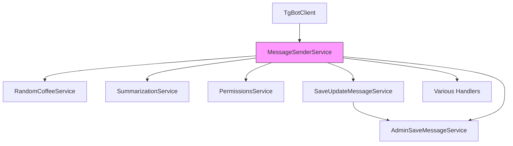
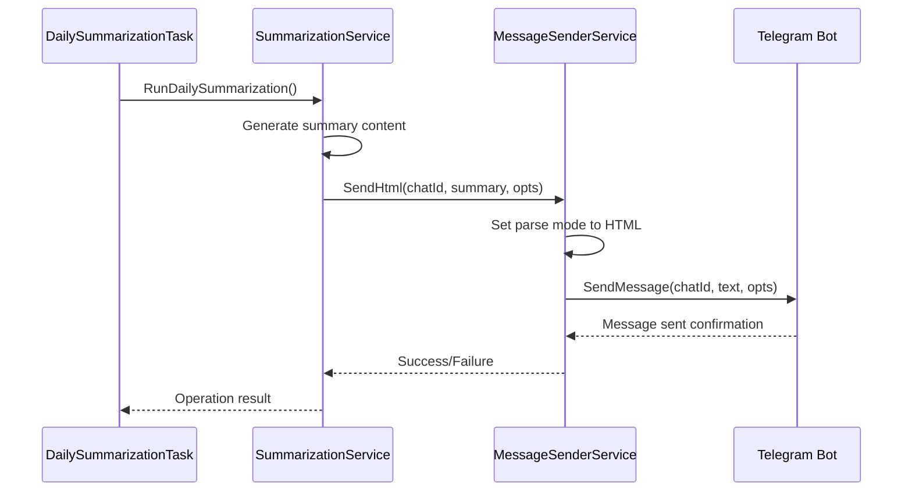

# Message Sender Service

<cite>
**Referenced Files in This Document**   
- [message_sender_service.go](file://internal/services/message_sender_service.go) - *Core service implementation*
- [bot.go](file://internal/bot/bot.go) - *Service initialization and dependency injection*
- [profile_formaters.go](file://internal/formatters/profile_formaters.go) - *Message content formatting*
- [random_coffee_service.go](file://internal/services/random_coffee_service.go) - *Usage example in coffee pairing workflow*
- [daily_summarization_task.go](file://internal/tasks/daily_summarization_task.go) - *Usage example in daily summaries*
- [save_update_message_service.go](file://internal/services/grouphandlersservices/save_update_message_service.go) - *New dependency relationship*
- [admin_save_message_service.go](file://internal/services/grouphandlersservices/admin_save_message_service.go) - *New service using MessageSenderService*
</cite>

## Update Summary
**Changes Made**   
- Updated dependency injection context to include new services that depend on MessageSenderService
- Added information about SaveUpdateMessageService and AdminSaveMessageService integration
- Enhanced architecture diagram to show new service relationships
- Updated section sources to reflect current file dependencies
- Added new diagram sources for updated architectural visualization

## Table of Contents
1. [Introduction](#introduction)
2. [Core Responsibilities](#core-responsibilities)
3. [Key Methods](#key-methods)
4. [Integration with TgBotClient](#integration-with-tgbotclient)
5. [Message Formatting and Utilities](#message-formatting-and-utilities)
6. [Concrete Usage Examples](#concrete-usage-examples)
7. [Error Handling and Recovery](#error-handling-and-recovery)
8. [Common Issues and Solutions](#common-issues-and-solutions)
9. [Performance Considerations](#performance-considerations)
10. [Conclusion](#conclusion)

## Introduction
The MessageSenderService component in evocoders-bot-go is a critical abstraction layer responsible for managing all Telegram message delivery operations. This service encapsulates the complexity of interacting with the Telegram Bot API, providing a clean interface for sending various types of messages across both private and group chats. By centralizing message delivery logic, the service ensures consistent behavior, proper error handling, and efficient resource management throughout the application.

**Section sources**
- [message_sender_service.go](file://internal/services/message_sender_service.go#L1-L20)

## Core Responsibilities
The MessageSenderService is designed to handle all aspects of message delivery within the evocoders-bot-go application. Its primary responsibilities include sending text messages, formatted content, and interactive elements like inline buttons to both individual users and group chats. The service abstracts the underlying Telegram Bot API interactions, providing higher-level methods that handle common messaging patterns and edge cases.

One of the key responsibilities is managing message delivery to forum topics in group chats, including automatic handling of closed topics by temporarily reopening them for message delivery and then restoring their original state. The service also handles specialized operations like pinning messages, removing inline keyboards, and sending typing indicators to create a more responsive user experience.

**Section sources**
- [message_sender_service.go](file://internal/services/message_sender_service.go#L21-L50)

## Key Methods
The MessageSenderService exposes several key methods for different messaging scenarios. The `SendMessage` method (implemented as `Send` and `SendWithReturnMessage`) handles basic text message delivery with optional parameters for message threading in forum topics. For formatted content, the service provides `SendMarkdown` and `SendHtml` methods that automatically configure the appropriate parse mode and disable link previews by default.

The service also includes reply-specific methods like `Reply`, `ReplyMarkdown`, and `ReplyHtml` that simplify responding to specific messages. Specialized methods such as `SendCopy` handle message forwarding with proper entity preservation, while `ReplyWithCleanupAfterDelayWithPing` implements a pattern of temporary replies that are automatically cleaned up after a specified delay.

**Section sources**
- [message_sender_service.go](file://internal/services/message_sender_service.go#L51-L150)

## Integration with TgBotClient
The MessageSenderService is tightly integrated with the TgBotClient from bot.go, receiving the initialized bot instance during construction through the `NewMessageSenderService` function. This integration occurs during the bot client initialization process, where the MessageSenderService is created and passed to other services that require messaging capabilities, such as the RandomCoffeeService and SummarizationService.

The service is registered as a dependency in the HandlerDependencies struct and made available to various handlers throughout the application. This dependency injection pattern ensures that all components have access to a consistent messaging interface while maintaining loose coupling between components. Notably, the recent addition of SaveUpdateMessageService and AdminSaveMessageService has expanded the dependency graph, with these services now relying on MessageSenderService for administrative message operations.

**Diagram sources**
- [bot.go](file://internal/bot/bot.go#L93-L134)
- [message_sender_service.go](file://internal/services/message_sender_service.go#L14-L16)
- [save_update_message_service.go](file://internal/services/grouphandlersservices/save_update_message_service.go#L14-L19)
- [admin_save_message_service.go](file://internal/services/grouphandlersservices/admin_save_message_service.go#L19-L27)

**Section sources**
- [bot.go](file://internal/bot/bot.go#L31-L31)
- [message_sender_service.go](file://internal/services/message_sender_service.go#L14-L16)
- [save_update_message_service.go](file://internal/services/grouphandlersservices/save_update_message_service.go#L14-L19)
- [admin_save_message_service.go](file://internal/services/grouphandlersservices/admin_save_message_service.go#L19-L27)

## Message Formatting and Utilities
The MessageSenderService works in conjunction with formatting utilities to construct properly formatted messages. While the service itself handles the delivery mechanics, it relies on formatters like those in profile_formaters.go to create the actual message content. For example, when sending profile information, the service uses formatted HTML content generated by FormatProfileManagerView to display user information with proper links and styling.

The service also integrates with markdown_utils.go for converting message entities to markdown format when needed. This separation of concerns allows the MessageSenderService to focus on delivery while specialized formatters handle content construction. The service automatically manages parse modes and message entities, ensuring that formatted content is properly interpreted by Telegram clients.

**Section sources**
- [profile_formaters.go](file://internal/formatters/profile_formaters.go#L1-L50)
- [markdown_utils.go](file://internal/utils/markdown_utils.go#L1-L20)

## Concrete Usage Examples
The MessageSenderService is used extensively in scheduled tasks and service operations. In the RandomCoffeeService, it sends HTML-formatted announcements about upcoming random coffee events and delivers pairing results to the group chat. The service handles message threading by specifying the RandomCoffeeTopicID, ensuring messages appear in the correct forum topic.

For daily summarization, the service delivers AI-generated summaries to the group chat at scheduled times. The daily_summarization_task.go triggers the SummarizationService, which in turn uses MessageSenderService to deliver the formatted summary content. These examples demonstrate how the service supports both immediate and scheduled messaging needs across different contexts.

**Diagram sources**
- [random_coffee_service.go](file://internal/services/random_coffee_service.go#L50-L100)
- [daily_summarization_task.go](file://internal/tasks/daily_summarization_task.go#L50-L80)

**Section sources**
- [random_coffee_service.go](file://internal/services/random_coffee_service.go#L50-L100)
- [daily_summarization_task.go](file://internal/tasks/daily_summarization_task.go#L50-L80)

## Error Handling and Recovery
The MessageSenderService implements comprehensive error handling for various failure scenarios. When encountering a "TOPIC_CLOSED" error, the service automatically attempts to recover by reopening the closed topic, sending the message, and then closing the topic again to maintain its original state. This transparent recovery mechanism ensures message delivery without requiring callers to handle topic state management.

Network failures and API errors are logged with contextual information, including the method name and error details, facilitating debugging and monitoring. The service also handles edge cases like invalid chat IDs or message IDs, with methods like RemoveInlineKeyboard returning gracefully when provided with zero values. This robust error handling ensures reliable message delivery even in challenging network conditions.

**Section sources**
- [message_sender_service.go](file://internal/services/message_sender_service.go#L450-L480)

## Common Issues and Solutions
The MessageSenderService addresses several common messaging issues. For message truncation, the SendCopy method handles long captions by splitting them into multiple messages while preserving formatting entities. Rate limiting is implicitly managed through the underlying Telegram Bot API client, with the service providing clear error feedback when limits are exceeded.

Formatting errors are minimized by enforcing consistent parse modes and automatically disabling link previews, which can interfere with message layout. The service also handles the complexity of message threading in forum topics, preventing errors that would occur if messages were sent to closed topics. These solutions ensure consistent message presentation across different client types and network conditions.

**Section sources**
- [message_sender_service.go](file://internal/services/message_sender_service.go#L300-L350)

## Performance Considerations
The MessageSenderService is designed with performance in mind, using efficient patterns for message delivery. The service avoids unnecessary allocations by reusing message options structures and minimizes API calls through intelligent error recovery. For high-frequency operations, the non-returning variants of methods (like Send instead of SendWithReturnMessage) reduce memory overhead by not returning message objects when they're not needed.

The service supports concurrency through goroutine-safe operations, allowing multiple components to send messages simultaneously without interference. Resource management is handled by the underlying Telegram Bot API client, with the service properly propagating errors related to connection limits or timeouts. This design ensures reliable message delivery even under heavy load conditions.

**Section sources**
- [message_sender_service.go](file://internal/services/message_sender_service.go#L1-L20)

## Conclusion
The MessageSenderService is a foundational component of the evocoders-bot-go application, providing a robust and flexible interface for all Telegram message operations. By abstracting the complexities of the Telegram Bot API, it enables other services and handlers to focus on business logic while ensuring consistent, reliable message delivery. Its comprehensive error handling, support for various message types, and integration with formatting utilities make it a critical piece of the application's communication infrastructure. Recent architectural changes have expanded its role, with new services like SaveUpdateMessageService and AdminSaveMessageService now depending on its messaging capabilities for database operations and administrative functions.