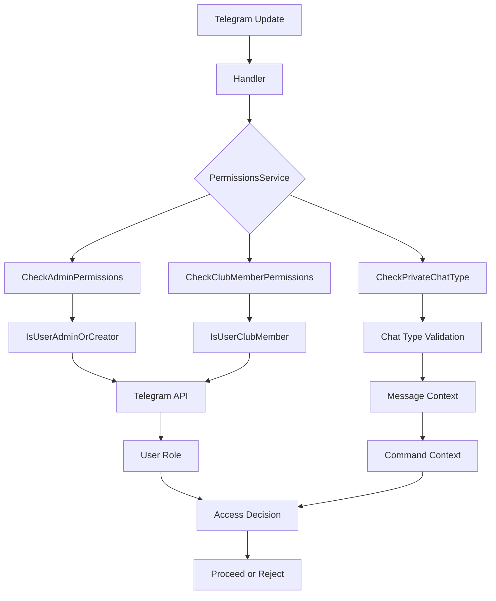

# Permissions Service

<cite>
**Referenced Files in This Document**   
- [permissions_service.go](file://internal/services/permissions_service.go)
- [permission_utils.go](file://internal/utils/permission_utils.go)
- [user_repository.go](file://internal/database/repositories/user_repository.go)
- [event_edit_handler.go](file://internal/handlers/adminhandlers/eventhandlers/event_edit_handler.go)
- [show_topics_handler.go](file://internal/handlers/adminhandlers/show_topics_handler.go)
- [profiles_manager_handler.go](file://internal/handlers/adminhandlers/profiles_manager_handler.go)
- [tg_user_constants.go](file://internal/constants/tg_user_constants.go)
</cite>

## Table of Contents
1. [Introduction](#introduction)
2. [Core Components](#core-components)
3. [Architecture Overview](#architecture-overview)
4. [Detailed Component Analysis](#detailed-component-analysis)
5. [Dependency Analysis](#dependency-analysis)
6. [Performance Considerations](#performance-considerations)
7. [Troubleshooting Guide](#troubleshooting-guide)
8. [Conclusion](#conclusion)

## Introduction
The PermissionsService component in evocoders-bot-go is responsible for managing user access control within the Telegram bot. It ensures that only authorized users can execute sensitive operations such as event management, topic moderation, and profile administration. The service implements role-based access control by verifying user membership status and administrative privileges against the bot's main group. It integrates with the Telegram API to check real-time chat membership and uses the application's database to validate user attributes. This document provides a comprehensive analysis of the PermissionsService, including its methods, integration points, and usage patterns across admin handlers.

## Core Components
The PermissionsService provides essential access control functionality through several key methods that validate user roles and command context. It works in conjunction with utility functions and database repositories to enforce security policies for admin-only and club-member-only commands. The service is injected into various handlers where permission checks are required before executing sensitive operations.

**Section sources**
- [permissions_service.go](file://internal/services/permissions_service.go#L1-L96)

## Architecture Overview
The PermissionsService operates as a middleware layer between Telegram update handlers and business logic execution. It intercepts incoming messages and evaluates whether the sender has sufficient privileges to perform the requested action. The service delegates role verification to utility functions that interact with the Telegram Bot API, while membership status is validated through database queries via UserRepository. This separation of concerns allows for flexible permission policies and easy testing through interface mocking.

**Diagram sources**
- [permissions_service.go](file://internal/services/permissions_service.go#L1-L96)
- [permission_utils.go](file://internal/utils/permission_utils.go#L1-L49)

## Detailed Component Analysis

### Permissions Service Implementation
The PermissionsService struct contains configuration, bot client, and message sender service dependencies to perform comprehensive access control checks. It provides methods to validate administrative privileges, club membership, and appropriate chat context for command execution.

#### Permission Checking Methods

**Diagram sources**
- [permissions_service.go](file://internal/services/permissions_service.go#L15-L48)

### User Role Verification
The service relies on utility functions to determine user roles by querying the Telegram API for chat membership status. These functions abstract the API interaction and provide a clean interface for permission checks.

**Diagram sources**
- [permissions_service.go](file://internal/services/permissions_service.go#L50-L96)
- [permission_utils.go](file://internal/utils/permission_utils.go#L16-L48)

### Database Integration for User Attributes
While role verification happens through the Telegram API, user attributes such as club membership status are stored in the database and accessed through UserRepository. The IsClubMember field in the User struct indicates whether a user has full access to club features.

**Diagram sources**
- [user_repository.go](file://internal/database/repositories/user_repository.go#L21-L28)

### Admin Handler Integration
The PermissionsService is integrated into various admin handlers to protect sensitive operations. When an admin command is invoked, the service validates both user privileges and command context before allowing execution.

**Diagram sources**
- [event_edit_handler.go](file://internal/handlers/adminhandlers/eventhandlers/event_edit_handler.go#L105-L132)
- [show_topics_handler.go](file://internal/handlers/adminhandlers/show_topics_handler.go#L35-L62)

## Dependency Analysis
The PermissionsService has well-defined dependencies that enable its access control functionality. It depends on the bot client to interact with the Telegram API, configuration to identify the target group, and message sender service to communicate permission denials to users. The service is consumed by various admin handlers that require permission validation before executing sensitive operations.

**Diagram sources**
- [permissions_service.go](file://internal/services/permissions_service.go#L1-L13)
- [event_edit_handler.go](file://internal/handlers/adminhandlers/eventhandlers/event_edit_handler.go#L105-L132)

## Performance Considerations
Permission checks involve external API calls to Telegram's servers, which introduces latency and potential reliability concerns. Each permission check requires a GetChatMember API call, which counts against Telegram's rate limits. For high-frequency operations, this could become a bottleneck. The current implementation does not include caching of permission results, meaning repeated commands from the same user will trigger repeated API calls. This design prioritizes security and up-to-date membership information over performance, ensuring that users who lose admin privileges or leave the group are immediately restricted from using admin commands.

## Troubleshooting Guide
Common issues with the PermissionsService include permission escalation due to stale membership data, false permission denials from API failures, and incorrect role assignment. When the Telegram API is unreachable, permission checks fail closed by denying access, which may block legitimate users. The service logs all permission violations and API errors for monitoring. To mitigate API reliability issues, implement client-side caching with short TTLs for permission results, though this introduces a small window where revoked privileges remain active. Ensure the bot has sufficient permissions in the target group to query member information, as restricted bots cannot perform membership checks.

**Section sources**
- [permissions_service.go](file://internal/services/permissions_service.go#L1-L96)
- [permission_utils.go](file://internal/utils/permission_utils.go#L1-L49)

## Conclusion
The PermissionsService provides a robust foundation for access control in the evocoders-bot-go application. By combining real-time Telegram API checks with database-stored user attributes, it enforces security policies for admin and club-member-only features. The service's modular design allows for easy integration into various handlers while maintaining separation of concerns. Future improvements could include caching mechanisms to reduce API calls, more granular role definitions, and enhanced logging for security auditing. The current implementation effectively protects sensitive operations while providing clear feedback to users when access is denied.