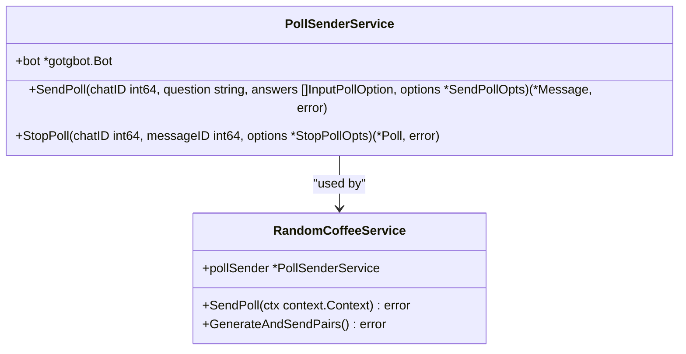
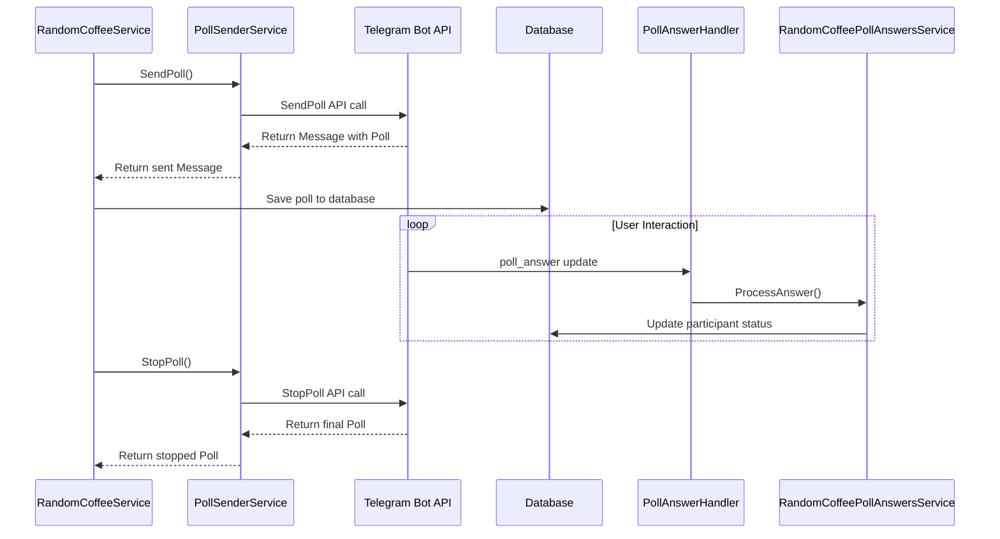
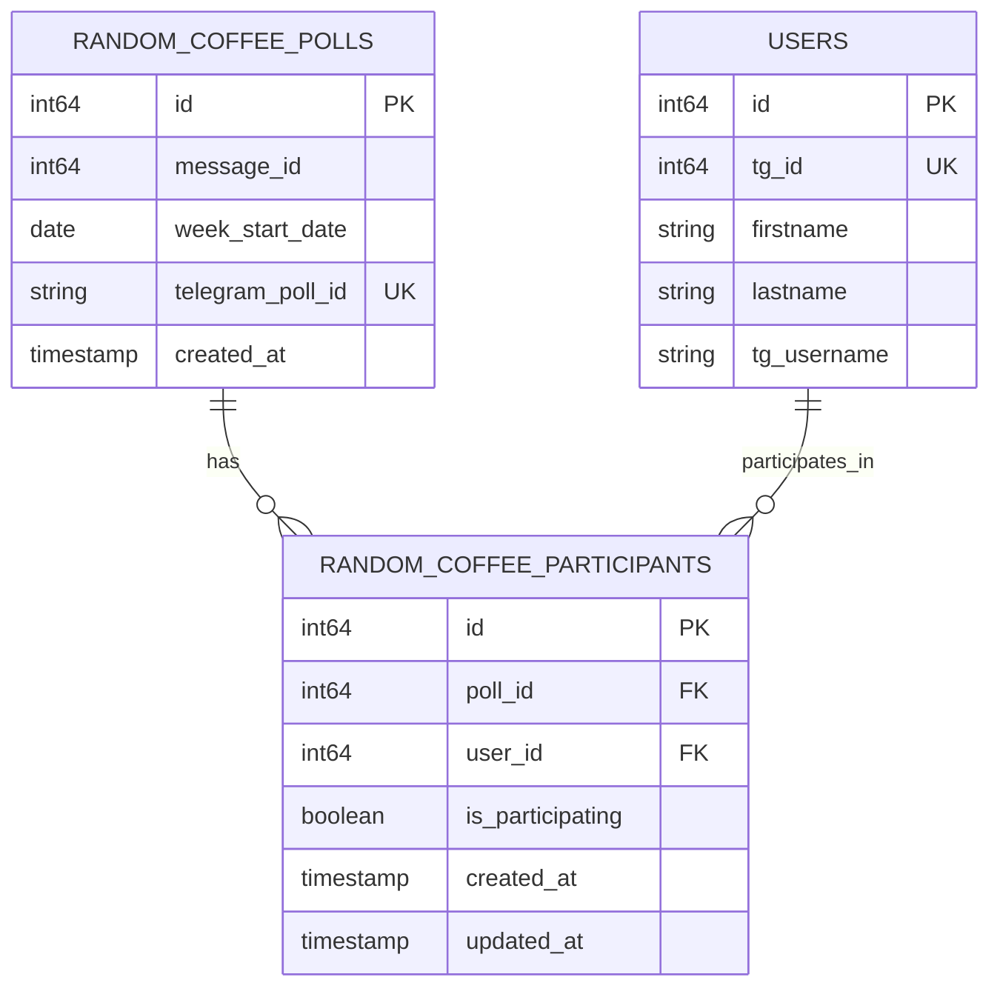
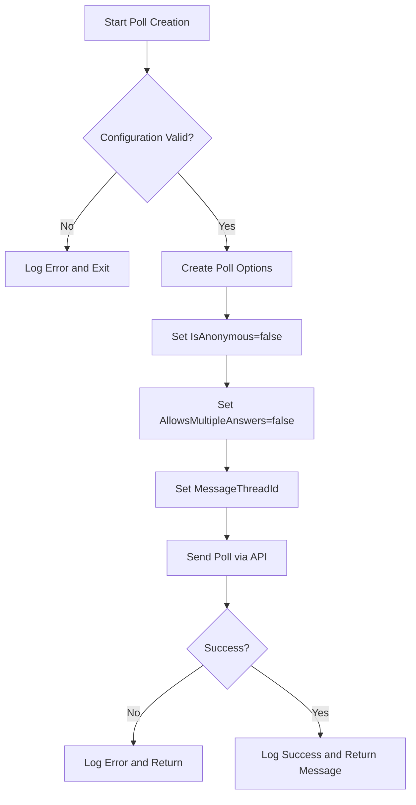

# Poll Sender Service

<cite>
**Referenced Files in This Document**   
- [poll_sender_service.go](file://internal/services/poll_sender_service.go)
- [random_coffee_service.go](file://internal/services/random_coffee_service.go)
- [randomcofee_poll_answers_service.go](file://internal/services/grouphandlersservices/randomcofee_poll_answers_service.go)
- [poll_answer_handler.go](file://internal/handlers/grouphandlers/poll_answer_handler.go)
- [random_coffee_poll_repository.go](file://internal/database/repositories/random_coffee_poll_repository.go)
- [random_coffee_participant_repository.go](file://internal/database/repositories/random_coffee_participant_repository.go)
- [bot.go](file://internal/bot/bot.go)
</cite>

## Update Summary
**Changes Made**   
- Updated integration details to reflect new service dependency via RandomCoffeePollAnswersService
- Revised sequence diagram to show updated flow from PollAnswerHandler to RandomCoffeePollAnswersService
- Added section on response processing logic in RandomCoffeePollAnswersService
- Updated diagram sources and section references to include new service files
- Corrected outdated handler reference from random_coffee_poll_answer_handler.go to current poll_answer_handler.go

## Table of Contents
1. [Introduction](#introduction)
2. [Core Functionality](#core-functionality)
3. [Poll Lifecycle Management](#poll-lifecycle-management)
4. [Integration with Random Coffee System](#integration-with-random-coffee-system)
5. [Data Flow and State Management](#data-flow-and-state-management)
6. [Error Handling and Recovery](#error-handling-and-recovery)
7. [Configuration and Telegram API Considerations](#configuration-and-telegram-api-considerations)
8. [Troubleshooting Guide](#troubleshooting-guide)

## Introduction
The PollSenderService is a specialized component within the evocoders-bot-go application responsible for creating and managing Telegram polls, particularly for the Random Coffee system. This service acts as a wrapper around the Telegram Bot API's poll functionality, providing a clean interface for sending and stopping polls while handling logging and error reporting. The service is tightly integrated with the application's database layer to ensure poll state consistency and supports the event-driven architecture required for user response tracking. It plays a critical role in facilitating weekly coffee pairings by enabling user participation through interactive polls in Telegram group topics.

**Section sources**
- [poll_sender_service.go](file://internal/services/poll_sender_service.go#L1-L71)

## Core Functionality
The PollSenderService provides two primary methods for poll management: SendPoll and StopPoll. The SendPoll method creates a new poll in a specified Telegram chat with configurable options including question text, answer choices, anonymity settings, and message thread placement. It returns the sent message object containing the poll, which includes critical identifiers for tracking. The StopPoll method allows administrators to prematurely close a poll, retrieving the final poll results. Both methods include comprehensive logging to track poll operations and error conditions. The service maintains a reference to the Telegram bot client, enabling direct API calls while abstracting the complexity of the underlying gotgbot library. This abstraction allows higher-level services like RandomCoffeeService to interact with Telegram polls through a simplified interface.

**Diagram sources**
- [poll_sender_service.go](file://internal/services/poll_sender_service.go#L1-L71)
- [random_coffee_service.go](file://internal/services/random_coffee_service.go#L17-L27)

**Section sources**
- [poll_sender_service.go](file://internal/services/poll_sender_service.go#L1-L71)

## Poll Lifecycle Management
The PollSenderService manages the complete lifecycle of Telegram polls within the Random Coffee system. When a new poll is initiated, the service sends it to a specific chat and thread ID as configured in the application settings. The poll remains active until either the natural expiration (not implemented in this service) or manual closure via the StopPoll method. The service ensures proper state tracking by logging key events such as poll creation and closure. After a poll is stopped, the service returns the final poll object which contains vote counts and other metadata. This lifecycle is coordinated with database operations through the RandomCoffeeService, which saves poll information immediately after creation and processes results after closure. The service does not handle poll expiration automatically, relying instead on scheduled tasks to close polls at appropriate times.

**Section sources**
- [poll_sender_service.go](file://internal/services/poll_sender_service.go#L54-L71)
- [random_coffee_service.go](file://internal/services/random_coffee_service.go#L111-L130)

## Integration with Random Coffee System
The PollSenderService is a critical component of the Random Coffee system, working in concert with the RandomCoffeeService and response handlers. The RandomCoffeeService uses the PollSenderService to create weekly participation polls with specific options ("Да! 🤗" for participation, "Не в этот раз 💁🏽" for non-participation). After poll creation, the system pins the message to ensure visibility. User responses are captured by the PollAnswerHandler, which processes poll_answer updates from Telegram. This handler delegates processing to the RandomCoffeePollAnswersService, which validates users, checks for bans, and updates the database with participation status. The integration follows a dependency injection pattern where the PollSenderService is provided to the RandomCoffeeService during initialization, enabling clean separation of concerns while maintaining necessary coordination between components.

**Diagram sources**
- [random_coffee_service.go](file://internal/services/random_coffee_service.go#L54-L109)
- [poll_answer_handler.go](file://internal/handlers/grouphandlers/poll_answer_handler.go#L1-L32)
- [randomcofee_poll_answers_service.go](file://internal/services/grouphandlersservices/randomcofee_poll_answers_service.go#L1-L116)

**Section sources**
- [random_coffee_service.go](file://internal/services/random_coffee_service.go#L54-L109)
- [poll_answer_handler.go](file://internal/handlers/grouphandlers/poll_answer_handler.go#L1-L32)
- [randomcofee_poll_answers_service.go](file://internal/services/grouphandlersservices/randomcofee_poll_answers_service.go#L1-L116)

## Data Flow and State Management
The PollSenderService participates in a sophisticated data flow that ensures consistency between Telegram's state and the application's database. When a poll is sent, its message ID and Telegram poll ID are stored in the random_coffee_polls table along with the week start date. User responses trigger updates to the random_coffee_participants table, recording whether each user is participating. The service uses the Telegram poll ID as a foreign key to associate responses with the correct poll instance. This design allows the system to handle multiple concurrent polls and maintain historical data for pairing algorithms that consider previous interactions. The data flow is event-driven, with the PollSenderService initiating the process and various handlers updating the state as users interact with the poll. Database constraints ensure referential integrity between polls, participants, and users.

**Diagram sources**
- [random_coffee_poll_repository.go](file://internal/database/repositories/random_coffee_poll_repository.go#L1-L96)
- [random_coffee_participant_repository.go](file://internal/database/repositories/random_coffee_participant_repository.go#L1-L86)

**Section sources**
- [random_coffee_poll_repository.go](file://internal/database/repositories/random_coffee_poll_repository.go#L1-L96)
- [random_coffee_participant_repository.go](file://internal/database/repositories/random_coffee_participant_repository.go#L1-L86)

## Error Handling and Recovery
The PollSenderService implements robust error handling to maintain system stability during poll operations. All API calls are wrapped in error checks with descriptive logging that includes the service name, operation type, and error details. When a poll fails to send, the service logs the error and returns it to the caller, allowing higher-level services to decide on recovery strategies. Similarly, failures to stop a poll are logged but do not prevent the system from proceeding with pair generation. The service follows a fail-open approach where temporary API issues don't halt the entire Random Coffee process. Recovery mechanisms are implemented at the service level, with the RandomCoffeeService capable of continuing pair generation even if poll stopping fails. Database operations include their own error handling, with specific cases like sql.ErrNoRows handled appropriately to distinguish between missing records and actual errors.

**Section sources**
- [poll_sender_service.go](file://internal/services/poll_sender_service.go#L35-L52)
- [random_coffee_service.go](file://internal/services/random_coffee_service.go#L118-L130)

## Configuration and Telegram API Considerations
The PollSenderService operates within specific constraints defined by both application configuration and Telegram API limitations. Polls are configured to be non-anonymous (IsAnonymous: false) to enable user identification and prevent bot participation, with the system actively detecting and rejecting votes from bot accounts. Multiple answers are disabled (AllowsMultipleAnswers: false) to ensure each user makes a single choice. Polls are sent to specific message threads (MessageThreadId) within the supergroup, maintaining organization in busy channels. The service relies on configuration values like SuperGroupChatID and RandomCoffeeTopicID, which must be properly set in the application configuration. The integration respects Telegram's rate limits and update mechanisms, with the bot configured to receive poll_answer updates through the allowed_updates parameter in the polling configuration.

**Diagram sources**
- [random_coffee_service.go](file://internal/services/random_coffee_service.go#L70-L109)
- [bot.go](file://internal/bot/bot.go#L300-L320)

**Section sources**
- [random_coffee_service.go](file://internal/services/random_coffee_service.go#L70-L109)
- [bot.go](file://internal/bot/bot.go#L300-L320)

## Troubleshooting Guide
Common issues with the PollSenderService typically involve configuration errors, API connectivity problems, or database inconsistencies. If polls fail to send, verify that SuperGroupChatID and RandomCoffeeTopicID are correctly configured in the application settings. Check Telegram API connectivity and bot token validity, as network issues can prevent poll creation. Database-related problems may occur if the random_coffee_polls or random_coffee_participants tables have schema mismatches or constraint violations. Response parsing errors can arise if Telegram's poll_answer updates don't match expected formats, though the system includes nil checks to prevent crashes. Inconsistent state may manifest as participants not being recorded, which can be diagnosed by checking the RandomCoffeePollAnswersService logs for database update errors. Recovery typically involves verifying configuration, checking database connectivity, and ensuring the bot has necessary permissions in the target chat and topic.

**Section sources**
- [poll_sender_service.go](file://internal/services/poll_sender_service.go#L35-L52)
- [randomcofee_poll_answers_service.go](file://internal/services/grouphandlersservices/randomcofee_poll_answers_service.go#L1-L116)
- [random_coffee_service.go](file://internal/services/random_coffee_service.go#L118-L130)