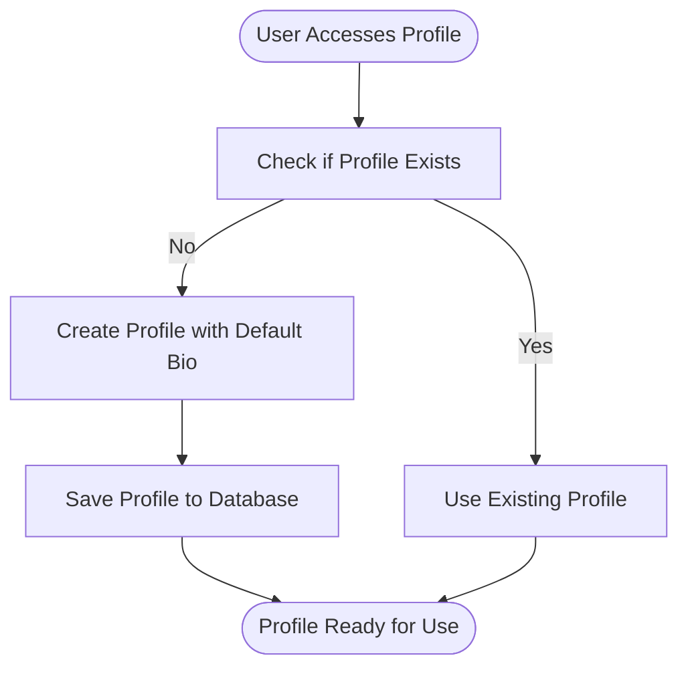
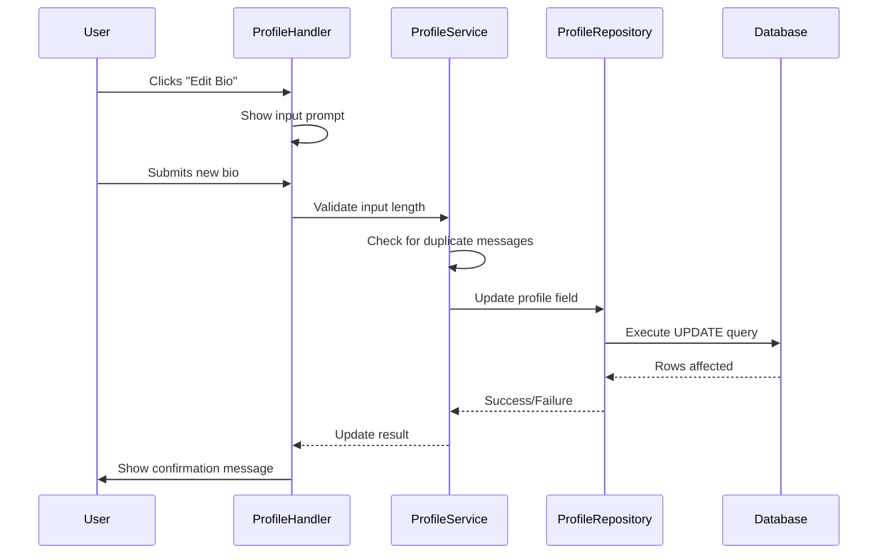
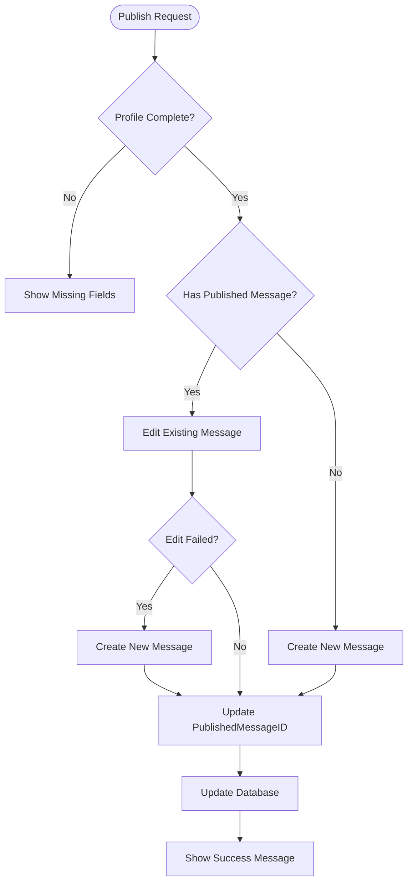
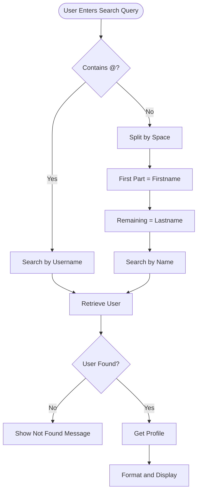
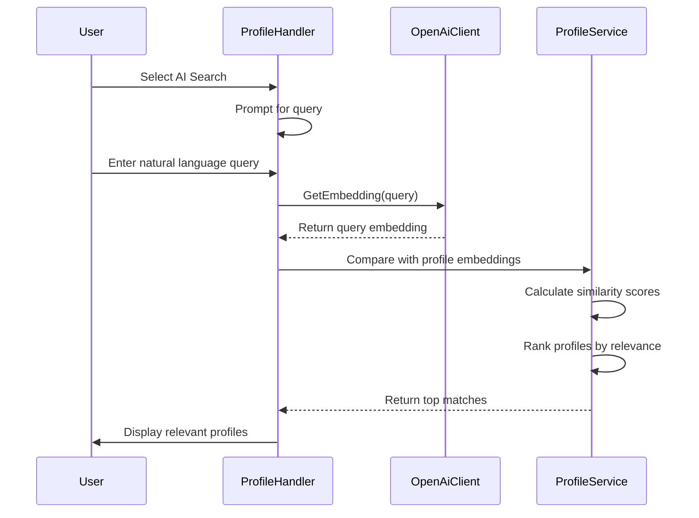
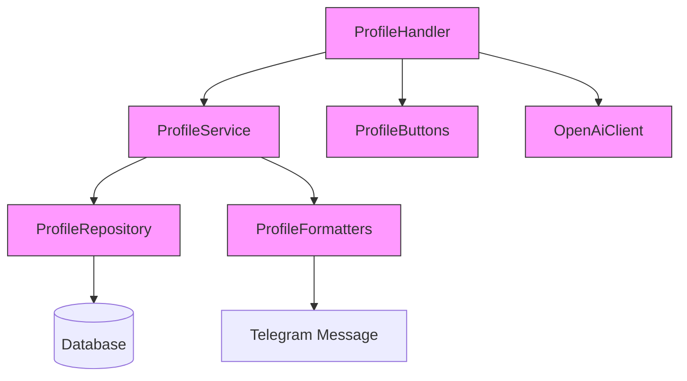

# Profile Service

<cite>
**Referenced Files in This Document**   
- [profile_service.go](file://internal/services/profile_service.go)
- [profile_repository.go](file://internal/database/repositories/profile_repository.go)
- [profile_formaters.go](file://internal/formatters/profile_formaters.go)
- [profile_handler.go](file://internal/handlers/privatehandlers/profile_handler.go)
- [profile_handler_buttons.go](file://internal/buttons/profile_handler_buttons.go)
- [openai_client.go](file://internal/clients/openai_client.go)
</cite>

## Table of Contents
1. [Introduction](#introduction)
2. [Core Components](#core-components)
3. [Profile Creation and Editing](#profile-creation-and-editing)
4. [Profile Publishing](#profile-publishing)
5. [Profile Search and AI Integration](#profile-search-and-ai-integration)
6. [Service Composition and Data Flow](#service-composition-and-data-flow)
7. [Error Handling and Data Consistency](#error-handling-and-data-consistency)
8. [Performance and Caching Considerations](#performance-and-caching-considerations)
9. [Conclusion](#conclusion)

## Introduction
The ProfileService component in evocoders-bot-go is responsible for managing user profiles within a Telegram bot ecosystem. It enables users to create, edit, publish, and search profiles, serving as a central hub for personal information management. The service ensures profile completeness before publication, interacts with the database through ProfileRepository, formats messages using dedicated formatters, and supports AI-enhanced search via OpenAI integration. This document details the service's architecture, key methods, business rules, and integration points to provide a comprehensive understanding for both new and experienced developers.

## Core Components

The ProfileService operates within a layered architecture, coordinating with repositories, formatters, handlers, and external clients to deliver profile management functionality. Key components include the ProfileService itself, ProfileRepository for data persistence, formatters for message construction, buttons for user interaction, and OpenAI client for intelligent search capabilities.

**Section sources**
- [profile_service.go](file://internal/services/profile_service.go#L1-L38)
- [profile_repository.go](file://internal/database/repositories/profile_repository.go#L1-L285)
- [profile_formaters.go](file://internal/formatters/profile_formaters.go#L1-L110)
- [profile_handler_buttons.go](file://internal/buttons/profile_handler_buttons.go#L1-L143)
- [openai_client.go](file://internal/clients/openai_client.go#L1-L97)

## Profile Creation and Editing

### Profile Creation Flow
The ProfileService supports profile creation through multiple pathways, including direct creation via `Create` method in ProfileRepository and automatic creation during user onboarding via `GetOrCreate` or `GetOrCreateWithBio` methods. When a user accesses their profile for the first time, the system automatically creates a profile if none exists, ensuring seamless user experience.

**Diagram sources**
- [profile_repository.go](file://internal/database/repositories/profile_repository.go#L120-L145)

### Editing Profile Fields
Profile editing is managed through the profile handler, which guides users through a state-based conversation. Users can edit their first name, last name, and bio through dedicated input handlers. The service enforces validation rules such as maximum length constraints (30 characters for names, configurable limit for bio) and proper text formatting.

When a user submits updated information, the service updates the corresponding fields in the database through transactional operations. The `saveProfileField` and `saveUserField` methods in the profile handler handle these updates, using the ProfileRepository and UserRepository respectively to persist changes.

**Diagram sources**
- [profile_handler.go](file://internal/handlers/privatehandlers/profile_handler.go#L500-L550)
- [profile_repository.go](file://internal/database/repositories/profile_repository.go#L60-L85)

**Section sources**
- [profile_handler.go](file://internal/handlers/privatehandlers/profile_handler.go#L400-L600)
- [profile_repository.go](file://internal/database/repositories/profile_repository.go#L60-L85)

## Profile Publishing

### Publishing Workflow
The publishing functionality allows users to share their profiles in a designated Telegram topic. The `PublishProfile` method checks profile completeness before allowing publication, ensuring that essential fields (first name, last name, and bio) are populated. This validation is performed by the `IsProfileComplete` method in ProfileService.

**Diagram sources**
- [profile_service.go](file://internal/services/profile_service.go#L20-L38)
- [profile_handler.go](file://internal/handlers/privatehandlers/profile_handler.go#L700-L800)

### Transaction Handling
During profile updates that involve publishing, the service ensures data consistency through careful transaction management. When a profile is published, the system first attempts to edit an existing message in the intro topic. If this fails (except when the content is identical), it creates a new message and updates the `published_message_id` in the database. This two-step process prevents orphaned messages and maintains referential integrity between the Telegram message and the database record.

The `UpdatePublishedMessageID` method in ProfileRepository handles the database update, using a parameterized query to prevent SQL injection and ensure atomic updates. The method validates that the update affected exactly one row, providing immediate feedback if the profile record doesn't exist.

**Section sources**
- [profile_handler.go](file://internal/handlers/privatehandlers/profile_handler.go#L700-L800)
- [profile_repository.go](file://internal/database/repositories/profile_repository.go#L100-L120)

## Profile Search and AI Integration

### Traditional Profile Search
The service supports traditional profile search by Telegram username or full name. Users can search for others by entering a username (with or without @ prefix) or a combination of first and last name. The search functionality uses UserRepository methods `GetByTelegramUsername` and `SearchByName` to locate users, then retrieves their associated profiles through ProfileRepository.

**Diagram sources**
- [profile_handler.go](file://internal/handlers/privatehandlers/profile_handler.go#L600-L650)

### AI-Enhanced Search with OpenAI
The service implements AI-powered profile search using OpenAI's embedding technology. When users select the "AI-search by bio" option, they can enter natural language queries that are converted to embeddings and compared against pre-computed embeddings of profile bios. This allows for semantic search capabilities, finding profiles that match the meaning of the query rather than just keyword matches.

The OpenAiClient provides methods `GetEmbedding` and `GetBatchEmbeddings` to generate vector representations of text. These embeddings are used to calculate similarity scores between the search query and stored profile bios, enabling intelligent matching based on contextual meaning rather than exact text matching.

**Diagram sources**
- [openai_client.go](file://internal/clients/openai_client.go#L60-L97)
- [profile_handler.go](file://internal/handlers/privatehandlers/profile_handler.go#L800-L850)

**Section sources**
- [openai_client.go](file://internal/clients/openai_client.go#L60-L97)
- [profile_handler.go](file://internal/handlers/privatehandlers/profile_handler.go#L800-L850)

## Service Composition and Data Flow

### Component Relationships
The ProfileService operates as part of a larger ecosystem, interacting with various components to deliver its functionality. The service is instantiated with a Telegram bot instance and is accessed through handlers that manage user interactions. It delegates data persistence operations to ProfileRepository while relying on formatters to construct user-facing messages.

**Diagram sources**
- [profile_service.go](file://internal/services/profile_service.go#L1-L38)
- [profile_handler.go](file://internal/handlers/privatehandlers/profile_handler.go#L1-L100)

### Message Construction and Formatting
The service uses dedicated formatters to create consistent, properly formatted messages for different contexts. The `FormatProfileView`, `FormatProfileManagerView`, and `FormatPublicProfileForMessage` functions in profile_formaters.go handle the construction of profile displays for user viewing, administrative management, and public publication respectively.

These formatters apply consistent styling, handle special characters through HTML entity replacement, and incorporate user information such as Telegram links and score display. They ensure that profile information is presented in a readable, secure format that prevents XSS vulnerabilities by escaping HTML characters in user-generated content.

**Section sources**
- [profile_formaters.go](file://internal/formatters/profile_formaters.go#L1-L110)
- [profile_handler.go](file://internal/handlers/privatehandlers/profile_handler.go#L450-L500)

## Error Handling and Data Consistency

### Common Issues and Mitigation
The ProfileService addresses several common issues that can arise in profile management:

- **Data Inconsistency**: Prevented through transactional updates and validation of database operation results (checking rows affected)
- **Search Relevance**: Improved through AI-powered semantic search using OpenAI embeddings
- **Formatting Errors**: Mitigated by consistent use of formatters that escape HTML characters and apply proper message formatting
- **Duplicate Processing**: Prevented by tracking message timestamps in user store to avoid processing the same message multiple times

The service implements comprehensive error handling throughout its operations, wrapping database errors with contextual information using Go's error wrapping. This provides detailed error messages that include the operation being performed and the specific record involved, facilitating debugging and monitoring.

### Validation and Business Rules
The service enforces several business rules to maintain data quality:

- Profile completeness validation requiring first name, last name, and bio for publication
- Length constraints on profile fields (30 characters for names, configurable limit for bio)
- Unique user identification through Telegram ID
- Proper HTML escaping of user-generated content to prevent injection attacks
- Rate limiting of operations through conversation state management

These rules are implemented at multiple levels - in the handler for input validation, in the service for business logic validation, and in the repository for data integrity constraints.

**Section sources**
- [profile_service.go](file://internal/services/profile_service.go#L20-L38)
- [profile_handler.go](file://internal/handlers/privatehandlers/profile_handler.go#L500-L600)
- [profile_repository.go](file://internal/database/repositories/profile_repository.go#L60-L85)

## Performance and Caching Considerations

### Search Query Optimization
The AI-enhanced search functionality presents performance considerations due to the computational cost of embedding generation and similarity calculations. To optimize performance:

- Batch embedding requests are supported through `GetBatchEmbeddings` to reduce API calls
- Search operations can be canceled through context cancellation to prevent long-running queries
- Results are likely to benefit from caching, though the current implementation doesn't show explicit caching mechanisms

For high-traffic scenarios, implementing a caching layer for frequent search queries or pre-computed profile embeddings would significantly improve response times. The service architecture supports such enhancements through its separation of concerns.

### Caching Opportunities
Several caching opportunities exist within the ProfileService:

- **Profile Data Caching**: Frequently accessed profiles could be cached to reduce database queries
- **Embedding Caching**: Profile bio embeddings could be stored and updated only when bios change
- **Search Result Caching**: Common search queries could have their results cached for a short duration
- **User Data Caching**: User information that doesn't change frequently could be cached

Implementing these caching strategies would require careful consideration of cache invalidation policies and memory usage, but could dramatically improve performance for read-heavy operations like profile viewing and searching.

**Section sources**
- [openai_client.go](file://internal/clients/openai_client.go#L60-L97)
- [profile_repository.go](file://internal/database/repositories/profile_repository.go#L200-L250)

## Conclusion
The ProfileService in evocoders-bot-go provides a comprehensive solution for user profile management within a Telegram bot environment. By integrating traditional database operations with modern AI capabilities, it offers both reliable data management and intelligent search functionality. The service's modular design, with clear separation between business logic, data access, and presentation layers, makes it maintainable and extensible. Through careful error handling, validation, and transaction management, it ensures data consistency and user experience quality. Future enhancements could focus on performance optimization through caching and expanded AI capabilities for profile recommendations and content analysis.