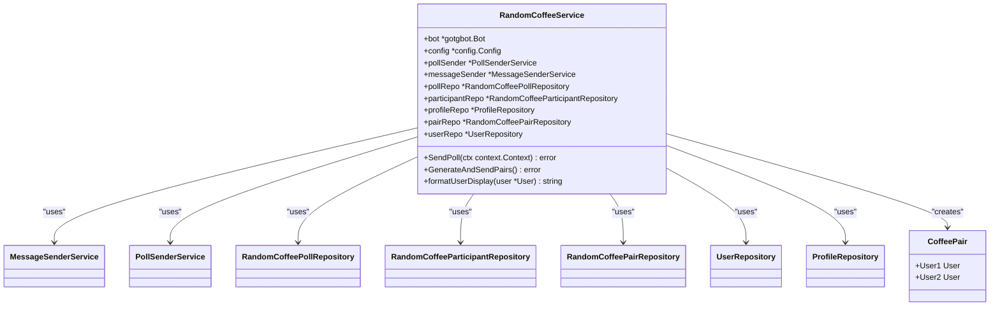
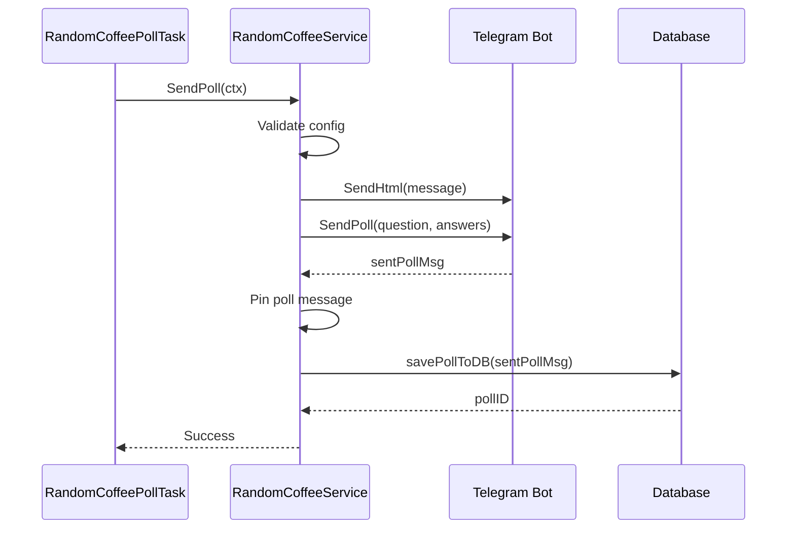
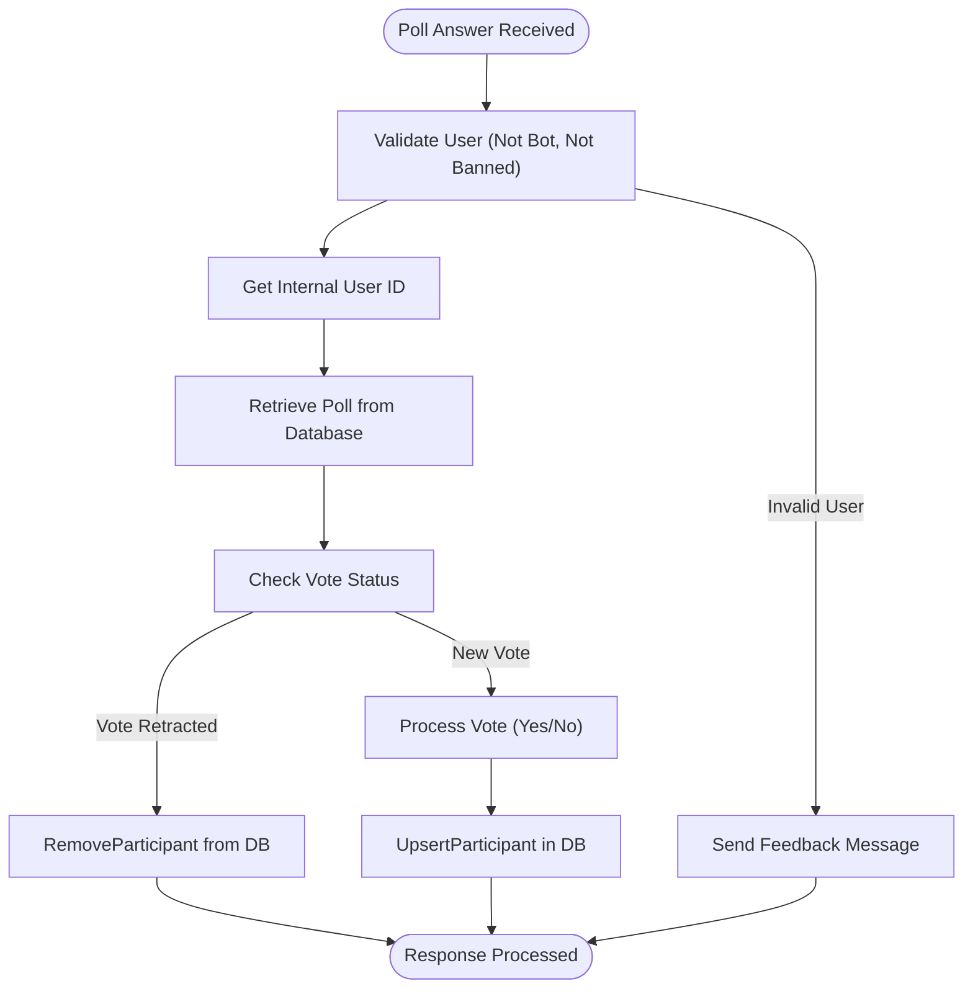
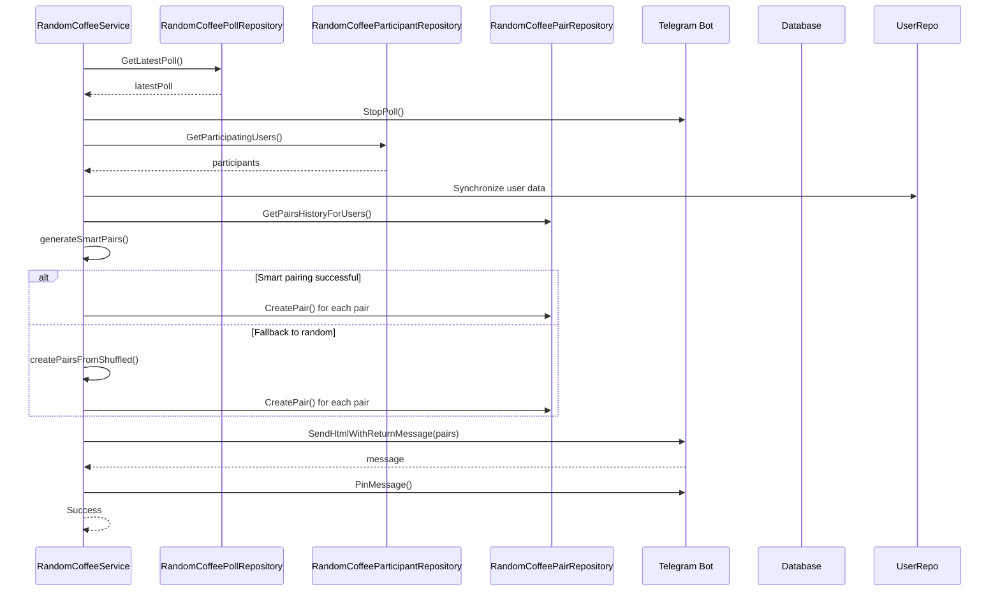
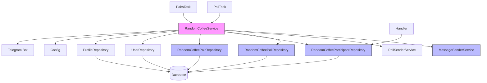

# Random Coffee Service

<cite>
**Referenced Files in This Document**   
- [random_coffee_service.go](file://internal/services/random_coffee_service.go)
- [random_coffee_poll_answer_handler.go](file://internal/handlers/grouphandlers/random_coffee_poll_answer_handler.go)
- [random_coffee_poll_task.go](file://internal/tasks/random_coffee_poll_task.go)
- [random_coffee_pairs_task.go](file://internal/tasks/random_coffee_pairs_task.go)
- [random_coffee_poll_repository.go](file://internal/database/repositories/random_coffee_poll_repository.go)
- [random_coffee_participant_repository.go](file://internal/database/repositories/random_coffee_participant_repository.go)
- [random_coffee_pair_repository.go](file://internal/database/repositories/random_coffee_pair_repository.go)
- [message_sender_service.go](file://internal/services/message_sender_service.go)
</cite>

## Table of Contents
1. [Introduction](#introduction)
2. [Core Components](#core-components)
3. [Architecture Overview](#architecture-overview)
4. [Detailed Component Analysis](#detailed-component-analysis)
5. [Dependency Analysis](#dependency-analysis)
6. [Performance Considerations](#performance-considerations)
7. [Troubleshooting Guide](#troubleshooting-guide)
8. [Conclusion](#conclusion)

## Introduction
The RandomCoffeeService component in evocoders-bot-go facilitates weekly peer-to-peer networking within a Telegram group by automating the creation of participant pairs for informal virtual coffee meetings. This service orchestrates a multi-stage workflow involving poll creation, response tracking, intelligent pairing, and match announcements. Designed for integration with Telegram's group topics and poll features, it ensures fair and engaging interactions while maintaining historical data to prevent repetitive pairings. The service operates through scheduled tasks and event-driven handlers, leveraging database persistence for state management and user history. This documentation provides a comprehensive analysis of its implementation, interfaces, data flow, and integration points.

## Core Components

The RandomCoffeeService component consists of several interconnected modules that handle different aspects of the random coffee workflow. The core functionality is implemented in the RandomCoffeeService struct, which coordinates with repository layers for data persistence, message sending services for Telegram integration, and scheduled tasks for automation. Key components include the poll creation mechanism, participant response handler, pairing algorithm, and scheduled execution tasks. The service integrates with Telegram's poll and message APIs to create interactive experiences while maintaining data consistency through database transactions. The implementation emphasizes user experience through formatted messages with profile links and handles edge cases such as uneven participant counts and user bans.

**Section sources**
- [random_coffee_service.go](file://internal/services/random_coffee_service.go#L1-L480)
- [random_coffee_poll_answer_handler.go](file://internal/handlers/grouphandlers/random_coffee_poll_answer_handler.go#L1-L128)
- [random_coffee_poll_task.go](file://internal/tasks/random_coffee_poll_task.go#L1-L106)
- [random_coffee_pairs_task.go](file://internal/tasks/random_coffee_pairs_task.go#L1-L102)

## Architecture Overview

```mermaid
graph TB
subgraph "Telegram Integration"
Bot[Telegram Bot]
Poll[Telegram Poll]
Message[Telegram Message]
end
subgraph "Scheduled Tasks"
PollTask[RandomCoffeePollTask]
PairsTask[RandomCoffeePairsTask]
end
subgraph "Service Layer"
RCS[RandomCoffeeService]
MSS[MessageSenderService]
end
subgraph "Repository Layer"
PollRepo[RandomCoffeePollRepository]
ParticipantRepo[RandomCoffeeParticipantRepository]
PairRepo[RandomCoffeePairRepository]
UserRepo[UserRepository]
ProfileRepo[ProfileRepository]
end
subgraph "Database"
DB[(PostgreSQL)]
end
PollTask --> RCS: "SendPoll"
PairsTask --> RCS: "GenerateAndSendPairs"
RCS --> MSS: "Send messages"
RCS --> PollRepo: "CRUD operations"
RCS --> ParticipantRepo: "Manage participants"
RCS --> PairRepo: "Store pairs"
RCS --> UserRepo: "Fetch user data"
RCS --> ProfileRepo: "Get profile links"
PollRepo --> DB
ParticipantRepo --> DB
PairRepo --> DB
UserRepo --> DB
ProfileRepo --> DB
Bot --> Poll: "Poll Answer"
Poll --> random_coffee_poll_answer_handler: "Process response"
random_coffee_poll_answer_handler --> ParticipantRepo: "Update participation"
```

**Diagram sources **
- [random_coffee_service.go](file://internal/services/random_coffee_service.go#L1-L480)
- [random_coffee_poll_answer_handler.go](file://internal/handlers/grouphandlers/random_coffee_poll_answer_handler.go#L1-L128)
- [random_coffee_poll_task.go](file://internal/tasks/random_coffee_poll_task.go#L1-L106)
- [random_coffee_pairs_task.go](file://internal/tasks/random_coffee_pairs_task.go#L1-L102)

## Detailed Component Analysis

### RandomCoffeeService Implementation

The RandomCoffeeService is the central component responsible for managing the entire random coffee workflow. It provides public methods for creating polls, processing responses, generating pairs, and announcing matches. The service maintains references to essential dependencies including the Telegram bot instance, configuration, poll sender, message sender, and various repositories for data persistence. The service follows a dependency injection pattern, receiving all its dependencies through the NewRandomCoffeeService constructor, which enhances testability and separation of concerns.

#### Public Interfaces and Methods



**Diagram sources **
- [random_coffee_service.go](file://internal/services/random_coffee_service.go#L1-L480)

**Section sources**
- [random_coffee_service.go](file://internal/services/random_coffee_service.go#L1-L480)

### Poll Creation and Management

The poll creation process begins with the SendPoll method, which creates a Telegram poll in the designated group topic to collect participant responses. The method first verifies configuration settings, then sends a preparatory message with participation rules before creating the actual poll. After successful poll creation, it saves the poll details to the database through the savePollToDB method, which calculates the upcoming Monday as the week start date for the coffee event. The poll is automatically pinned to ensure visibility, and all operations include comprehensive error handling and logging.

The RandomCoffeePollTask schedules the poll creation according to configurable time and day settings, using a ticker-based approach to check for execution time every minute. This task runs in a separate goroutine, allowing non-blocking execution while ensuring precise timing for the weekly poll. The task calculates the next run time based on the current day and time, accounting for weekly recurrence patterns.



**Diagram sources **
- [random_coffee_service.go](file://internal/services/random_coffee_service.go#L1-L480)
- [random_coffee_poll_task.go](file://internal/tasks/random_coffee_poll_task.go#L1-L106)
- [random_coffee_poll_repository.go](file://internal/database/repositories/random_coffee_poll_repository.go#L1-L97)

**Section sources**
- [random_coffee_service.go](file://internal/services/random_coffee_service.go#L1-L480)
- [random_coffee_poll_task.go](file://internal/tasks/random_coffee_poll_task.go#L1-L106)
- [random_coffee_poll_repository.go](file://internal/database/repositories/random_coffee_poll_repository.go#L1-L97)

### Participant Response Processing

Participant responses are handled by the RandomCoffeePollAnswerHandler, which listens for poll answer events from Telegram. When a user votes in the random coffee poll, this handler processes the response by first validating the user (checking for bot accounts and coffee bans), then updating the database with the user's participation status. The handler uses the RandomCoffeeParticipantRepository to upsert participant records, creating new entries or updating existing ones based on the user's vote. Vote retractions are handled by removing the participant record entirely.

The handler integrates with the UserRepository to ensure user data is current, creating internal user records if they don't exist. It also provides immediate feedback to users who are banned or attempting to vote with a bot account, sending personalized messages through the MessageSenderService. This event-driven approach ensures real-time response processing without polling the Telegram API.



**Diagram sources **
- [random_coffee_poll_answer_handler.go](file://internal/handlers/grouphandlers/random_coffee_poll_answer_handler.go#L1-L128)
- [random_coffee_participant_repository.go](file://internal/database/repositories/random_coffee_participant_repository.go#L1-L87)

**Section sources**
- [random_coffee_poll_answer_handler.go](file://internal/handlers/grouphandlers/random_coffee_poll_answer_handler.go#L1-L128)
- [random_coffee_participant_repository.go](file://internal/database/repositories/random_coffee_participant_repository.go#L1-L87)

### Pair Generation and Announcement

The GenerateAndSendPairs method orchestrates the pairing process at the end of each week. It begins by retrieving the latest poll from the database and stopping the poll to prevent further responses. The service then fetches all participating users through the RandomCoffeeParticipantRepository, verifying that sufficient participants exist for pairing. Before generating pairs, it synchronizes user data from Telegram to ensure display names and usernames are current.

The pairing algorithm employs a smart strategy that considers historical pairings to minimize repetition. The generateSmartPairs method retrieves the pairing history from the last four polls using the RandomCoffeePairRepository, then attempts to pair users who haven't been paired recently or at all. When users have been paired before, the algorithm prioritizes those with the oldest pairing date. This approach balances fairness with novelty, encouraging diverse interactions within the community.



**Diagram sources **
- [random_coffee_service.go](file://internal/services/random_coffee_service.go#L1-L480)
- [random_coffee_participant_repository.go](file://internal/database/repositories/random_coffee_participant_repository.go#L1-L87)
- [random_coffee_pair_repository.go](file://internal/database/repositories/random_coffee_pair_repository.go#L1-L126)

**Section sources**
- [random_coffee_service.go](file://internal/services/random_coffee_service.go#L1-L480)
- [random_coffee_participant_repository.go](file://internal/database/repositories/random_coffee_participant_repository.go#L1-L87)
- [random_coffee_pair_repository.go](file://internal/database/repositories/random_coffee_pair_repository.go#L1-L126)

## Dependency Analysis



**Diagram sources **
- [random_coffee_service.go](file://internal/services/random_coffee_service.go#L1-L480)
- [random_coffee_poll_repository.go](file://internal/database/repositories/random_coffee_poll_repository.go#L1-L97)
- [random_coffee_participant_repository.go](file://internal/database/repositories/random_coffee_participant_repository.go#L1-L87)
- [random_coffee_pair_repository.go](file://internal/database/repositories/random_coffee_pair_repository.go#L1-L126)

**Section sources**
- [random_coffee_service.go](file://internal/services/random_coffee_service.go#L1-L480)
- [random_coffee_poll_repository.go](file://internal/database/repositories/random_coffee_poll_repository.go#L1-L97)
- [random_coffee_participant_repository.go](file://internal/database/repositories/random_coffee_participant_repository.go#L1-L87)
- [random_coffee_pair_repository.go](file://internal/database/repositories/random_coffee_pair_repository.go#L1-L126)

## Performance Considerations

The RandomCoffeeService implementation demonstrates several performance-conscious design decisions. The use of goroutines for task execution ensures non-blocking operations, particularly important for the scheduled tasks that run at specific times. Database queries are optimized to retrieve only necessary data, such as the GetParticipatingUsers method which joins user and participant tables to minimize round trips. The pairing algorithm uses in-memory operations after retrieving data from the database, reducing the need for repeated queries during the pairing process.

Concurrency control is managed through the use of channels and goroutines, with the scheduled tasks using a stop channel for graceful shutdown. The service avoids holding database connections for extended periods by following a request-response pattern for database operations. Error handling is comprehensive but designed to prevent cascading failures, with non-critical errors logged but not propagated to stop the entire process.

The implementation also considers Telegram API rate limits by batching operations where possible and using asynchronous execution for non-essential tasks. The message sender service includes retry logic for transient errors like closed topics, enhancing reliability without compromising performance.

## Troubleshooting Guide

Common issues with the RandomCoffeeService typically fall into several categories: configuration errors, database inconsistencies, Telegram API issues, and pairing algorithm edge cases. Configuration problems often involve incorrect chat IDs, topic IDs, or scheduling parameters, which can be diagnosed through the service's logging output. Database issues may arise from schema mismatches or constraint violations, particularly when migrating between versions.

For uneven pairing (odd number of participants), the service handles this by designating one participant as unpaired and including them in the announcement message with a note that they're seeking company. Duplicate matches are prevented by the smart pairing algorithm, which checks historical data to avoid recent repetitions. Missing responses are handled gracefully by the participant repository, which updates records based on the latest poll answer.

When debugging, examine the service logs for error messages related to poll creation, message sending, or database operations. Verify that the Telegram bot has the necessary permissions in the target chat and topic. Check the database tables (random_coffee_polls, random_coffee_participants, random_coffee_pairs) to ensure data is being recorded correctly. For pairing issues, review the historical data in the random_coffee_pairs table to understand the algorithm's decision-making context.

**Section sources**
- [random_coffee_service.go](file://internal/services/random_coffee_service.go#L1-L480)
- [random_coffee_poll_answer_handler.go](file://internal/handlers/grouphandlers/random_coffee_poll_answer_handler.go#L1-L128)
- [random_coffee_poll_repository.go](file://internal/database/repositories/random_coffee_poll_repository.go#L1-L97)
- [random_coffee_participant_repository.go](file://internal/database/repositories/random_coffee_participant_repository.go#L1-L87)

## Conclusion

The RandomCoffeeService component provides a robust and well-architected solution for facilitating peer-to-peer networking within a Telegram community. Its modular design separates concerns effectively, with clear boundaries between service logic, data persistence, and external integrations. The implementation demonstrates thoughtful consideration of user experience, data consistency, and operational reliability. By leveraging scheduled tasks and event-driven handlers, the service automates a complex workflow while maintaining transparency through comprehensive logging and error handling. The smart pairing algorithm adds significant value by promoting diverse interactions within the community, and the integration with Telegram's features creates an engaging user experience. This component serves as an excellent example of how to build maintainable, scalable services for community engagement platforms.