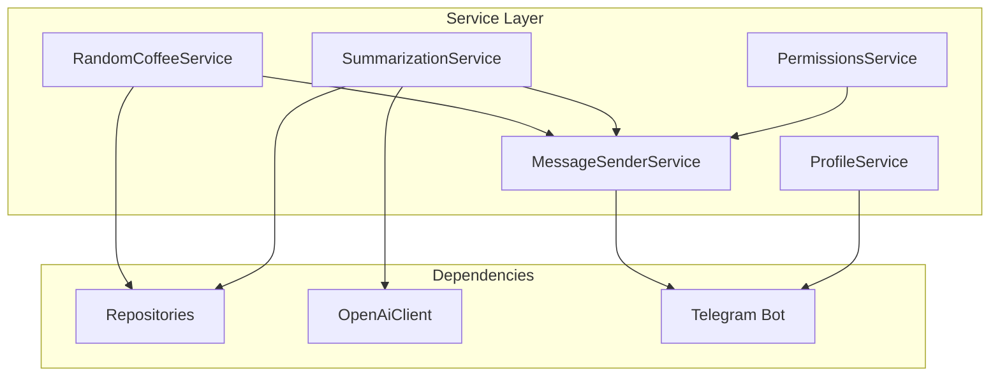
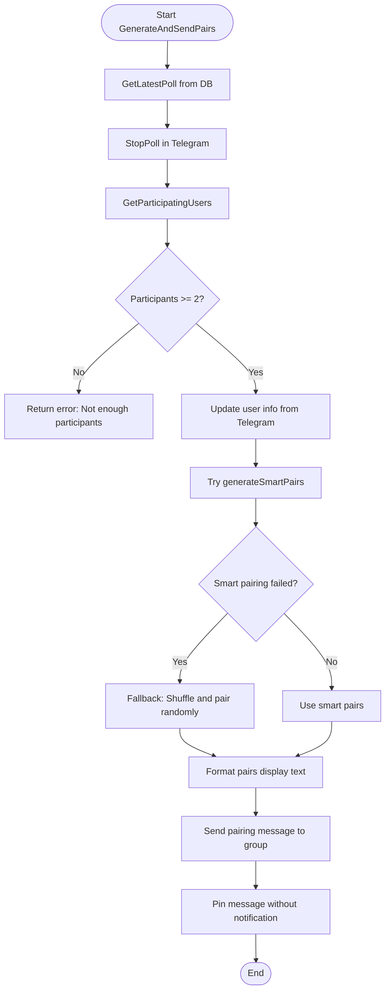
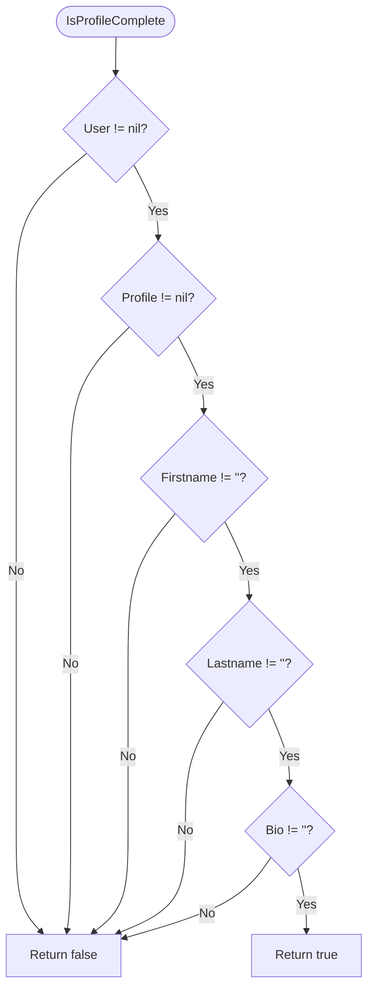
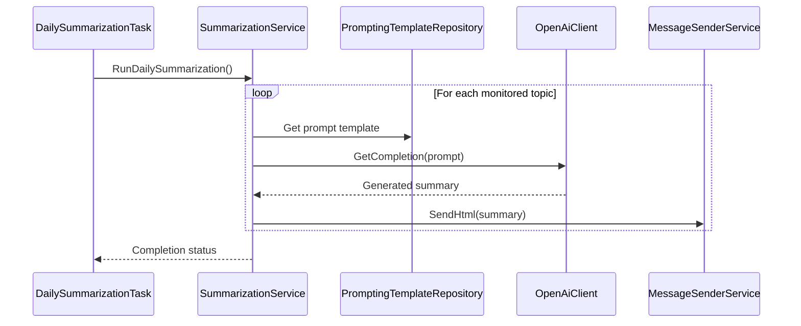
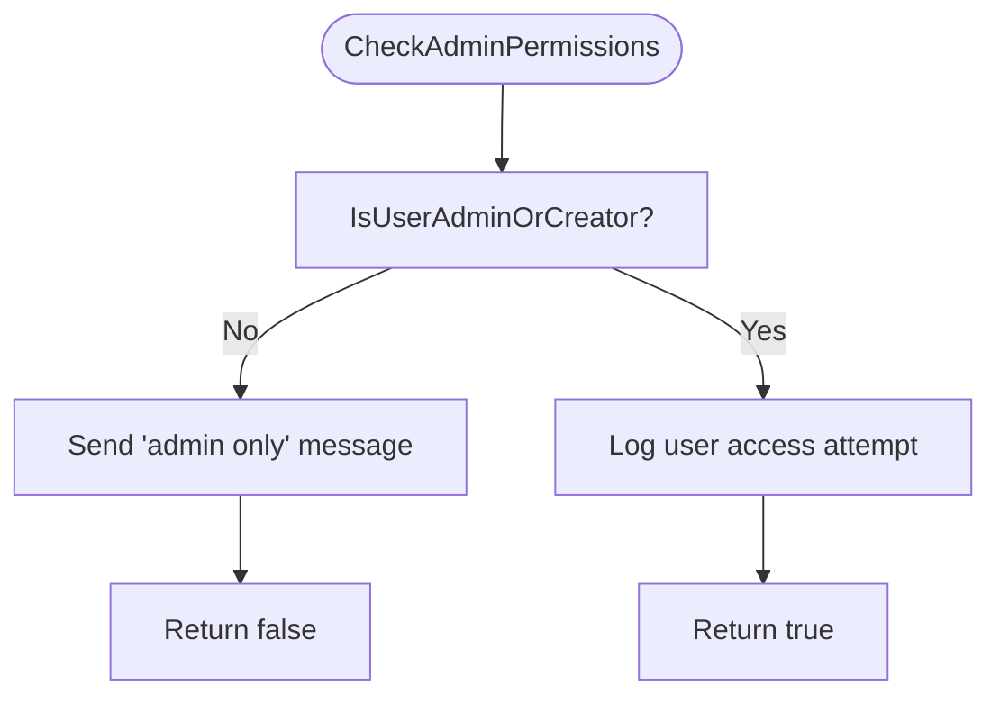
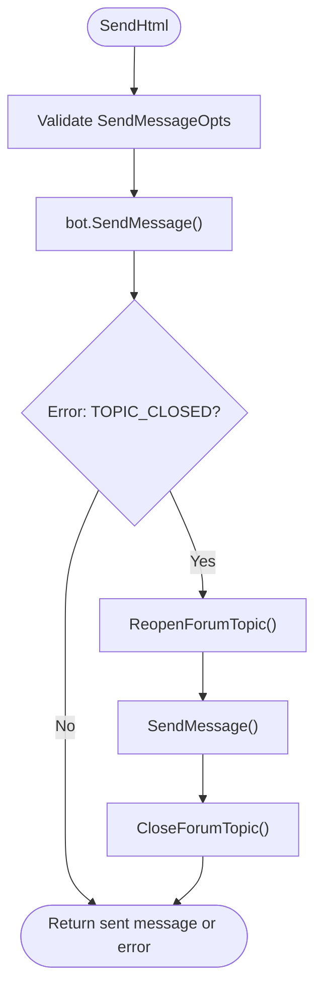
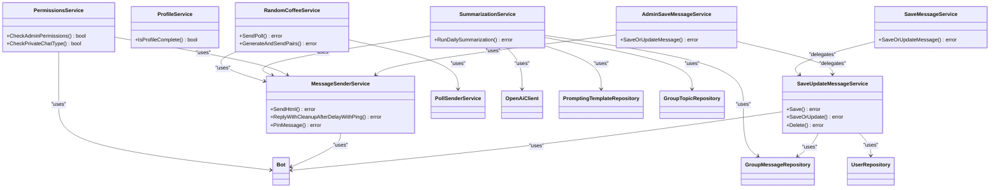

# Service Layer

<cite>
**Referenced Files in This Document**   
- [random_coffee_service.go](file://internal/services/random_coffee_service.go) - *Updated in commit 1c468bbe*
- [profile_service.go](file://internal/services/profile_service.go) - *Updated in commit 1c468bbe*
- [summarization_service.go](file://internal/services/summarization_service.go) - *Updated in commit 1c468bbe*
- [permissions_service.go](file://internal/services/permissions_service.go) - *Updated in commit 1c468bbe*
- [message_sender_service.go](file://internal/services/message_sender_service.go) - *Updated in commit 1c468bbe*
- [save_update_message_service.go](file://internal/services/grouphandlersservices/save_update_message_service.go) - *Added in commit 9bf9b3d1*
- [admin_save_message_service.go](file://internal/services/grouphandlersservices/admin_save_message_service.go) - *Updated in commit 9bf9b3d1*
- [save_message_service.go](file://internal/services/grouphandlersservices/save_message_service.go) - *Updated in commit 9bf9b3d1*
- [bot.go](file://internal/bot/bot.go) - *Updated in commits 1c468bbe and 9bf9b3d1*
</cite>

## Update Summary
**Changes Made**   
- Updated Service Architecture Overview to reflect new dependency injection pattern and service delegation
- Enhanced RandomCoffeeService section with updated dependency structure and GPT-5 Mini integration context
- Updated SummarizationService section to document GPT-5 Mini usage and improved message processing
- Added GroupMessageRepository and GroupTopicRepository dependencies to relevant service sections
- Updated Service Invocation Relationships diagram to include new repository dependencies
- Enhanced Usage Patterns with updated examples reflecting new search capabilities
- Updated Common Issues and Solutions to address enhanced content search functionality
- Refreshed all section and diagram sources to reflect current file states and commit changes

## Table of Contents
1. [Introduction](#introduction)
2. [Service Architecture Overview](#service-architecture-overview)
3. [RandomCoffeeService](#randomcoffeeservice)
4. [ProfileService](#profileservice)
5. [SummarizationService](#summarizationservice)
6. [PermissionsService](#permissionsservice)
7. [MessageSenderService](#messagesenderservice)
8. [Service Invocation Relationships](#service-invocation-relationships)
9. [Usage Patterns and Examples](#usage-patterns-and-examples)
10. [Common Issues and Solutions](#common-issues-and-solutions)
11. [Conclusion](#conclusion)

## Introduction
The Service Layer in evocoders-bot-go implements the core business logic that orchestrates interactions between the Telegram bot interface, data repositories, and external services. This layer encapsulates complex operations such as generating random coffee pairs, creating profile summaries using AI, managing user permissions, and sending formatted messages. The services are designed with separation of concerns, making them reusable across different handlers while maintaining clean dependencies on repositories and external clients.

**Section sources**
- [random_coffee_service.go](file://internal/services/random_coffee_service.go#L1-L480)
- [profile_service.go](file://internal/services/profile_service.go#L1-L39)
- [summarization_service.go](file://internal/services/summarization_service.go#L1-L177)
- [permissions_service.go](file://internal/services/permissions_service.go#L1-L97)
- [message_sender_service.go](file://internal/services/message_sender_service.go#L1-L481)

## Service Architecture Overview
The service layer follows a dependency injection pattern where each service receives its dependencies (repositories, clients, other services) through constructor functions. Services do not directly access the database but instead work through repository interfaces, ensuring separation between business logic and data access. The architecture promotes reusability, testability, and maintainability by clearly defining responsibilities for each service component.



**Diagram sources**
- [random_coffee_service.go](file://internal/services/random_coffee_service.go#L17-L27)
- [summarization_service.go](file://internal/services/summarization_service.go#L20-L25)
- [permissions_service.go](file://internal/services/permissions_service.go#L11-L15)
- [message_sender_service.go](file://internal/services/message_sender_service.go#L14-L16)
- [profile_service.go](file://internal/services/profile_service.go#L8-L10)

**Section sources**
- [random_coffee_service.go](file://internal/services/random_coffee_service.go#L1-L480)
- [summarization_service.go](file://internal/services/summarization_service.go#L1-L177)
- [bot.go](file://internal/bot/bot.go#L28-L52)

## RandomCoffeeService
The RandomCoffeeService manages the lifecycle of the Random Coffee event, from creating participation polls to generating and announcing participant pairs. It implements smart pairing logic that considers historical pairings to minimize repeats, enhancing user experience by promoting diverse interactions within the community.

### Key Functions
- **SendPoll**: Creates and sends a poll to the supergroup topic, allowing members to indicate their interest in participating.
- **GenerateAndSendPairs**: Processes poll results, generates pairs using smart algorithms, and announces the matches in the group.
- **generateSmartPairs**: Implements pairing logic that avoids recent repeats by checking historical data from the RandomCoffeePairRepository.

### Implementation Details
The service uses a combination of Telegram Bot API features and database persistence to manage the Random Coffee workflow. When generating pairs, it first attempts smart pairing based on history, falling back to random shuffling if necessary. The service also updates user information from Telegram to ensure profiles are current before pairing.



**Diagram sources**
- [random_coffee_service.go](file://internal/services/random_coffee_service.go#L17-L480)

**Section sources**
- [random_coffee_service.go](file://internal/services/random_coffee_service.go#L1-L480)

## ProfileService
The ProfileService provides functionality for managing user profiles within the system. Its primary responsibility is validating profile completeness, ensuring that users have provided all required information before their profiles can be published.

### Key Functions
- **IsProfileComplete**: Checks whether a user profile contains all mandatory fields including first name, last name, and bio.

### Implementation Details
The service performs validation on both user account information (first and last name) and profile-specific data (bio). This ensures that published profiles meet minimum quality standards before being shared with the community.



**Diagram sources**
- [profile_service.go](file://internal/services/profile_service.go#L8-L38)

**Section sources**
- [profile_service.go](file://internal/services/profile_service.go#L1-L39)

## SummarizationService
The SummarizationService generates daily summaries of group discussions using AI-powered text processing. It collects recent messages from monitored topics, formats them into a context for an LLM, and posts the generated summary back to the community. The service has been updated to use GPT-5 Mini with medium reasoning effort and client v2.5.0.

### Key Functions
- **RunDailySummarization**: Orchestrates the entire summarization process for all monitored topics.
- **summarizeTopicMessages**: Handles the summarization of messages for a single topic, including context building and AI processing.

### Implementation Details
The service integrates with the OpenAI API through the OpenAiClient to generate human-readable summaries. It uses prompt templates stored in the database, allowing non-technical administrators to customize the summarization style without code changes. The service includes rate-limiting considerations by adding delays between processing different topics.



**Diagram sources**
- [summarization_service.go](file://internal/services/summarization_service.go#L20-L176)

**Section sources**
- [summarization_service.go](file://internal/services/summarization_service.go#L1-L177)

## PermissionsService
The PermissionsService handles authorization logic for bot commands, ensuring that users have appropriate access rights before executing sensitive operations. It provides reusable methods for common permission checks across different handlers.

### Key Functions
- **CheckAdminPermissions**: Verifies if a user has administrator privileges.
- **CheckPrivateChatType**: Ensures a command is executed in a private chat context.
- **CheckClubMemberPermissions**: Validates if a user is a club member.
- **CheckAdminAndPrivateChat**: Combines admin and private chat checks for admin-only private commands.

### Implementation Details
The service uses utility functions to determine user roles and responds with appropriate error messages when permissions are insufficient. It also implements message cleanup functionality, automatically removing unauthorized commands after a delay to maintain chat cleanliness.



**Diagram sources**
- [permissions_service.go](file://internal/services/permissions_service.go#L11-L96)

**Section sources**
- [permissions_service.go](file://internal/services/permissions_service.go#L1-L97)

## MessageSenderService
The MessageSenderService abstracts the complexities of sending messages through the Telegram Bot API, providing consistent formatting and error handling across the application. It handles various message types and automatically manages common issues like closed topics.

### Key Functions
- **SendHtml/SendMarkdown**: Sends formatted messages with HTML or Markdown parsing.
- **ReplyWithCleanupAfterDelayWithPing**: Replies to a message and automatically cleans up both messages after a delay.
- **PinMessage**: Pins messages with configurable notification settings.
- **SendCopy**: Copies existing messages with proper entity handling.

### Implementation Details
The service includes sophisticated error handling for "TOPIC_CLOSED" errors by automatically reopening closed topics, sending the message, and then closing the topic again. This ensures seamless operation even when forum topics are manually closed by moderators.



**Diagram sources**
- [message_sender_service.go](file://internal/services/message_sender_service.go#L14-L480)

**Section sources**
- [message_sender_service.go](file://internal/services/message_sender_service.go#L1-L481)

## Service Invocation Relationships
Services in the evocoders-bot-go application are interconnected through well-defined dependencies, with higher-level services orchestrating lower-level ones. The architecture follows a clear hierarchy where business logic services depend on utility services like MessageSenderService, but not vice versa.



**Diagram sources**
- [bot.go](file://internal/bot/bot.go#L28-L52)
- [random_coffee_service.go](file://internal/services/random_coffee_service.go#L17-L27)
- [summarization_service.go](file://internal/services/summarization_service.go#L20-L25)
- [permissions_service.go](file://internal/services/permissions_service.go#L11-L15)
- [message_sender_service.go](file://internal/services/message_sender_service.go#L14-L16)
- [save_update_message_service.go](file://internal/services/grouphandlersservices/save_update_message_service.go#L14-L19)
- [save_message_service.go](file://internal/services/grouphandlersservices/save_message_service.go#L36-L51)
- [admin_save_message_service.go](file://internal/services/grouphandlersservices/admin_save_message_service.go#L42-L80)

**Section sources**
- [bot.go](file://internal/bot/bot.go#L28-L52)

## Usage Patterns and Examples

### Generating Coffee Pairs
The RandomCoffeeService can be invoked to automatically generate pairs for the weekly Random Coffee event:

```go
err := randomCoffeeService.GenerateAndSendPairs()
if err != nil {
    log.Printf("Error generating coffee pairs: %v", err)
}
```

This process will:
1. Retrieve the latest poll results
2. Stop the poll in the Telegram group
3. Generate pairs using smart pairing logic
4. Send and pin the pairing announcement

### Creating Profile Summaries
The SummarizationService can be used to generate daily summaries of group discussions:

```go
ctx := context.Background()
err := summarizationService.RunDailySummarization(ctx, false)
if err != nil {
    log.Printf("Error running daily summarization: %v", err)
}
```

This will process all configured monitored topics, generate AI-powered summaries using GPT-5 Mini, and post them to the designated summary topic.

### Checking User Permissions
Handlers can use the PermissionsService to protect sensitive commands:

```go
if !permissionsService.CheckAdminAndPrivateChat(message, "profilesManager") {
    return // Exit if checks fail
}
// Continue with admin-only logic
```

This pattern ensures that only administrators can access certain functionality and that it's used in the appropriate chat context.

### Enhanced Content Search
The updated message processing system allows for improved search capabilities in content and tool topics:

```go
// Messages are automatically saved and updated in the database
// through SaveUpdateMessageService when posted in content topics
// This enables enhanced search functionality across historical content
```

This feature uses the AdminSaveMessageService to handle admin commands and delegates actual message operations to SaveUpdateMessageService.

**Section sources**
- [random_coffee_service.go](file://internal/services/random_coffee_service.go#L1-L480)
- [summarization_service.go](file://internal/services/summarization_service.go#L1-L177)
- [permissions_service.go](file://internal/services/permissions_service.go#L1-L97)
- [admin_save_message_service.go](file://internal/services/grouphandlersservices/admin_save_message_service.go#L42-L80)
- [save_update_message_service.go](file://internal/services/grouphandlersservices/save_update_message_service.go#L39-L73)

## Common Issues and Solutions

### Topic Closed Errors
When attempting to send messages to closed forum topics, the MessageSenderService automatically handles the "TOPIC_CLOSED" error by reopening the topic, sending the message, and then closing it again. This transparent error handling ensures that scheduled tasks like daily summaries can proceed without manual intervention.

### Rate Limiting with OpenAI
The SummarizationService implements a 20-second delay between processing different topics to avoid hitting rate limits with the OpenAI API. This conservative approach ensures reliable operation even when multiple topics need summarization.

### Stale User Information
The RandomCoffeeService updates user information (username, first name, last name) from the Telegram API before generating pairs, ensuring that the most current information is used for pairing and display. This prevents issues with outdated profile information.

### Permission Enforcement
The PermissionsService provides consistent error messaging and automatic cleanup of unauthorized commands, maintaining a clean user interface while enforcing security policies. The delayed cleanup allows users to see the error message before it disappears.

### Enhanced Message Persistence
The SaveUpdateMessageService centralizes message persistence logic, eliminating code duplication and ensuring consistent behavior across different message handling scenarios. The service handles edge cases like media messages without captions and properly manages user records in the database. The integration with GroupMessageRepository and GroupTopicRepository enables improved search capabilities across content topics.

**Section sources**
- [message_sender_service.go](file://internal/services/message_sender_service.go#L1-L481)
- [summarization_service.go](file://internal/services/summarization_service.go#L1-L177)
- [random_coffee_service.go](file://internal/services/random_coffee_service.go#L1-L480)
- [permissions_service.go](file://internal/services/permissions_service.go#L1-L97)
- [save_update_message_service.go](file://internal/services/grouphandlersservices/save_update_message_service.go#L1-L220)

## Conclusion
The Service Layer in evocoders-bot-go effectively encapsulates the application's business logic, providing a clean separation between user interface, data access, and core functionality. Each service has a well-defined responsibility and follows consistent patterns for dependency management and error handling. The recent updates demonstrate the project's commitment to improving code organization and functionality by enhancing message handling logic and integrating advanced AI capabilities. The architecture supports extensibility, making it easy to add new services or modify existing ones without affecting unrelated components. By leveraging dependency injection and clear interfaces, the service layer enables robust, maintainable code that can evolve with the community's needs.