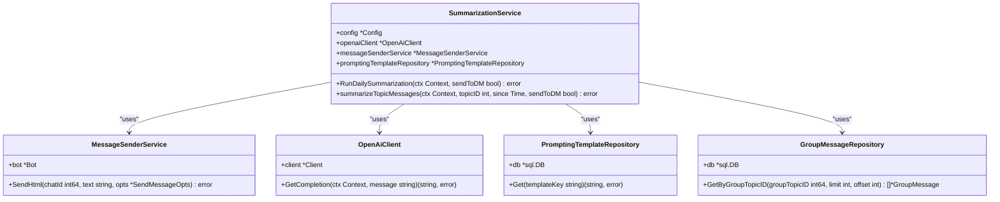
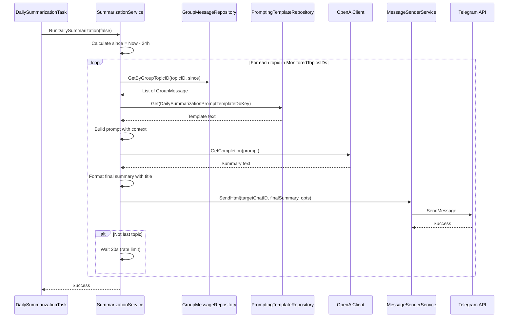
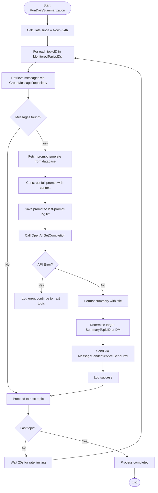
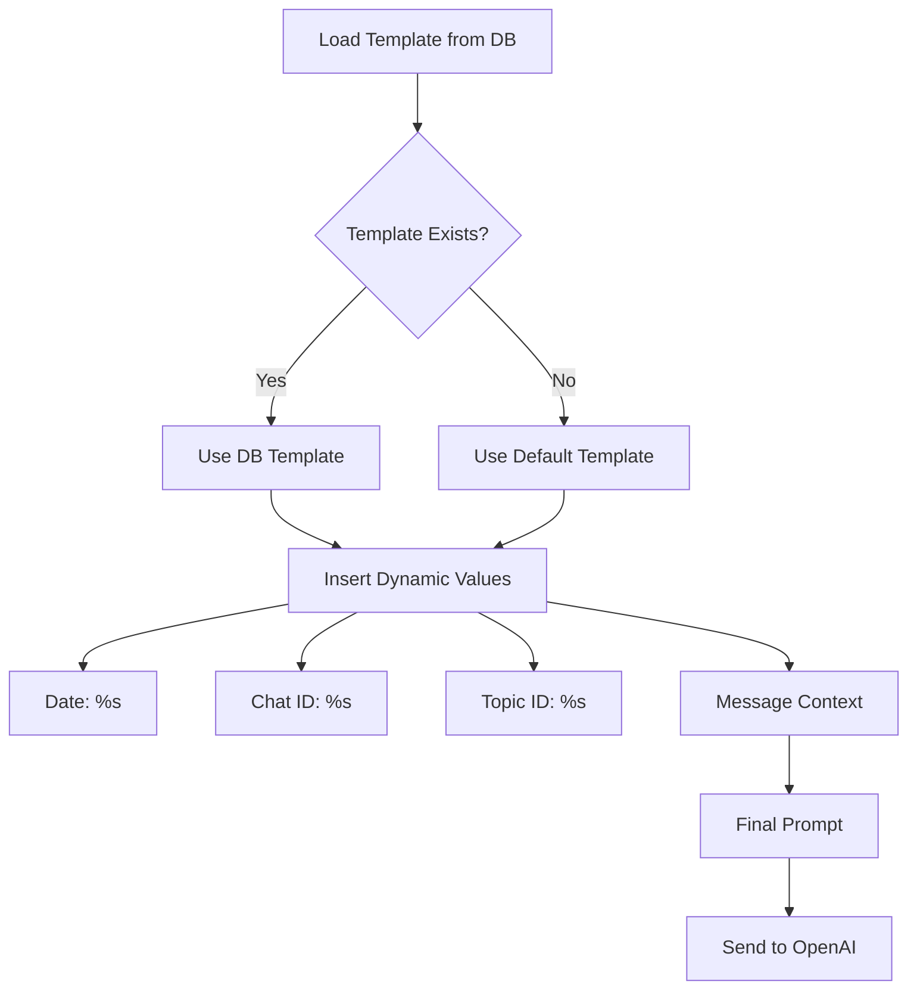
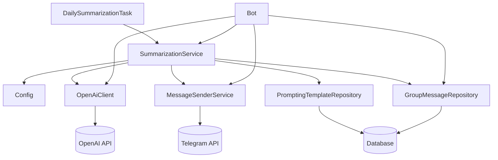

# Summarization Service

<cite>
**Referenced Files in This Document**   
- [summarization_service.go](file://internal/services/summarization_service.go)
- [group_message_repository.go](file://internal/database/repositories/group_message_repository.go)
- [openai_client.go](file://internal/clients/openai_client.go)
- [summarization_prompt.go](file://internal/database/prompts/summarization_prompt.go)
- [message_sender_service.go](file://internal/services/message_sender_service.go)
- [daily_summarization_task.go](file://internal/tasks/daily_summarization_task.go)
- [prompting_templates_repository.go](file://internal/database/repositories/prompting_templates_repository.go)
- [config.go](file://internal/config/config.go)
</cite>

## Table of Contents
1. [Introduction](#introduction)
2. [Core Components](#core-components)
3. [Architecture Overview](#architecture-overview)
4. [Detailed Component Analysis](#detailed-component-analysis)
5. [Dependency Analysis](#dependency-analysis)
6. [Performance Considerations](#performance-considerations)
7. [Troubleshooting Guide](#troubleshooting-guide)
8. [Conclusion](#conclusion)

## Introduction
The SummarizationService component in evocoders-bot-go is responsible for generating AI-powered daily summaries of Telegram group chat discussions. This service collects messages from monitored topics, formats them into structured prompts, and leverages the OpenAI API to produce concise, organized summaries. These summaries are then posted back to designated threads in the Telegram group. The process is automated through scheduled tasks that run daily at a configured time. The service supports flexible configuration for summary length, tone, and output destination, including direct messaging (DM) capabilities for testing. It integrates tightly with database repositories, external AI clients, and message delivery systems to provide a robust summarization pipeline.

## Core Components

The SummarizationService orchestrates several key components: message collection via GroupMessageRepository, prompt generation using configurable templates from PromptingTemplateRepository, AI processing through OpenAiClient, and summary delivery via MessageSenderService. The service is initialized with dependencies including configuration settings, the OpenAI client, message sender, and prompt repository. Its primary method, RunDailySummarization, triggers the end-to-end summarization workflow across all monitored topics. Each topic's messages from the past 24 hours are retrieved, formatted into context, and submitted to OpenAI for processing. The resulting summary is enriched with metadata and delivered to the appropriate Telegram thread or user DM.

**Section sources**
- [summarization_service.go](file://internal/services/summarization_service.go#L20-L25)
- [summarization_service.go](file://internal/services/summarization_service.go#L38-L47)

## Architecture Overview

```mermaid
graph TB
subgraph "Scheduling"
Task[DailySummarizationTask]
end
subgraph "Summarization Pipeline"
Service[SummarizationService]
Repository[GroupMessageRepository]
PromptRepo[PromptingTemplateRepository]
OpenAIClient[OpenAiClient]
MessageSender[MessageSenderService]
end
subgraph "External Systems"
DB[(Database)]
OpenAI[(OpenAI API)]
Telegram[(Telegram)]
end
Task --> Service: RunDailySummarization
Service --> Repository: GetByGroupTopicID
Repository --> DB
Service --> PromptRepo: Get
PromptRepo --> DB
Service --> OpenAIClient: GetCompletion
OpenAIClient --> OpenAI
Service --> MessageSender: SendHtml
MessageSender --> Telegram
```

**Diagram sources **
- [summarization_service.go](file://internal/services/summarization_service.go#L59-L176)
- [daily_summarization_task.go](file://internal/tasks/daily_summarization_task.go#L48-L99)
- [group_message_repository.go](file://internal/database/repositories/group_message_repository.go#L130-L158)
- [prompting_templates_repository.go](file://internal/database/repositories/prompting_templates_repository.go#L28-L42)
- [openai_client.go](file://internal/clients/openai_client.go#L63-L78)
- [message_sender_service.go](file://internal/services/message_sender_service.go#L245-L267)

## Detailed Component Analysis

### Summarization Service Analysis
The SummarizationService is the central orchestrator of the daily summary generation process. It begins by calculating a 24-hour window from the current time and iterates through each topic ID listed in the MonitoredTopicsIDs configuration. For each topic, it retrieves messages using the GroupMessageRepository and constructs a contextual string containing message metadata and text. This context is combined with a dynamic prompt template fetched from the database via PromptingTemplateRepository. The prompt includes placeholders for date, chat ID, topic ID, and the message context itself. After generating the prompt, it is sent to OpenAI's API through the OpenAiClient. The response is formatted with a title and sent via MessageSenderService to either a designated summary thread or directly to a user's DM if requested.

#### For Object-Oriented Components:


**Diagram sources **
- [summarization_service.go](file://internal/services/summarization_service.go#L20-L25)
- [message_sender_service.go](file://internal/services/message_sender_service.go#L10-L12)
- [openai_client.go](file://internal/clients/openai_client.go#L12-L14)
- [prompting_templates_repository.go](file://internal/database/repositories/prompting_templates_repository.go#L15-L17)
- [group_message_repository.go](file://internal/database/repositories/group_message_repository.go#L22-L24)

#### For API/Service Components:


**Diagram sources **
- [summarization_service.go](file://internal/services/summarization_service.go#L59-L176)
- [group_message_repository.go](file://internal/database/repositories/group_message_repository.go#L130-L158)
- [prompting_templates_repository.go](file://internal/database/repositories/prompting_templates_repository.go#L28-L42)
- [openai_client.go](file://internal/clients/openai_client.go#L63-L78)
- [message_sender_service.go](file://internal/services/message_sender_service.go#L245-L267)

#### For Complex Logic Components:


**Diagram sources **
- [summarization_service.go](file://internal/services/summarization_service.go#L59-L176)

**Section sources**
- [summarization_service.go](file://internal/services/summarization_service.go#L59-L176)
- [group_message_repository.go](file://internal/database/repositories/group_message_repository.go#L130-L158)
- [openai_client.go](file://internal/clients/openai_client.go#L63-L78)
- [message_sender_service.go](file://internal/services/message_sender_service.go#L245-L267)

### Prompt Construction and Configuration
The summarization process relies on a configurable prompt template stored in the database under the key `daily_summarization_prompt`. If no custom template exists, a default Russian-language template is used. This template instructs the AI to analyze chat logs and generate a bulleted list of main discussion topics using specific formatting rules. It requires the AI to group messages into discussion threads using reply IDs and timestamps, identify core themes, and include HTML links to the first message of each thread. The output must use only allowed HTML tags (`<b>`, `<i>`, `<a>`) and follow a strict markdown-like structure with emoji bullets (🔸). The prompt dynamically inserts date, chat ID, and topic ID values at runtime to create the final request sent to OpenAI.



**Diagram sources **
- [summarization_prompt.go](file://internal/database/prompts/summarization_prompt.go#L4-L42)
- [summarization_service.go](file://internal/services/summarization_service.go#L108-L127)

**Section sources**
- [summarization_prompt.go](file://internal/database/prompts/summarization_prompt.go#L4-L42)
- [summarization_service.go](file://internal/services/summarization_service.go#L108-L127)

## Dependency Analysis



**Diagram sources **
- [summarization_service.go](file://internal/services/summarization_service.go#L20-L25)
- [config.go](file://internal/config/config.go#L14-L78)
- [openai_client.go](file://internal/clients/openai_client.go#L12-L14)
- [message_sender_service.go](file://internal/services/message_sender_service.go#L10-L12)
- [prompting_templates_repository.go](file://internal/database/repositories/prompting_templates_repository.go#L15-L17)
- [group_message_repository.go](file://internal/database/repositories/group_message_repository.go#L22-L24)
- [daily_summarization_task.go](file://internal/tasks/daily_summarization_task.go#L13-L17)

**Section sources**
- [summarization_service.go](file://internal/services/summarization_service.go#L20-L25)
- [config.go](file://internal/config/config.go#L14-L78)
- [openai_client.go](file://internal/clients/openai_client.go#L12-L14)
- [message_sender_service.go](file://internal/services/message_sender_service.go#L10-L12)
- [prompting_templates_repository.go](file://internal/database/repositories/prompting_templates_repository.go#L15-L17)
- [group_message_repository.go](file://internal/database/repositories/group_message_repository.go#L22-L24)
- [daily_summarization_task.go](file://internal/tasks/daily_summarization_task.go#L13-L17)

## Performance Considerations
The SummarizationService implements several performance and reliability measures. It includes a 20-second delay between processing each monitored topic to prevent OpenAI API rate limiting. The service uses context-aware timeouts (30 minutes) during AI processing to avoid hanging operations. Message retrieval is optimized through database indexing on group_topic_id and created_at fields. The prompt construction avoids unnecessary data by including only essential message metadata. For cost optimization, the service uses o3-mini model which is cost-effective for summarization tasks. Error handling allows partial success—failure in one topic doesn't prevent processing others. The temporary logging of prompts to "last-prompt-log.txt" aids in debugging without impacting production performance. Configuration options allow disabling the task when not needed, conserving resources.

## Troubleshooting Guide
Common issues with the summarization service include empty summaries, API rate limiting, and message retrieval failures. If summaries are irrelevant, check the prompt template in the database and verify message context formatting. For token limit issues, ensure message volume from the past 24 hours isn't excessive—consider adjusting monitoring scope. If messages are missed, verify the GroupMessageRepository correctly captures all messages via the save_messages_handler. API timeouts or rate limits should be addressed by adjusting the inter-topic delay or upgrading OpenAI plan. When summaries fail to post, check if the target topic is closed—MessageSenderService attempts to reopen closed topics automatically. For debugging, inspect the "last-prompt-log.txt" file to validate prompt construction. Ensure environment variables like TG_EVO_BOT_MONITORED_TOPICS_IDS and TG_EVO_BOT_SUMMARY_TOPIC_ID are correctly configured. Test with sendToDM=true to verify functionality without affecting the main chat.

**Section sources**
- [summarization_service.go](file://internal/services/summarization_service.go#L129-L135)
- [summarization_service.go](file://internal/services/summarization_service.go#L84-L88)
- [message_sender_service.go](file://internal/services/message_sender_service.go#L430-L480)

## Conclusion
The SummarizationService provides a robust, configurable solution for automated daily chat summarization in Telegram groups. By integrating message persistence, AI processing, and message delivery components, it delivers valuable insights from group discussions with minimal manual intervention. The architecture supports extensibility through database-stored prompt templates and flexible configuration. With proper monitoring and error handling, it serves as a reliable tool for community management and information dissemination. The combination of scheduled execution, rate limit awareness, and fallback mechanisms ensures consistent operation in production environments.