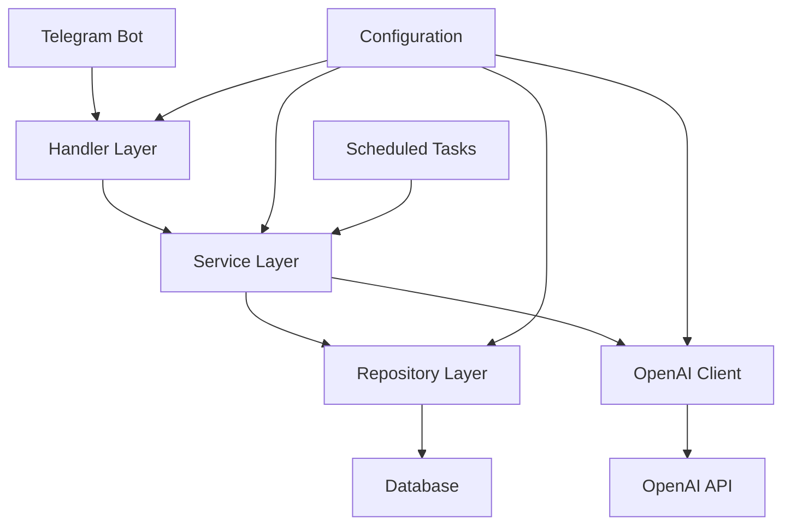
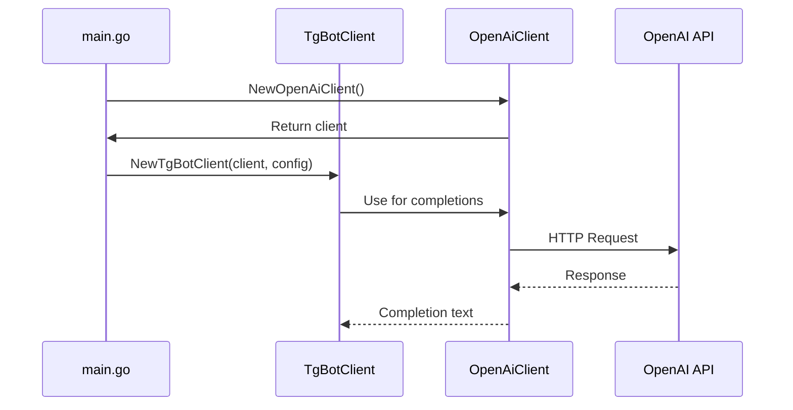
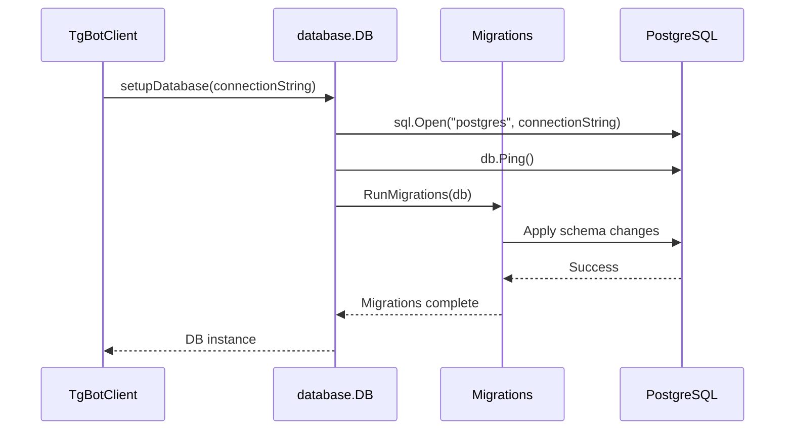
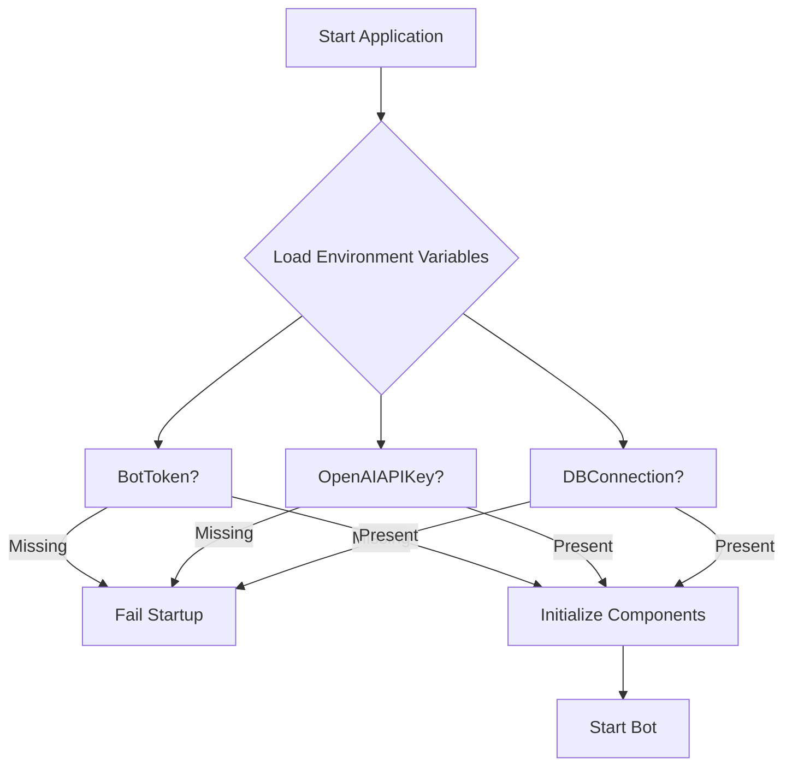
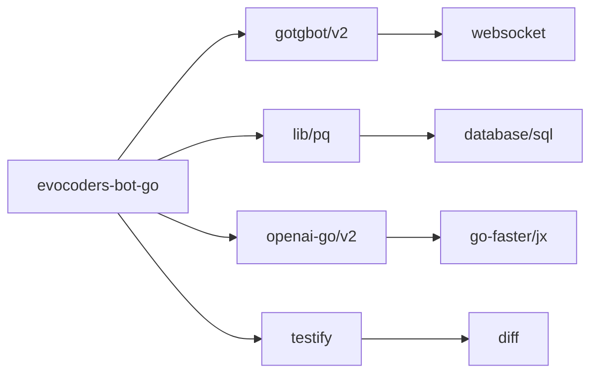

# Technology Stack & Dependencies

<cite>
**Referenced Files in This Document**   
- [main.go](file://main.go) - *Updated in recent commit*
- [config.go](file://internal/config/config.go) - *Updated in recent commit*
- [bot.go](file://internal/bot/bot.go)
- [openai_client.go](file://internal/clients/openai_client.go) - *Updated in recent commit*
- [db.go](file://internal/database/db.go)
- [go.mod](file://go.mod) - *Updated in recent commit*
</cite>

## Update Summary
**Changes Made**   
- Updated OpenAI client version from v0.1.0-beta.10 to v2.5.0
- Updated import paths for OpenAI client to reflect new module structure
- Updated model reference from o3-mini to ChatModelGPT5Mini
- Added ReasoningEffort parameter to chat completion requests with default medium effort
- Updated dependency analysis section to reflect new version
- Modified component interactions section to reflect updated OpenAI client usage
- Verified configuration loading mechanism for OpenAI API key

## Table of Contents
1. [Introduction](#introduction)
2. [Core Technology Stack](#core-technology-stack)
3. [Component Interactions](#component-interactions)
4. [Database Architecture and PostgreSQL Rationale](#database-architecture-and-postgresql-rationale)
5. [Configuration Management and Security](#configuration-management-and-security)
6. [Infrastructure Requirements and Scalability](#infrastructure-requirements-and-scalability)
7. [Dependency Analysis](#dependency-analysis)
8. [Conclusion](#conclusion)

## Introduction
The evocoders-bot-go application is a Telegram bot designed to facilitate community engagement through AI-powered interactions, automated content summarization, and social features like random coffee pairings. Built using Go 1.23.3, the system integrates multiple third-party services to deliver advanced functionality while maintaining a modular and maintainable architecture. This document details the technology stack, design decisions, component interactions, and infrastructure considerations that underpin the application's capabilities.

**Section sources**
- [main.go](file://main.go#L1-L53)
- [go.mod](file://go.mod#L1-L5)

## Core Technology Stack

### Backend Language: Go 1.23.3
The application is built using Go version 1.23.3, as specified in the `go.mod` file. Go was selected for its performance, concurrency model, and strong standard library, making it ideal for networked applications like Telegram bots. The language's static typing and compilation ensure runtime stability, while its efficient garbage collection and goroutine-based concurrency support high-throughput message processing.

### Telegram Integration: gotgbot/v2
The bot uses the `gotgbot/v2` library (version v2.0.0-rc.32) to interface with the Telegram Bot API. This lightweight, actively maintained library provides a clean abstraction over Telegram's update system, enabling event-driven handling of messages, callbacks, polls, and chat events. It supports long polling with configurable timeouts and handles deserialization of Telegram's JSON payloads into Go structs.

### AI Capabilities: github.com/openai/openai-go/v2
The `github.com/openai/openai-go/v2` library (v2.5.0) enables integration with OpenAI's API for natural language processing tasks. The bot leverages this for generating responses, summarizing content, and powering conversational features. The client uses the `ChatModelGPT5Mini` model for chat completions and `text-embedding-ada-002` for embedding generation, supporting semantic search and context-aware interactions. The updated client includes the ReasoningEffort parameter to control processing depth, with medium effort set as the default.

### Database Connectivity: github.com/lib/pq
PostgreSQL connectivity is provided by the `github.com/lib/pq` driver (v1.10.9), a pure Go PostgreSQL driver that supports the `database/sql` interface. It enables secure, efficient communication with the PostgreSQL database, including connection pooling, SSL, and prepared statements.

**Section sources**
- [go.mod](file://go.mod#L1-L35)
- [openai_client.go](file://internal/clients/openai_client.go#L1-L97)
- [db.go](file://internal/database/db.go#L1-L44)

## Component Interactions

### High-Level Architecture Overview
The application follows a layered architecture with clear separation between concerns: configuration, clients, services, repositories, handlers, and database. The main components interact through dependency injection, ensuring loose coupling and testability.

**Diagram sources**
- [main.go](file://main.go#L1-L53)
- [bot.go](file://internal/bot/bot.go#L1-L384)
- [openai_client.go](file://internal/clients/openai_client.go#L1-L97)

### OpenAI Client Initialization and Usage
The OpenAI client is initialized at startup in `main.go` and passed to the bot constructor. It is used by various handlers and services to generate AI-powered responses. The client is configured with the API key from environment variables and exposes methods for chat completions and embeddings. The updated v2.5.0 client uses a new import path and includes enhanced parameters for controlling reasoning effort. The `GetCompletion` method now defaults to medium reasoning effort through the `GetCompletionWithReasoning` method.

**Section sources**
- [main.go](file://main.go#L1-L53)
- [openai_client.go](file://internal/clients/openai_client.go#L16-L32)
- [bot.go](file://internal/bot/bot.go#L65-L221)
- [openai_client.go](file://internal/clients/openai_client.go#L40-L56)

### Database Connection Lifecycle
The database connection is established during bot initialization using the connection string from environment variables. The `database.DB` struct wraps `sql.DB` and manages the lifecycle, including migration execution on startup and graceful shutdown.

**Diagram sources**
- [bot.go](file://internal/bot/bot.go#L65-L221)
- [db.go](file://internal/database/db.go#L16-L28)
- [migrator.go](file://internal/database/migrations/migrator.go#L54-L111)

## Database Architecture and PostgreSQL Rationale

### PostgreSQL Selection Rationale
PostgreSQL was chosen as the persistence layer for several key reasons:
- **Relational Integrity**: The application manages complex relationships between users, profiles, events, and group messages, which are naturally modeled in a relational database.
- **JSON Support**: PostgreSQL's JSONB type allows flexible storage of semi-structured data like user preferences or message metadata.
- **Maturity and Reliability**: As an enterprise-grade database, PostgreSQL offers ACID compliance, robust transaction handling, and proven scalability.
- **Migration Support**: The project includes a structured migration system with timestamped migration files, enabling safe schema evolution.

### Schema Evolution and Migrations
The database schema is managed through a series of incremental migrations stored in `internal/database/migrations/implementations/`. Each migration is versioned by date and implements the `Migration` interface with `Apply` and `Rollback` methods. This approach ensures reproducible database states across environments and supports rollback capabilities.

**Section sources**
- [db.go](file://internal/database/db.go#L31-L38)
- [migration_base.go](file://internal/database/migrations/implementations/migration_base.go#L1-L24)
- [20250519_add_users_and_profiles_tables.go](file://internal/database/migrations/implementations/20250519_add_users_and_profiles_tables.go#L1-L50)

## Configuration Management and Security

### Environment-Based Configuration
All configuration is managed through environment variables, loaded by the `config.LoadConfig()` function. This follows the 12-factor app methodology, enabling environment-specific settings without code changes. The configuration struct includes typed fields for bot tokens, database connections, feature flags, and scheduling parameters.

### Secure API Key Handling
API keys (Telegram bot token, OpenAI API key) are never hardcoded. They are retrieved from environment variables at runtime, minimizing the risk of accidental exposure. The application fails to start if required secrets are missing, preventing operation in an insecure state.

**Section sources**
- [config.go](file://internal/config/config.go#L1-L318)
- [main.go](file://main.go#L1-L53)

## Infrastructure Requirements and Scalability

### Version Compatibility
The application requires Go 1.23.3 or higher, as specified in `go.mod`. The toolchain directive ensures consistent builds across development and production environments. All dependencies are pinned to specific versions to prevent breaking changes.

### Scalability Considerations
The architecture supports scalability through several mechanisms:
- **Stateless Design**: The bot itself is stateless, with all persistent data stored in PostgreSQL.
- **Concurrent Processing**: Go's goroutines allow concurrent handling of multiple Telegram updates.
- **Scheduled Tasks**: Background tasks (summarization, coffee pairings) run independently of request processing.
- **Database Connection Pooling**: The `sql.DB` connection pool efficiently manages database connections.

For horizontal scaling, multiple bot instances could be deployed behind a load balancer, provided they coordinate scheduled tasks to avoid duplication.

**Section sources**
- [go.mod](file://go.mod#L1-L5)
- [bot.go](file://internal/bot/bot.go#L56-L62)
- [tasks](file://internal/tasks#L1-L20)

## Dependency Analysis

### Direct Dependencies
The application depends on the following key libraries:
- `github.com/PaulSonOfLars/gotgbot/v2`: Telegram Bot API client
- `github.com/lib/pq`: PostgreSQL driver
- `github.com/openai/openai-go/v2`: OpenAI API client (v2.5.0)
- `github.com/stretchr/testify`: Testing utilities

### Indirect Dependencies
Several indirect dependencies support core functionality:
- `golang.org/x/crypto`: Secure communication
- `go.uber.org/zap`: Structured logging (indirectly via dependencies)
- `github.com/cenkalti/backoff/v4`: Retry logic for API calls

**Section sources**
- [go.mod](file://go.mod#L1-L35)

## Conclusion
The evocoders-bot-go application employs a modern, well-structured technology stack centered around Go 1.23.3, with strategic use of third-party libraries for Telegram integration, AI capabilities, and database connectivity. The architecture emphasizes security through environment-based configuration and secure API key handling, while PostgreSQL provides a reliable and scalable persistence layer. Component interactions are clearly defined through dependency injection, and the system is designed for maintainability with a comprehensive migration system and modular service layer. This foundation supports current functionality and provides a solid base for future enhancements.