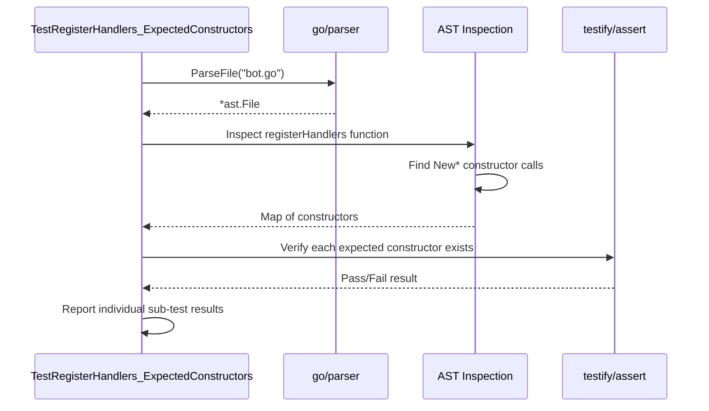
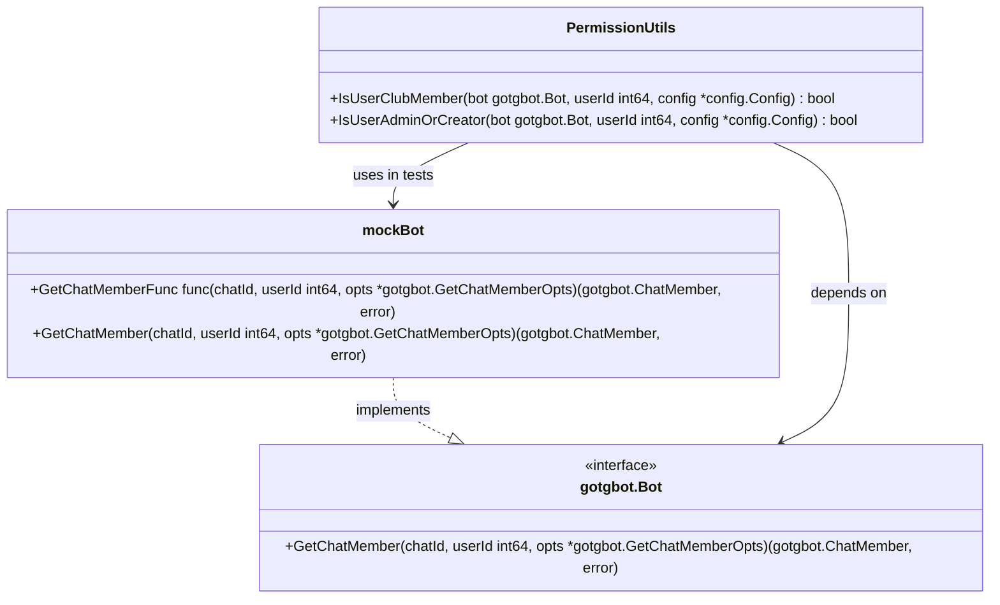

# Testing Strategy

<cite>
**Referenced Files in This Document**   
- [README.md](file://README.md)
- [bot_ast_test.go](file://internal/bot/bot_ast_test.go)
- [chat_utils_test.go](file://internal/utils/chat_utils_test.go)
- [datastore_utils_test.go](file://internal/utils/datastore_utils_test.go)
- [markdown_utils_test.go](file://internal/utils/markdown_utils_test.go)
- [permission_utils_test.go](file://internal/utils/permission_utils_test.go)
- [string_utils_test.go](file://internal/utils/string_utils_test.go)
- [type_utils_test.go](file://internal/utils/type_utils_test.go)
- [unicode_utils_test.go](file://internal/utils/unicode_utils_test.go)
</cite>

## Table of Contents
1. [Introduction](#introduction)
2. [Testing Tools and Commands](#testing-tools-and-commands)
3. [Test Organization in Utils Package](#test-organization-in-utils-package)
4. [Integration Test Implementation](#integration-test-implementation)
5. [Unit Test Patterns](#unit-test-patterns)
6. [Mocking Strategies](#mocking-strategies)
7. [Test Coverage Goals](#test-coverage-goals)
8. [Asynchronous Telegram Testing](#asynchronous-telegram-testing)
9. [Conclusion](#conclusion)

## Introduction
The evocoders-bot-go project implements a comprehensive testing strategy to ensure the reliability and quality of its Telegram bot functionality. The testing approach combines unit tests for isolated components with integration tests that verify system-wide behavior. The test suite focuses on critical aspects of the bot including handler logic, service interactions, utility functions, and database operations. This documentation provides an in-depth analysis of the testing architecture, implementation details, and best practices used throughout the codebase. The strategy emphasizes automated verification of both functional correctness and edge case handling, with particular attention to the asynchronous nature of Telegram interactions and the complex state management required for bot operations.

## Testing Tools and Commands
The project leverages Go's built-in testing framework along with several supplementary tools to provide comprehensive test execution and analysis capabilities. Developers can run tests using standard Go commands as specified in the README.md documentation. The primary command `go test ./...` recursively executes all tests across the entire project, while more targeted testing is possible with package-specific commands like `go test evo-bot-go/internal/handlers/privatehandlers`. For detailed output, the `-v` flag provides verbose information about test execution. The project supports code coverage analysis through `go test -cover ./...` for basic coverage metrics and the more detailed workflow using `go test -coverprofile=coverage.out ./...` followed by `go tool cover -html=coverage.out` to generate an interactive HTML report. To detect race conditions in concurrent code, the `-race` flag can be used with `go test -race ./...`. Additionally, the project recommends using gotestsum for enhanced test output with color coding and icons, which can be installed via `go install gotest.tools/gotestsum@latest` and executed with various formatting options for improved readability.

**Section sources**
- [README.md](file://README.md#L264-L294)

## Test Organization in Utils Package
The utils package contains a comprehensive suite of unit tests that validate the correctness of various utility functions used throughout the application. Each utility module has a corresponding test file following Go's naming convention (e.g., chat_utils.go has chat_utils_test.go). The tests are organized to cover all significant functionality with thorough input validation and edge case handling. For example, the chat_utils_test.go file contains tests for the ChatIdToFullChatId function, verifying its behavior with various input types including positive and negative chat IDs, zero values, and boundary conditions. Similarly, the string_utils_test.go file includes comprehensive tests for functions like IndexAny, ExtractNumber, and EscapeMarkdown, with test cases covering normal operation, edge cases, and error conditions. The datastore_utils_test.go file implements tests for the UserDataStore functionality, validating operations like Get, Set, Clear, and type-specific methods with different data types. Each test file follows a consistent pattern of defining test cases as structs with descriptive names, expected inputs, and outputs, then iterating through these cases with t.Run to provide clear reporting of failures.

**Section sources**
- [chat_utils_test.go](file://internal/utils/chat_utils_test.go#L0-L68)
- [datastore_utils_test.go](file://internal/utils/datastore_utils_test.go#L0-L246)
- [markdown_utils_test.go](file://internal/utils/markdown_utils_test.go#L0-L172)
- [permission_utils_test.go](file://internal/utils/permission_utils_test.go#L0-L245)
- [string_utils_test.go](file://internal/utils/string_utils_test.go#L0-L283)
- [type_utils_test.go](file://internal/utils/type_utils_test.go#L0-L65)
- [unicode_utils_test.go](file://internal/utils/unicode_utils_test.go#L0-L245)

## Integration Test Implementation
The project implements integration testing through the bot_ast_test.go file, which uses Go's AST (Abstract Syntax Tree) parsing capabilities to verify the correct registration of bot handlers. This unique approach analyzes the source code structure to ensure that all expected handler constructors are properly registered in the bot's handler registration process. The test uses the go/parser package to parse the bot.go file and inspect the registerHandlers function, identifying all constructor calls that begin with "New". It then compares these found constructors against a predefined list of expected constructors stored in the expectedConstructors variable. The test suite includes two main test functions: TestRegisterHandlers_ExpectedConstructors, which verifies that every expected constructor is present in the registration process, and TestRegisterHandlers_NoUnexpectedConstructors, which ensures no unlisted constructors are registered. This approach provides a robust mechanism for maintaining handler registration integrity, automatically detecting both missing handlers and unauthorized additions. The test leverages testify/assert for assertion handling and uses t.Helper() to properly attribute test failures to the appropriate location in the test code.

**Diagram sources **
- [bot_ast_test.go](file://internal/bot/bot_ast_test.go#L0-L113)

**Section sources**
- [bot_ast_test.go](file://internal/bot/bot_ast_test.go#L0-L113)

## Unit Test Patterns
The project demonstrates several effective unit testing patterns across its codebase. One prominent pattern is the table-driven test approach used extensively in the utils package, where test cases are defined as slices of structs containing input values, expected outputs, and descriptive names. This pattern promotes comprehensive test coverage by making it easy to add new test cases and ensures consistent test execution. For example, the permission_utils_test.go file uses this pattern to test the IsUserClubMember and IsUserAdminOrCreator functions with various Telegram chat member statuses. Another pattern is the use of mock implementations for external dependencies, as seen in the permission_utils_test.go file which defines a mockBot struct that implements the GetChatMember method to simulate different chat member scenarios without requiring actual Telegram API calls. The tests also follow the arrange-act-assert pattern, clearly separating test setup, execution, and verification phases. Additionally, the project uses helper functions and methods like t.Helper() to improve test failure reporting and maintain clean test code organization.

**Section sources**
- [permission_utils_test.go](file://internal/utils/permission_utils_test.go#L0-L245)
- [string_utils_test.go](file://internal/utils/string_utils_test.go#L0-L283)
- [chat_utils_test.go](file://internal/utils/chat_utils_test.go#L0-L68)

## Mocking Strategies
The project employs effective mocking strategies to isolate components during testing and avoid dependencies on external systems. The most sophisticated example is found in permission_utils_test.go, which implements a mockBot struct that satisfies the interface required by the permission utility functions. This mock implementation allows the tests to simulate various Telegram chat member statuses (creator, administrator, member, restricted, left, kicked) without making actual API calls to Telegram. The mockBot struct includes a GetChatMemberFunc field that can be configured to return different chat member types or errors, enabling comprehensive testing of all possible scenarios. This approach provides complete control over the test environment and ensures reliable, repeatable test results. The mocking strategy follows Go's interface-based design principles, allowing the production code to work with the real Telegram bot client while tests can substitute the mock implementation. This separation of concerns enables thorough testing of business logic without the complexity and unreliability of external service integration.

**Diagram sources **
- [permission_utils_test.go](file://internal/utils/permission_utils_test.go#L0-L245)

**Section sources**
- [permission_utils_test.go](file://internal/utils/permission_utils_test.go#L0-L245)

## Test Coverage Goals
The project aims for comprehensive test coverage across all critical components, with particular emphasis on utility functions, permission logic, and handler registration. The test suite is designed to achieve high code coverage by testing both normal operation and edge cases for all significant functionality. The utils package appears to have particularly thorough coverage, with dedicated tests for each utility function and multiple test cases for different input scenarios. The integration test in bot_ast_test.go ensures complete coverage of handler registration, verifying that all expected handlers are properly connected to the bot's dispatcher. The project leverages Go's built-in coverage tools to measure and visualize coverage, allowing developers to identify untested code paths. While specific coverage targets are not documented, the testing strategy suggests a goal of comprehensive coverage for core functionality, especially for components that handle user interactions, data processing, and security-related operations like permission checking. The use of table-driven tests and mock implementations facilitates achieving high coverage by making it easy to test multiple scenarios with minimal code duplication.

**Section sources**
- [README.md](file://README.md#L278-L283)
- [bot_ast_test.go](file://internal/bot/bot_ast_test.go#L0-L113)
- [utils package test files](file://internal/utils/)

## Asynchronous Telegram Testing
Testing asynchronous Telegram interactions presents unique challenges due to the event-driven nature of bot communications and the reliance on external APIs. The project addresses these challenges through several strategies. First, it uses mock implementations to simulate Telegram API responses, as demonstrated in the permission_utils_test.go file where the mockBot struct can return predefined chat member information without making actual API calls. This approach allows testing of permission logic and other functionality that depends on Telegram data without the unpredictability of network requests. Second, the project appears to design its components with testability in mind, using interfaces and dependency injection to enable substitution of real services with test doubles. For example, the permission utility functions accept a bot interface rather than a concrete implementation, facilitating mocking. Third, the integration test in bot_ast_test.go verifies the structural correctness of handler registration, ensuring that the bot will properly respond to incoming messages. While the available code does not show explicit testing of message handling workflows, the combination of unit tests for individual components and structural verification of the handler registration suggests a strategy of testing the pieces independently and ensuring they are properly connected.

**Section sources**
- [permission_utils_test.go](file://internal/utils/permission_utils_test.go#L0-L245)
- [bot_ast_test.go](file://internal/bot/bot_ast_test.go#L0-L113)

## Conclusion
The evocoders-bot-go project demonstrates a mature and comprehensive testing strategy that combines traditional unit testing with innovative integration testing approaches. The extensive test suite for utility functions ensures the reliability of foundational components, while the AST-based integration test provides a unique mechanism for verifying the correct registration of bot handlers. The project effectively uses mocking to isolate components and test edge cases without relying on external services. By leveraging Go's built-in testing tools and supplementary utilities like gotestsum, the project provides developers with multiple options for test execution and analysis. The testing approach emphasizes both functional correctness and structural integrity, with particular attention to the asynchronous nature of Telegram bot interactions. This comprehensive strategy contributes significantly to the overall quality and maintainability of the codebase, providing confidence in the bot's reliability and facilitating future development and refactoring.