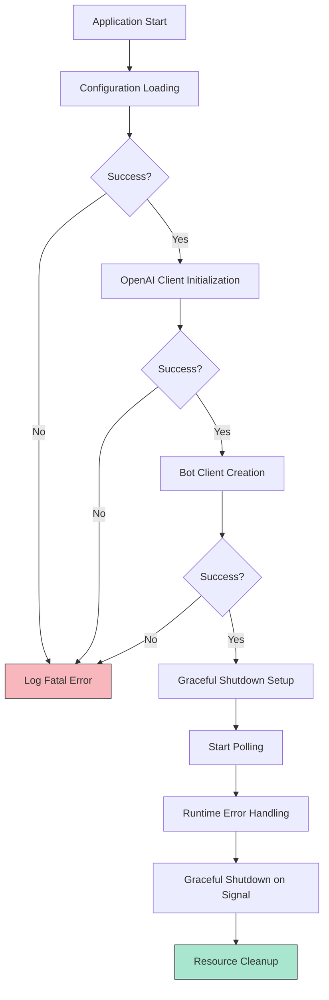
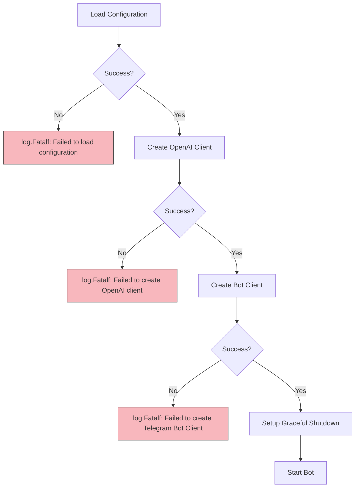
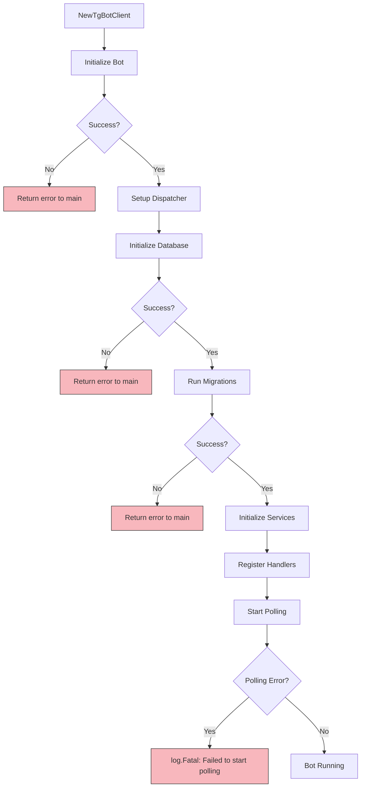
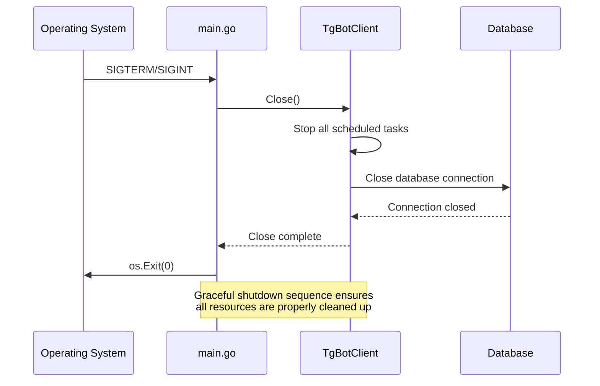

# Troubleshooting

<cite>
**Referenced Files in This Document**   
- [main.go](file://main.go)
- [internal/bot/bot.go](file://internal/bot/bot.go)
- [internal/database/db.go](file://internal/database/db.go)
- [internal/clients/openai_client.go](file://internal/clients/openai_client.go)
- [internal/config/config.go](file://internal/config/config.go)
- [internal/tasks/task.go](file://internal/tasks/task.go)
- [internal/handlers/privatehandlers/content_handler.go](file://internal/handlers/privatehandlers/content_handler.go)
- [internal/handlers/privatehandlers/intro_handler.go](file://internal/handlers/privatehandlers/intro_handler.go)
- [internal/handlers/privatehandlers/profile_handler.go](file://internal/handlers/privatehandlers/profile_handler.go)
- [internal/handlers/privatehandlers/tools_handler.go](file://internal/handlers/privatehandlers/tools_handler.go)
- [internal/handlers/adminhandlers/testhandlers/try_summarize_handler.go](file://internal/handlers/adminhandlers/testhandlers/try_summarize_handler.go)
</cite>

## Table of Contents
1. [Introduction](#introduction)
2. [Error Handling Architecture](#error-handling-architecture)
3. [Error Logging Implementation](#error-logging-implementation)
4. [Common Error Scenarios](#common-error-scenarios)
5. [Performance Optimization](#performance-optimization)
6. [Debugging Techniques](#debugging-techniques)
7. [Conclusion](#conclusion)

## Introduction
This troubleshooting guide provides comprehensive guidance for diagnosing and resolving common issues in the evocoders-bot-go application. The document covers error handling mechanisms, logging implementation, common error scenarios, performance optimization techniques, and debugging strategies. The bot is designed to manage Telegram group interactions, AI-powered content generation, and scheduled tasks such as daily summarization and random coffee pairings.

**Section sources**
- [main.go](file://main.go#L1-L53)
- [internal/bot/bot.go](file://internal/bot/bot.go#L1-L384)

## Error Handling Architecture

The evocoders-bot-go application implements a layered error handling architecture that ensures robust operation and graceful degradation when issues occur. The system follows a structured approach to error management across initialization, runtime execution, and shutdown phases.



**Diagram sources**
- [main.go](file://main.go#L1-L53)
- [internal/bot/bot.go](file://internal/bot/bot.go#L1-L384)

**Section sources**
- [main.go](file://main.go#L1-L53)
- [internal/bot/bot.go](file://internal/bot/bot.go#L1-L384)

## Error Logging Implementation

The application implements comprehensive error logging with specific patterns in both main.go and bot.go files. The error handling strategy follows a fail-fast approach during initialization and graceful error recovery during runtime operations.

### Main Package Error Handling

The main.go file implements critical error handling during application startup. Any failure in configuration loading, OpenAI client creation, or bot client initialization results in a fatal log entry and application termination.



**Diagram sources**
- [main.go](file://main.go#L1-L53)

**Section sources**
- [main.go](file://main.go#L1-L53)

### Bot Package Error Handling

The bot.go file implements sophisticated error handling for runtime operations, including database connections, handler registration, and polling mechanisms. The system uses Go's standard log package for error reporting with contextual information.



**Diagram sources**
- [internal/bot/bot.go](file://internal/bot/bot.go#L1-L384)
- [internal/database/db.go](file://internal/database/db.go#L1-L44)

**Section sources**
- [internal/bot/bot.go](file://internal/bot/bot.go#L1-L384)
- [internal/database/db.go](file://internal/database/db.go#L1-L44)

### Graceful Shutdown Procedures

The application implements graceful shutdown procedures to ensure proper resource cleanup when termination signals are received. This prevents data corruption and ensures all pending operations are completed.



**Diagram sources**
- [main.go](file://main.go#L45-L53)
- [internal/bot/bot.go](file://internal/bot/bot.go#L375-L384)

**Section sources**
- [main.go](file://main.go#L45-L53)
- [internal/bot/bot.go](file://internal/bot/bot.go#L375-L384)

## Common Error Scenarios

### Database Connection Failures

Database connection failures are one of the most common startup issues. These typically occur due to incorrect connection strings, network issues, or database server unavailability.

**Error Message to Look For:**
```
Failed to open database connection: ...
```

**Root Causes:**
- Incorrect database URL or credentials in TG_EVO_BOT_DB_CONNECTION environment variable
- Database server not running or unreachable
- Network connectivity issues between application and database
- Firewall blocking database port

**Resolution Steps:**
1. Verify the TG_EVO_BOT_DB_CONNECTION environment variable contains the correct connection string
2. Check that the PostgreSQL server is running and accessible
3. Test network connectivity to the database server
4. Verify firewall rules allow connections on the database port
5. Check database logs for authentication or connection issues

**Section sources**
- [internal/database/db.go](file://internal/database/db.go#L1-L44)

### API Rate Limiting

The application interacts with OpenAI's API for AI-powered features, which may result in rate limiting when usage exceeds quota.

**Error Message to Look For:**
```
failed to get completion: ...
failed to get embedding: ...
```

**Root Causes:**
- Exceeding OpenAI API rate limits
- Insufficient API key quota
- Network issues with OpenAI service
- Invalid API key in TG_EVO_BOT_OPENAI_API_KEY

**Resolution Steps:**
1. Check OpenAI API usage dashboard for rate limit status
2. Verify the TG_EVO_BOT_OPENAI_API_KEY environment variable contains a valid key
3. Implement retry logic with exponential backoff for rate-limited requests
4. Consider upgrading OpenAI plan for higher rate limits
5. Monitor application logs for FLOOD_WAIT errors containing wait times

**Section sources**
- [internal/clients/openai_client.go](file://internal/clients/openai_client.go#L1-L97)

### Handler Execution Issues

Handler execution issues can occur when specific bot commands fail to process correctly.

**Common Error Patterns:**
- `defer func() { ... }` patterns in handler files indicate panic recovery mechanisms
- Missing required environment variables for specific handlers
- Permission issues when accessing restricted commands

**Debugging Approach:**
1. Check for panic recovery in handler files using defer statements
2. Verify all required environment variables are set
3. Confirm user has appropriate permissions for the requested operation
4. Review handler-specific error messages in logs

**Section sources**
- [internal/handlers/privatehandlers/content_handler.go](file://internal/handlers/privatehandlers/content_handler.go#L144)
- [internal/handlers/privatehandlers/intro_handler.go](file://internal/handlers/privatehandlers/intro_handler.go#L142)
- [internal/handlers/privatehandlers/profile_handler.go](file://internal/handlers/privatehandlers/profile_handler.go#L868)
- [internal/handlers/privatehandlers/tools_handler.go](file://internal/handlers/privatehandlers/tools_handler.go#L144)

## Performance Optimization

### Slow AI Responses

Slow AI responses can impact user experience, particularly for interactive features.

**Optimization Techniques:**
- Implement caching for frequently requested AI responses
- Optimize prompt engineering to reduce token usage
- Use appropriate OpenAI models for the task (e.g., o3-mini for faster responses)
- Implement request batching where possible
- Add timeouts to prevent hanging requests

**Monitoring Indicators:**
- Long response times in logs
- High CPU usage during AI processing
- Increased error rates during peak usage

**Section sources**
- [internal/clients/openai_client.go](file://internal/clients/openai_client.go#L1-L97)

### High Message Volumes

High message volumes in Telegram groups can overwhelm the bot's processing capabilities.

**Optimization Strategies:**
- Optimize database queries for message processing
- Implement message batching in handlers
- Tune the polling timeout and update frequency
- Scale database connection pool size
- Implement rate limiting for non-critical operations

**Configuration Parameters:**
- Adjust polling timeout in Start() method
- Optimize database connection settings
- Configure appropriate MaxRoutines in dispatcher

**Section sources**
- [internal/bot/bot.go](file://internal/bot/bot.go#L355-L374)

## Debugging Techniques

### Task Scheduling Issues

Task scheduling issues can prevent scheduled operations like daily summaries or random coffee pairings.

**Common Issues:**
- Incorrect time configuration in environment variables
- Disabled tasks in configuration
- Timezone mismatches between server and configuration
- Failed task execution without proper error reporting

**Diagnostic Commands:**
- Check TG_EVO_BOT_SUMMARIZATION_TASK_ENABLED value
- Verify TG_EVO_BOT_RANDOM_COFFEE_POLL_TASK_ENABLED setting
- Confirm time values are in UTC format
- Validate day of week settings match expected values

**Section sources**
- [internal/config/config.go](file://internal/config/config.go#L1-L340)
- [internal/tasks/task.go](file://internal/tasks/task.go#L1-L5)

### Context Timeout Analysis

The application uses context with timeout for various operations, particularly in AI-related handlers.

**Example from try_summarize_handler.go:**
```go
// Create a context with timeout and user ID for DM
```

**Best Practices:**
- Always use context with timeout for external API calls
- Set appropriate timeout values based on expected response times
- Handle context cancellation errors gracefully
- Log timeout occurrences for performance analysis

**Section sources**
- [internal/handlers/adminhandlers/testhandlers/try_summarize_handler.go](file://internal/handlers/adminhandlers/testhandlers/try_summarize_handler.go#L166)

## Conclusion

The evocoders-bot-go application implements a comprehensive error handling and logging system designed for reliability and maintainability. By understanding the error handling architecture, common failure modes, and optimization techniques, developers can effectively troubleshoot and enhance the bot's performance. Key areas of focus include proper configuration management, graceful error recovery, and performance optimization for AI interactions and high-volume message processing.

The graceful shutdown mechanism ensures data integrity during termination, while the layered error handling approach provides clear diagnostic information for troubleshooting. By following the guidance in this document, developers can quickly identify and resolve issues, ensuring the bot operates reliably in production environments.